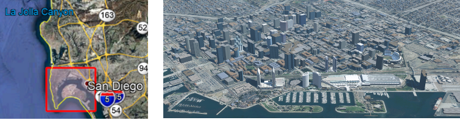

== Subject

The OGC Interoperable Simulation and Gaming Sprint advanced the use of relevant OGC and Khronos standards in the modeling and simulation community through practical exercise and testing of the OGC API - GeoVolumes draft specification produced by the https://docs.ogc.org/per/20-031.html[3D Data Container and Tiles API Pilot]. Of particular interest was the handling and integration of glTF models coming from multiple sources, but the sprint also examined the specification’s implementability, consistency, completeness, and maturity.

== Executive Summary

NOTE: (from Scott Serich to Leonard) The Finding section seemed particularly strong, so certainly create summary content from that section. But also include material from the Conclusion and Future Recommendations. I'd avoid going to deep into the weeds (for example, the content of the participant chapters, TIE table, etc.).

(( The Executive Summary clause shall contain the key findings and results in a concise form. A more detailed description of the findings should be in the body of the report. ))

=== Introduction

The Interactive Simulation and Gaming Sprint (Sprint) was undertaken by OGC to verify the results of the 3D Data Container and Tiles API Pilot (Pilot). The Pilot produced a GeoVolumes draft specification. The Sprint was specifically designed to test the coverage and consistency of the specification and with respect to other OGC APIs. It was expected that the Sprint would uncover no major issues with the GeoVolumes draft specficication, but would identify interoperability issues with multiple data stores and between other OGC APIs. The Sprint was not designed as a full-coverage verification and validation of the GeoVolume draft specfication.

An important component in the Sprint was the use of 3D models in graphics language transmission format (glTF cite:[glTF]). This format is of particular to OGC because of its emmergence as a common (i.e. de facto standard) web transmission model format. The format is developed and supported by the Khronos Group. The Khronos Group was a partner in the Sprint.

=== Operation

The Sprint project lasted six weeks, primarly during September 2020. The original plan called for a week-long in-person coding effort; however, due to the Covid-19 pandemic this was changed to a virtual effort with each participant providing thier own development support.

The dataset that was chosen for the Sprint is known as <<data-sets,San Diego CDB>>. 

[#img_SanDiegoOrientation,reftext='{figure-caption} {counter:figure-num}']
.The orientation images for the San Diego CDB dataset. The left image is an overhead shot of the San Diego coastline from La Jolla to the US/Mexico border. The red square indicates the data set region. The right image is a rendering of a portion of this dataset. Up is approximately north-east with the San Diego Convention Center at bottom center-right. The rendering was done by CAE.

The participants for the Sprint were (in alphabetical order): <<CAE>>, <<Cesium>>, <<Cognitics>>, <<Ecere>>, <<Helyx>>, <<Hexagon>>, <<InfoDao>>, <<SimBlocks>>, and <<Steinbeis>>. Most of the participants had participation experience with OGC prior projects.

The Call for Participation (CfP, cite:[SprintCfP]) provided three scenarios. Participants could also construct their own that fit within the guidelines of the Sprint. <<table-scenario-summary-count>> shows the number of participants working each scenario

[#table-scenario-summary-count,reftext='{table-caption} {counter:table-num}']
.A summary of the scenarios used during the Sprint. Scenarios 1-3 were in the Call for Proposals. Other-1 and Other-2 were proposed by Cognitics and SimBlocks, respectively. The total of the *Count* column exceeds the number of participants because some participants choose to work on more than one scenario.
[cols="^1,<5,^1",options="header",align="center"]
|===
|Scenario ^|Summary Desription ^|Count
   |1 
   | Investigate model and terrain updates
   | 5

   |2 
   | Investigate alternate and multiple distributions 
   | 2

   |3 
   | Investigate organization of underlying 3D data
   | 3

   |Other-1 
   | Investigate integration with Rapid3D (Full Motion Video)
   | 1

   |Other-2 
   | Investigate the integration of GeoVolumes API with Unity game engine
   | 1
|===

=== Accomplishments

All of the parrticipants worked together using each other's resources and expertise to augment their work. <<annex-a,Annex A: TIE Results>> shows the full results of their cooperative work testing their GeoVolumes API implementations and those of others.

Through this testing and development work undertaken as part of the Sprint, the participants tested a wide range of the GeoVolumes draft specification coverage. No serious defects were identified, nor were any major problems with correctness, completeness, or consistency reported.

==== Proficiencies
Significant results were reported:

* Use of a previously unused dataset (San Diego CDB) with the GeoVolumes API
* Hosting the GeoVolumes service on Amazon Web Services without issue
* Partial integration with OGC's SensorThings API 
* Dynamic update of models in the datastore
* Dynamic update of terrain used in the datastore
* Partial integration with Unity's game engine

==== Issues
As expected the Sprint identified several issues. Most of these were not with the GeoVolumes API, but the underlying support. One item that all participants noted and no solution was provided was the lack of an optimized conversion between the various data formats that were used. This included CDB, glTF, and OpenFlight.

It is very important to point out that participants innvestigated issues arising from differences between various OGC APIs. The finding was that the http://docs.opengeospatial.org/DRAFTS/20-024.html[OGC API - Common - Part 2: Geospatial Data] was a key document. Issues would arise if the  various functional specifications were inconsistent with that one. At the time of the investigation there were no inconsistencies had been discovered.

The issues with GeoVolumes were in the areas of definitions and use of URLs and HTTP requests and replies. These issues do not prevent the API from working, but differences may arise between different implementations because there is a lack of specificy on the part of the specification.

There were three items identified as involving <<URLs>>. Mostly it is a case of determining how the URL path end-point (final component of the path) is used to access specific data format. This is tied in with the issue noted in <<Media Type>>. A minor note is that the GeoVolumes draft specification is not completely clear on the server environment. An issue may arise if the server (the part of the system that provides the data through the API) is configured as a file server (responds to the `file` protocol).

Issues involving `HTTP` concern the use of <<Request Methods>>, <<Media Type>>, and <<Request Attributes>>. These issues do not prevent the API from working, but may cause some interoperability issues in larger-scale environments.

Issues with Request Methods address how a data change should be made to the datastore. Media yypes allow the client and server to communicate as to the format of the data. This interacts with the URL issues (above) by controlling how a specific format of data is requested and received. Request attributes assist in the means to specify alternate or roll-over data sources.

=== Recommendations

Seventeen recommendations were made for future work. These items are called projects, but may be a fairly short and small undertaking by a Domain or Standards Working Group or as part of another effort (Sprint, Pilot, Testbed, etc) within OGC. The items not part of OGC can be address through appropriate joint projects or liaison arrangements with the external organizations/groups.

These range from projects external to OGC (four projects) generally carried out by other organizations or community efforts, three data based projects (generally conversion from one format to another), three projects to enhance the GeoVolumes API, four projects to develop a clear definition of feature (model or terrain) change (part to HTTP Request Method discussed above), and three on API infrastructure (most of the URL and HTTP issues described above).

'''

===	Document contributor contact points

All questions regarding this document should be directed to the editor or the contributors:

*Contacts*
[width="80%",options="header",caption=""]
|====================
| Name | Organization | Role
| Leonard Daly | Daly Realism representing Khronos Group  | Contributor & Editor
| Holly Black | CAE | Contributor
| Sean Lilley | Cesium | Contributor
| Michala Hill | Cognitics | Contributor
| Jerome St-Louis | Ecere | Contributor
| Anneley Hadland | Helyx | Contributor
| Emeric Beaufays | Hexagon | Contributor
| Joshua Rentrope | InfoDao | Contributor
| Jordan Dauble   | SimBlocks.io | Contributor
| Patrick Caughey | SimBlocks.io | Contributor
| Barbara Cotter  | SimBlocks.io | Contributor
| Glenn Johnson   | SimBlocks.io | Contributor
| Joseph Kaile    | SimBlocks.io | Contributor
| Volker Coors                    | Steinbeis, HFT Stuttgart | Contributor
| Thunyathep Santhanavanich (Joe) | Steinbeis, HFT Stuttgart | Contributor
| Harpreet Singh                  | Steinbeis, HFT Stuttgart | Contributor
| Patrick Würstle                 | Steinbeis, HFT Stuttgart | Contributor
| Scott Serich | Open Geospatial Consortium | Contributor & Editor
|====================

// *****************************************************************************
// Editors please do not change the Foreword.
// *****************************************************************************
=== Foreword

Attention is drawn to the possibility that some of the elements of this document may be the subject of patent rights. The Open Geospatial Consortium shall not be held responsible for identifying any or all such patent rights.

Recipients of this document are requested to submit, with their comments, notification of any relevant patent claims or other intellectual property rights of which they may be aware that might be infringed by any implementation of the standard set forth in this document, and to provide supporting documentation.
