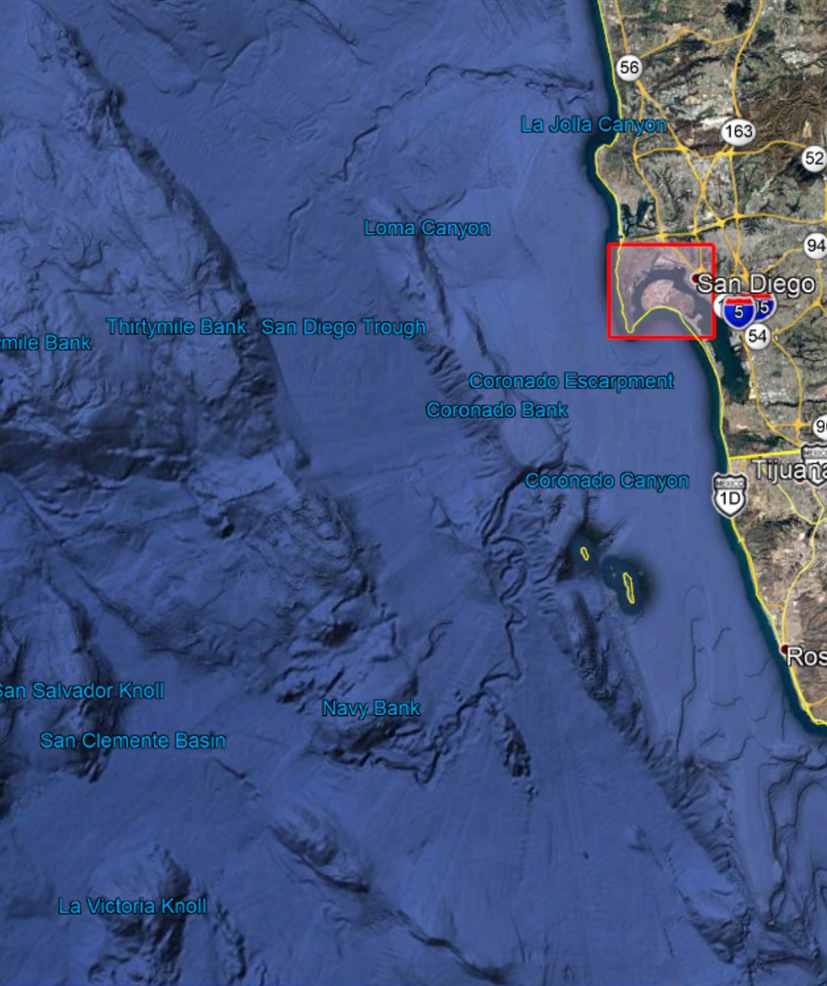
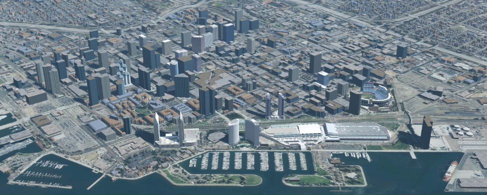

[[SetupOverview]]
== Material and Purpose

=== Call for Participation

The https://portal.ogc.org/files/?artifact_id=94059[ISG Sprint: Call for Participation] (CfP) cite:[SprintCfP] was released on 7 July 2020 by Open Geospatial Consortium for the purpose of obtaining proposals from organizations interested in furthering study of the GeoVolumes draft specification cite:[GeoVolumesAPI]. The CfP provided all of the material necessary for organizations to make a proposal for participation either by direct inclusion in the document or publicly available links.

The CfP specified a schedule from kickoff meeting (1 September) through the Sprint Week (21-25 September), and participant final report inputs (5 October). The Sprint was originally desired to be in-person; however, pandemic lockdown restrictions required that all participant work be done remotely during the sprint week. This decision was made prior to the due date for proposals.

=== Data Sets

The primary data set for the Sprint is known as San Diego CDB. It was collected using a number of sensors and methods from <start> to <end> and encompassed nearly all of the downtown San Diego and vicinity, including the port, sports stadium, recreational facilities, commercial, and housing areas.

[#img_SanDiegoOverview,reftext='{figure-caption} {counter:figure-num}']
.An  overview of the coverage of the San Diego CDB V4.1. It is a single geocell with the southwest corner at N33 V118.

[#img_SanDiegoRendered,reftext='{figure-caption} {counter:figure-num}']
.A rendering of a portion of this dataset. Up is approximately north-east with the San Diego Convention Center at bottom center-right. The rendering was done by CAE.

All participants could elect to use other datasets, particularly any of those from the https://www.ogc.org/projects/initiatives/3dt[OGC 3D Data Container and Tiles API Pilot] (aka Pilot) cite:[PilotExperiences,GeoVolumesAPI,ExtendedExecutiveSummary]. In particular, much use was made of the New York data set.

[#img_NewYorkRendered,reftext='{figure-caption} {counter:figure-num}']
.A rendering of a portion of the New York City dataset. The rendering was done by InfoDao using the Ecere data server.
image::images/InfoDao/ecereNewYorkPassing.png[width=800,align="center"]

The San Diego CDB was available for download by all participants. Many of the participants made that data available to all participants through the GeoVolume API on their servers. New York data was also made available through multiple APIs implemented during the Pilot. See <<table->> for a list of available servers.

=== 3D GeoVolume Servers

Several of the Sprint participants also participated in the Pilot. These organizations provided their GeoVolumes API servers for use to everyone during the Sprint. These servers were generally populated with both the New York and San Diego data.

[#table_summary-servers,reftext='{table-caption} {counter:table-num}']
.Servers providing GeoVolume API access to the indicated dataset
[cols="2,4,8a",options="header",align="center"]
|===
|*Organization* |*URL*  |*Notes*
|Cesium |https://3d.hypotheticalhorse.com | Server
|Cesium | https://map.hypotheticalhorse.com/ | Client
|Cognitics |http://cdb.cognitics.net:3000/ | _n/a_
.2+|Ecere | http://maps.ecere.com/ogcapi |/collections/SanDiegoCDB in particular, with Tiles API and GeoVolumes/3D Tiles
 |https://maps.ecere.com/3DAPI/ |New York City 3D Tiles dataset (static server)
|Helyx |http://helyxapache2.eastus.azurecontainer.io/ | _n/a_
|InfoDao |http://pygeoapi.isg-sprint-hub.infodaollc.com/stac | PyGeoAPI serving San Diego and Copenhagen CDB (base url has rest of API)
|Skymantics |http://13.82.99.186:5050/ | _n/a_
.4+|Steinbeis |https://steinbeis-3dps.eu/3DGeoVolumes | New Steinbeis 3D GeoVolumes server for OGC-ISG
 |http://steinbeis-3dps.eu:8080/3DContainerTile/ | Existing Steinbeis 3D GeoVolumes server from the 3D Container and Tiles pilot, containing New York City 3D Tiles dataset, New York City I3S dataset
 |http://steinbeis-3dps.eu/STT3DClient/ |STT 3D Client (based on CesiumJS & ArcGIS for JavaScript)
 |https://ogc3dc.igd.fraunhofer.de/ |STT 3D Client (by Fraunhofer and GeoRocket)
|===

=== GeoVolume API Pilot Engineering Report

The three 3D Data Container and Tiles API Pilot engineering reports (collectively referred to as "Pilot ER") cite:[PilotExperiences,GeoVolumesAPI,ExtendedExecutiveSummary] were made available to all participants prior to kickoff. Subsequent to the start of the Sprint, the Pilot ER was made publicly available. The draft specification is part 2 cite:[GeoVolumesAPI] of the document set. This contained the API specification that was the primary target of the Sprint.

=== Architecture diagrams

These architecture diagrams were provided with the CfP. Figure <<#img_ServiceArchitecture>> illustrate the service architecture of the 3D Data Container and Tiles environment that includes the GeoVolume API. Figure <<#img_ResourceArchitecture>> illistrates access to city-based datasets (in particular for New York, US and Montreal, CA), but only showing the detail for New York City.

[#img_ServiceArchitecture,reftext='{figure-caption} {counter:figure-num}']
.The architecture of the various Pilot capabilities is shown with connecting arrows indicating request flow. Each client has a built-in Globe model that provides a base coordinate system for all additional data.
image::images/OGC-Pilot-ServiceArchitecture.jpg[width=600,align="center"]

Arrows show the potential paths of requests from the clients; data flow is in the reverse direction. The connecting lines indicate conceptual requests and data flows. The actual connections may be distributed across several physical devices.

[#img_ResourceArchitecture,reftext='{figure-caption} {counter:figure-num}']
.Pilot data architecture illustrating access to datasets for two North American cities (Montreal and New York). The architecture supporting New York City is shown in detail.
image::images/OGC-Pilot-ResourceArchitecture.jpg[width=600,align="center"]

This figure is presented as an illustration of possible connections. It is not intended to be a complete illustration of all connections, nor possible data sets.

=== Discussion of Scenarios

The CfP described three possible scenarios cite:[SprintCfP]. Participants could choose to work on any number of these, any variant of these, or one (or more) of their choosing.

. Investigate how model and terrain updates, originating (preferred) from a CDB data store and delivered as glTF, are integrated with 3D Tiles into the client environment. The questions to be examined should include:
.. How are terrain changes handled with existing structures?
.. How are new models integrated with existing elevation terrain?
.. How are existing models handled when CDB updates indicate change (additions/deletions/configurations)?

. Containers may specify 0 or 1 datasets. A dataset indicates a primary and potentially one or more alternate distributions. Investigate whether there are implementation issues with accessing multiple distributions.

. What should be the organization of the underlying 3D data? It is unlikely that there is a single best solution to these problems, so identifying use cases for particular choices will be important.
.. Is there one bounding volume hierarchy per county, region, city, or some other geo-political boundaries?
.. How are features (buildings, vegetation, transportation networks, etc.) structured in the data store? Are they layers in geo-political sets, or are geo-political data layers in feature sets?

These scenarios were designed to test and explore portions of the draft GeoVolumes specification that OGC and the sponsors felt were not sufficiently explored in the Pilot. They derive directly from the discussion from Chapter 10 of the Extended Executive Summary cite:[ExtendedExecutiveSummary]. In addition to the listed scenarios, participants were invited to explore other areas that fit within the opportunities described in Chapter 10. Some of the participants did use this option to explore other capabilities, especially related to game-engine integration. The Findings chapter of this report discusses the participant's scenario choices.
