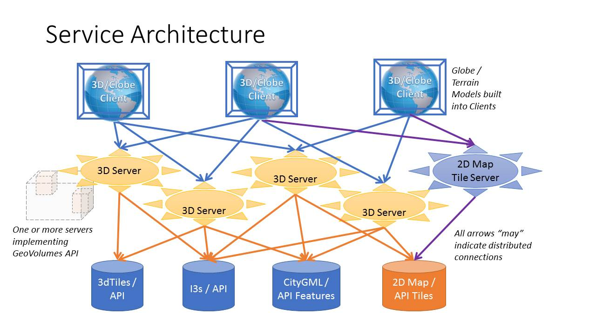
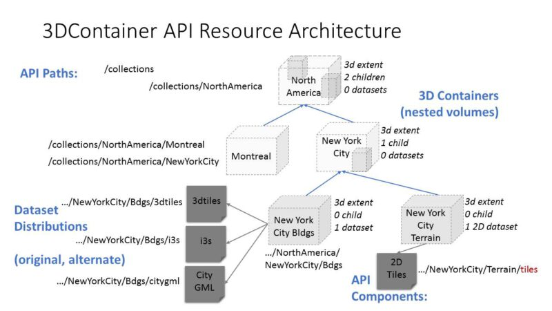

[[Overview]]
== Overview

[NOTE]
.Instructions
====
This section describes everything that was used to set up the Sprint. It either includes directly or by reference all material that the participants had available to them. There was nothing hidden from the participants.
====

=== Call for Participation

The "ISG Sprint: Call for Participation (CfP)" [^1] was released on 7 July 2020 by Open Geospatial Consortium for the purpose of obtaining proposals from organizations interested in furthering study of the GeoVolumes draft specification [^2b]. The CfP provided all of the material necessary for organizations to make a proposal for participation either by direct inclusion in the document or publicly available links.

The CfP specified a schedule from kick off meeting (1 September) through the Sprint Week (21-25 September), and final report (5 October). The Sprint was originally desired to be in-person; however, the epidemic required that all work be done in the participants own facilities during the alloted week. This decision was made prior to the due date for proposals.

=== Data Sets

The primary data set for the Sprint is known as San Diego CDB. It was collected using a number of sensors and methods from <start> to <end> and encompased nearly all of the downtown San Diego and vacinity, including the port, sports stadium, recreational facilities, commercial, and housing areas.

[NOTE]
====
_A picture of this would be really good (probably necessary)._
====

All participants could elect to use other datasets, particularly any of those from the OGC 3D Data Container and Tiles API Pilot (aka Pilot) [^2abc]. In particular much use was made of the New York data set.

[NOTE]
====
_A picture of this would be nice._
====

The San Diego CDB was available for download by all participants. The Pilot Net York data was available through multiple servers built during the Pilot using the API from the Pilot.

=== 3D GeoVolume Servers

Several of the Sprint participants also participated in the Pilot. These organizations provided their GeoVolumes API servers for use to everyone during the Sprint. These servers were generally populated with both the New York and San Diego data. 

[NOTE]
====
_A list/table of the available servers._
====

=== GeoVolume API Pilot Engineering Report

The entirity of the 3D Data Container and Tiles API Pilot engineering report (aka Pilot ER)[^2abc] was made available to all participants prior to the kick off meeting. Subsequent to the start of the Sprint, the Pilot ER was made publicly available. The draft specification is part 2 [^2b] of the document set. This is the API specification that is the primary target of the Sprint.

=== Architecture diagrams

These architecture diagrams were provided with the CfP. Figure <<#img_ServiceArchitecture>> illustrate the service architecture of the 3D Data Container and Tiles environment that includes the GeoVolume API. Figure <<#img_ResourceArchitecture>> illistrates access to city-based datasets (in particular for New York, US and Montreal, CA), but only showing the detail for New York City. 

[#img_ServiceArchitecture,reftext='{figure-caption} {counter:figure-num}']
.The architecture of the various Pilot capabilities is shown with connecting arrows indicating request flow. Each client has a built-in Globe model that provides a base coordinate system for all additional data.

Arrows show the potential paths of requests from the clients; data flow is in the reverse direction. The connecting lines indicate conceptual requests and data flows. The actual connections may be distributed across several physical devices. 

[#img_ResourceArchitecture,reftext='{figure-caption} {counter:figure-num}']
.Pilot data architecture illustrating access to datasets for two North American cities (Montreal and New York). The architecture supporting New York City is shown in detail.

This figure is presented as an illustration of possible connections. It is not intended to be a complete illustration of all connections, nor possible data sets.

=== Discussion of scenarios

The CfP described three possible scenarios. Participants could choose to work on any number of these, any variant of these, or one (or more) of their choosing. The three provided scenarios were [^1]:

. Investigate how model and terrain updates, originating (preferred) from a CDB data store and delivered as glTF, are integrated with 3D Tiles into the client environment. The questions to be examined should include:
.. How are terrain changes handled with existing structures?
.. How are new models integrated with existing elevation terrain?
.. How are existing models handled when CDB updates indicate change (additions/deletions/configurations)?

. Containers may specify 0 or 1 datasets. A dataset indicates a primary and potentially one or more alternate distributions. Investigate whether there are implementation issues with accessing multiple distributions.

. What should be the organization of the underlying 3D data? It is unlikely that there is a single best solution to these problems, so identifying use cases for particular choices will be important.
.. Is there one bounding volume hierarchy per county, region, city, or some other geo-political boundaries?
.. How are features (buildings, vegetation, transportation networks, etc.) structured in the data store? Are they layers in geo-political sets, or are geo-political data layers in feature sets?

=== References (move to Bibliography Annex)
* ^1: https://portal.ogc.org/files/?artifact_id=94059[ISG Sprint: Call for Participation]
* ^2: OGC 3D Data Container and Tiles API Pilot Engineering Report
** a: https://portal.ogc.org/files/?artifact_id=94028[D001 3D Data Container ER (aka Pilot Implementation Experiences)]
** b: https://portal.ogc.org/files/?artifact_id=94029[D002 OGC API GeoVolumes ER (aka Draft Specification)]
** c: https://portal.ogc.org/files/?artifact_id=94030[D003 Pilot Summary ER (aka Extended Executive Summary)]