== CAE

=== Introduction
The focus of the analysis of data was centered upon the generation of 3D Tiles and glTF models from a CDB data store. This activity
exercised the National Geospatial Intelligence Agency's Foundation in GEOINT 3D (FG3D) pipeline and the United States Special 
Operation Command Rapid 3D (R3D) architecture. The resultant data was reviewed for anomalies encountered with those 3D formats 
from the original CDB content. 

*CAE High Level Workflow*
[#img_CAE-1,reftext='{figure-caption} {counter:figure-num}']
._Need caption_
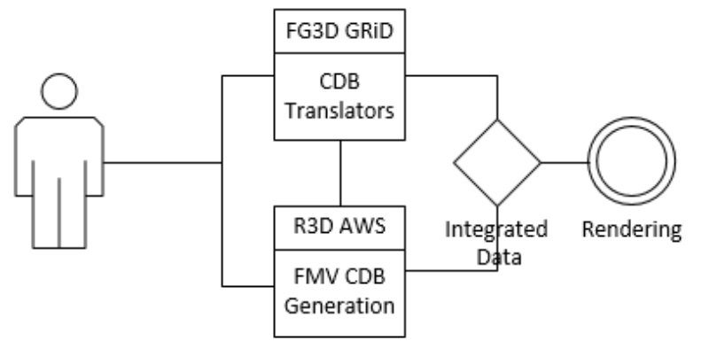

////
[CAE High Level Workflow]
////

=== Data
CAE provided the San Diego v4.1 CDB for participant use in the OGC ISG Sprint.

The San Diego CDB v4.1 is a single geocell (1° latitude by 1° longitude) with the southwest corner at N33 W118.
The CDB coverage is considered Medium Resolution and contains a High Resolution inset in the San Diego area.

*CAE San Diego Coverage*
[#img_CAE-2,reftext='{figure-caption} {counter:figure-num}']
._Need caption_
image::images/CAE_CDB_SD_coverage.png[width=400,align="center"]

////
image::images/CAE_CDB_SD_coverage.png[400,400,align="center"][CAE San Diego Coverage]
////

The CDB dataset contained elevation (GeoTIFF), imagery (jpeg2000), 3D models with textures (Openflight), road and hydrography 
vectors (ESRI shapefiles). The 3D models were a mixture of GSFeature and GTFeature representations.  
The base imagery is populated in the high resolution area to CDB Level of Detail 9; equivalent to 0.0212354 meter resolution.

*CAE San Diego High Resolution Area Views*
[#img_CAE-3,reftext='{figure-caption} {counter:figure-num}']
._Need caption_
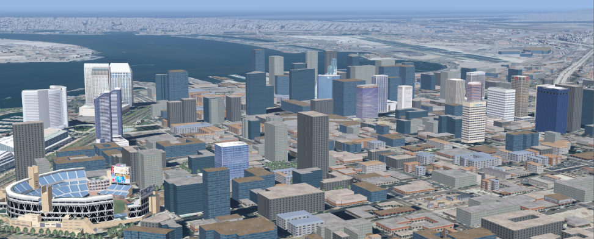

////
[CAE San Diego High Resolution Area Views]
////

*_Need title_*
[#img_CAE-4,reftext='{figure-caption} {counter:figure-num}']
._Need caption_
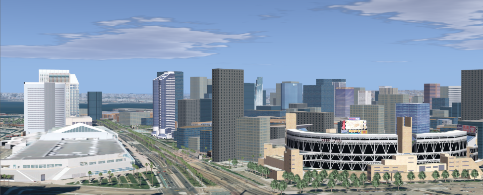

////

////

*_Need title_*
[#img_CAE-5,reftext='{figure-caption} {counter:figure-num}']
._Need caption_
image::images/CAE_CDB_SD_HighRes4.png[width=800,align="center"]

////
image::images/CAE_CDB_SD_HighRes4.png[800,800,align="center"]
////

The dataset was created with open source data provided by the United States Geological Survey and the San Diego Geographic
Information Source.

=== Workflows
From the full CDB geocell, a smaller subset of data was used as a focus for this analysis.

.Focus Area Bounding Box
|===
| |
|Northwest Corner N32.710 W117.167
|Northwest Corner N32.710 W117.153

|Southwest Corner N32.702 W117.167
|Southeast Corner N32.702 W117.153
|===

*_Need title_*
[#img_CAE-6,reftext='{figure-caption} {counter:figure-num}']
._Need caption_
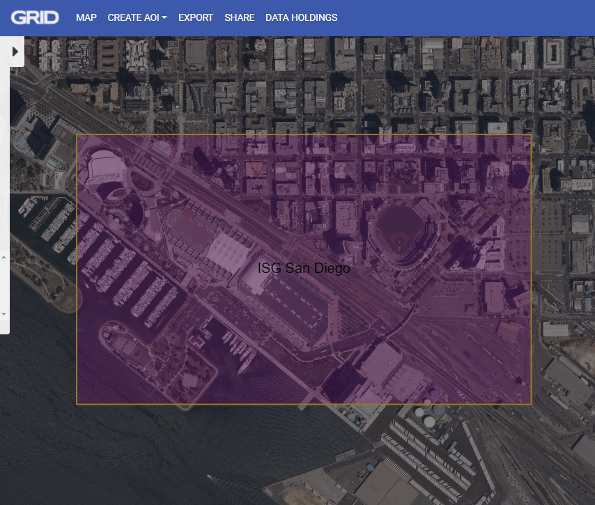

////

////

Two independent workflows were employed for CDB data generation and conversion.  One for the translation of CDB datasets to 3D Tiles.  The other for the creation of a new CDB Openflight model from full motion video converted to glTF.

*CAE Data Production Workflow*
[#img_CAE-7,reftext='{figure-caption} {counter:figure-num}']
._Need caption_
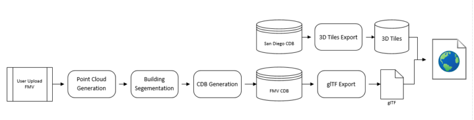

////
[CAE Data Production Workflow]
////

==== CDB to OGC 3D Tiles
The CDB to 3D tile workflow utilized a FG3D 3D Tile microservice initiated from within the Rapid3D architecture.  

*CAE R3D 3D Tile CDB Conversion*
[#img_CAE-8,reftext='{figure-caption} {counter:figure-num}']
._Need caption_
image::images/CAE_R3D_workflow1.JPG[width=800,align="center"]

////
image::images/CAE_R3D_workflow1.JPG[300,300,align="center"][CAE R3D 3D Tile CDB Conversion]
////

The CDB data was hosted in an S3 container on the Amazon Web Service Cloud.  The conversion was conducted within the AWS environment.

The newly created 3D Tiles were shared with other experiment participants for their testing purposes.

==== FMV to CDB to glTF
The generation of the glTF 3D model began by uploading full motion video (FMV) via the R3D browser user interface.  Microservices were invoked within the R3D AWS environment
generating a point cloud from the FMV, segmenting the point cloud to and independent single model geometry, and then creating a CDB compliant Openflight model.

The model was then translated to glTF format using an FG3D data translator for glTF.

*CAE glTF Translation and Export*
[#img_CAE-9,reftext='{figure-caption} {counter:figure-num}']
._Need caption_
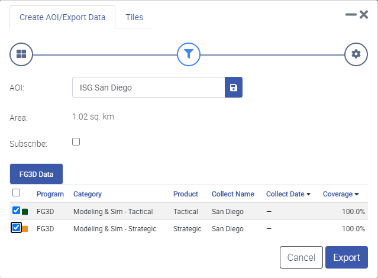

////
[CAE glTF Translation and Export]
////

The 3D Tiles and the glTF model were then brought together for rendering.  The glTF model was geopositioned at coordinate N32.704 W117.164 in order to reside
within the same San Diego focus area for the experiment. 

=== Analysis
Original CDB content rendered in Presagis VegaPrime shows no apparent content loss once the data was converted to 3D Tile.
The comparison was made as rendered in Cesium ion and Cognitics Dragonfly.

.CDB Displayed in VegaPrime
[caption="Figure: "]

*CAE CDB VegaPrime*
[#img_CAE-10,reftext='{figure-caption} {counter:figure-num}']
._Need caption_
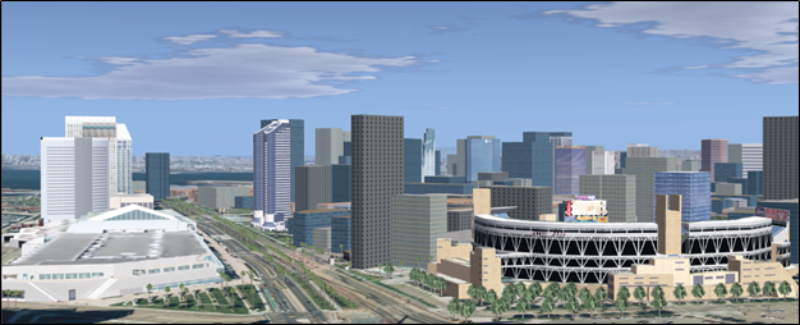

////
[CAE CDB VegaPrime]
////

.3D Tiles Displayed in Cesium ion
[caption="Figure: "]

*AE 3D Tiles Cesium Ion*
[#img_CAE-11,reftext='{figure-caption} {counter:figure-num}']
._Need caption_
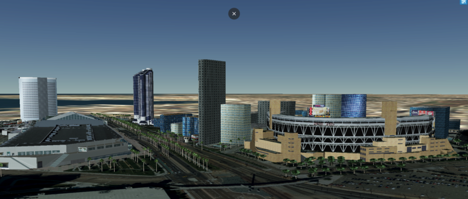

////
[CAE 3D Tiles Cesium Ion]
////

.3D Tiles Displayed in Cognitics Dragonfly
[caption="Figure: "]

*CAE 3D Tiles Dragonfly*
[#img_CAE-12,reftext='{figure-caption} {counter:figure-num}']
._Need caption_
image::images/CAE_CDB_sd_petco_dragonfly.png[width=800,align="center"]

////
image::images/CAE_CDB_sd_petco_dragonfly.png[align="center"][CAE 3D Tiles Dragonfly]
////

Our initial 3D Tile rendering in Dragonfly appeared too dark compared to the original content and surrounding basemap. To mitigate the noticeable difference in brightness 
the Cesium3DTileset object was created with the property imageBasedLightingFactor: new Cesium.Cartesian2(5,5) set. 
 
*CAE 3D Tile Dark Rendering*
[#img_CAE-13,reftext='{figure-caption} {counter:figure-num}']
._Need caption_
image::images/CAE_tile dark.JPG[width=500,align="center"]

////
image::images/CAE_tile dark.JPG[500,500,align="left"][CAE 3D Tile Dark Rendering]
////

*CAE 3D Tile Modified Rendering*
[#img_CAE-14,reftext='{figure-caption} {counter:figure-num}']
._Need caption_
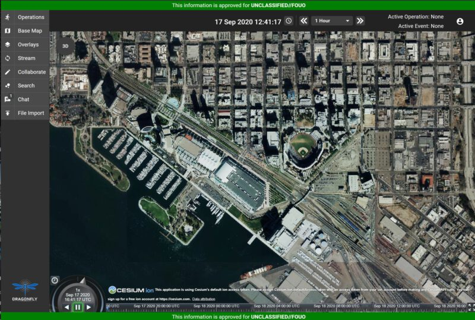

////
[CAE 3D Tile Modified Rendering]
////

The glTF model generated using FMV source was visually no different then the CDB Openflight model.

.Full Motion Video Source

*CAE Full Motion Video Source*
[#img_CAE-15,reftext='{figure-caption} {counter:figure-num}']
._Need caption_
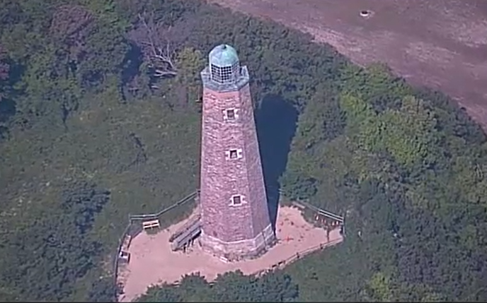

////
[caption="Figure: "]
[CAE Full Motion Video Source]
////

.glTF Model From FMV

*CAE glTF Model*
[#img_CAE-16,reftext='{figure-caption} {counter:figure-num}']
._Need caption_
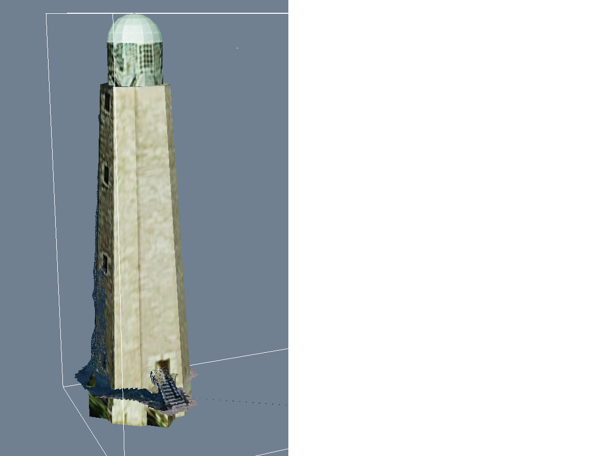

////
[caption="Figure: "]
[CAE glTF Model]
////

Our original CDB to glTF convertor utilized in the FG3D data translation service, placed all textures associated with the glTF in a subfolder.  This proved problematic for several
of the glTF rendering platforms we used to very glTF compliance.  Therefore, modifications were completed to collocate the textures with the model geometry.

The final result of placing the glTF model in the 3D Tile scene required manual editing for geopositional placement.  In CDB a corresponding shapefile would provide the 
positioning information for transmission.

*CAE glTF Rendered in Dragonfly with 3D Tiles*
[#img_CAE-17,reftext='{figure-caption} {counter:figure-num}']
._Need caption_
image::images/CAE_CDB_dragonfly_lighthouse.png[width=800,align="center"]

////
image::images/CAE_CDB_dragonfly_lighthouse.png[align="center"][CAE glTF Rendered in Dragonfly with 3D Tiles]
////

=== Recommendations

- Further analysis and consideration needs to be conducted in the following areas.
- Assess the accuracy, data loss, or resolution degradation of the conversion of CDB content to 3D Tiles.
- A common method for storing and transmitting the geoposition information for glTF models
- Deconfliction of CDB or 3D Tile data when a new glTF model is added to a scene or datastore
- 3D rendering performance of large scale content of glTF models
- Development of a robust batch converter of CDB models to glTF complete with geolocation information
