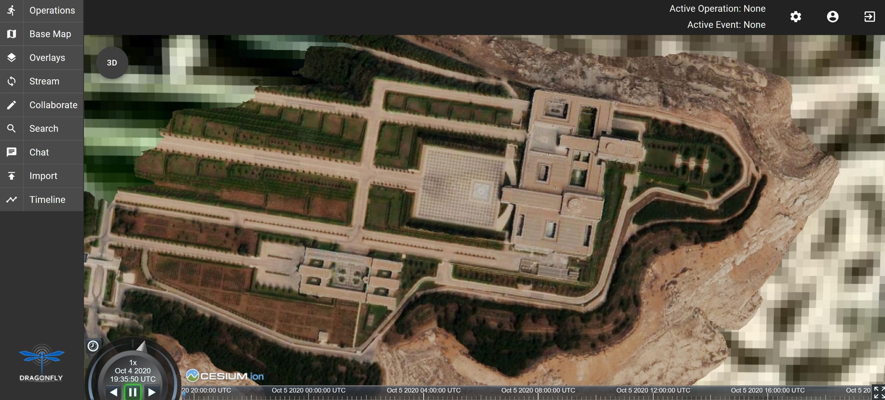
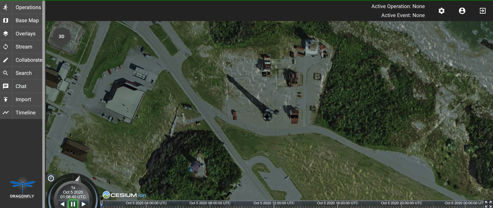
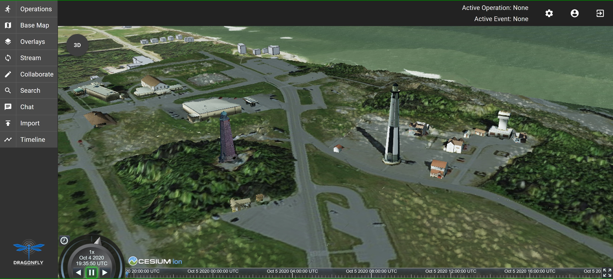

== Cognitics Sprint Report

=== Abstract
In cooperation with CAE and Cesium, we used GeoVolumes to enhance integration between our Global Situational Awareness (GSA) and Rapid3D (R3D) efforts. The current phase of the GSA effort has produced a prototype infrastructure/service called Dragonfly.

Within Dragonfly, a user has the ability to send full motion video (FMV) into Rapid3D for the generation of 3D content. When a production task has completed, Rapid3D provides the content back into Dragonfly for visualization in 2D and 3D (Cesium).

Currently, all content produced in this manner is incorporated into the visualization. It lacks any method for organizing the content for user filtering.

In this Sprint, we:

* Implemented a GeoVolumes service providing Rapid3D result content.

* Implemented a GeoVolumes client in the Dragonfly web interface, allowing a user to select content based on source or geographic area.

This provides a realistic scenario for the Sprint while also solving a real SOCOM need.

=== Architecture

Drgonfly is deployed in the commercial Amazon Web Services cloud as a series of Docker containers.  The Dragonfly web based user interface supports 2D and 3D content and is currently hosted at https://dragonfly.caeusa.com/. The Dragonfly datastore contains both static 3D content and processed content from Rapid3D which is indexed using GeoVolumes and filtered by a visible bounding box. Dragonfly utilizes GeoServer for 2D streaming and Cesium Ion for streaming of 3D Tiles.  Ion is a robust, scalable, and secure platform for 3D geospatial data that optimizes and tiles it for the web, serves it up in the cloud, and streams it to any device. Cesium 3D content shown in Dragonfly includes Cesium World Terrain, and Cesium OSM Buildings. PostgreSQL/PostGIS, OGC CDB, 3D Tiles are all used for data storage.

[#img_Cognitics-1,reftext='{figure-caption} {counter:figure-num}']
.High level system architecture for Dragonfly
image::images/CogniticsArchitectureDiag.PNG[width=400,align="center"]

Dragonfly utilizes the GeoVolumes API for selection and of 3D content based on bounding box, rather than displaying all content at all zoom levels. While in 3D view, GeoVolumes is displayed under Overlays in the Main Menu.

[#img_Cognitics-2,reftext='{figure-caption} {counter:figure-num}']
.Dragonfly user interface (UI) in 3D mode, showing GeoVolumes in menu
image::images/CogniticsDragonflyGeoVolumes.png[width=800,align="center"]

When the user is zoomed out to the globe level, the effective bounding box is the entire globe, and all available GeoVolumes overlays are displayed in the table of contents.

[#img_Cognitics-3,reftext='{figure-caption} {counter:figure-num}']
.Dragonfly in 3D mode showing all available GeoVolume overlays.
image::images/CogniticsDragonflyGlobe.png[width=800,align="center"]

As the user zooms in, the bounding box encompasses only the area shown in the user interface and only the corresponding GeoVolumes overlays are shown.  In the figure below, the bounding box includes Beirut and Damascus.  When the user hovers over a GeoVolumes overlay, the extent of that overlay is highlighted, as seen in the figure below of the Damascus overlay.

[#img_Cognitics-4,reftext='{figure-caption} {counter:figure-num}']
.Damascus bounding box extent highlighted
image::images/CogniticsDragonflyDamascus.png[width=800,align="center"]

=== Damascus, Syria Vricon SurfaceMesh

The Vricon SurfaceMesh of Damascus, Syria is static 3D content in the Dragonfly datastore. The figures below show the data in directly overhead and oblique views.

[#img_Cognitics-5,reftext='{figure-caption} {counter:figure-num}']
.Overhead view of Vricon SurfaceMesh in Dragonfly.

[#img_Cognitics-6,reftext='{figure-caption} {counter:figure-num}']
.Oblique view of Vricon SurfaceMesh in Dragonfly.
image::images/CogniticsDragonflyDamascus3.png[width=800,align="center"]

=== Fort Story Rapid 3D Data

The Fort Story dataset is constructed from full motion video (FMV) that has been uploaded via the Dragonfly user interface and sent through the Rapid3D process to generate the 3D content.  The figures below show the data in directly overhead and oblique views.

[#img_Cognitics-7,reftext='{figure-caption} {counter:figure-num}']
.Overhead view of Rapid 3D Fort Story lighthouse dataset.

[#img_Cognitics-8,reftext='{figure-caption} {counter:figure-num}']
.Oblique view of Rapid 3D Fort Story lighthouse dataset.

