== Component Implementation: Ecere

[#Ecere-Client-0,reftext='{figure-caption} {counter:figure-num}']
.San Diego CDB data visualized in Ecere's GNOSIS Cartographer (Petco Park)
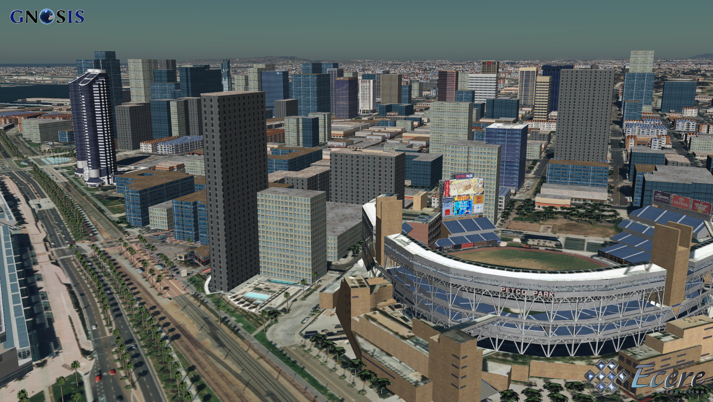

=== Overview

In the OGC Interoperable Simulation and Gaming Sprint, Ecere improved its _GeoVolumes API_ service implementation, based on its
GNOSIS Map Server. Some issues were resolved with the CDB importing process. The 3D Tiles tileset generation was improved with support for textures.
Caching and other optimizations were also implemented to achieve better performance.
Other Sprint participants were able to successfully access and display the 3D data from the San Diego CDB served by the service.

Ecere, in collaboration with Steinbeis, also investigated a mechanism to update 3D content, such as adding, removing or updating 3D models,
based on the _Simple Transactions_ extension defined for the _OGC API - Features_ specifications.

Although Ecere focused on the server-side aspect during the ISG Sprint,
some performance improvements were still made to the client to better deal with the large dataset used.

In this report, Ecere also presents some considerations for the standardization of the _GeoVolumes API_ based on its experience as both
client and server developers, as well as involvement in other OGC Innovation and Standards Program activities.

==== Components Wiring Architecture

[#Ecere-Architecture,reftext='{figure-caption} {counter:figure-num}']
.Connectivity and APIs between Ecere and other participants components
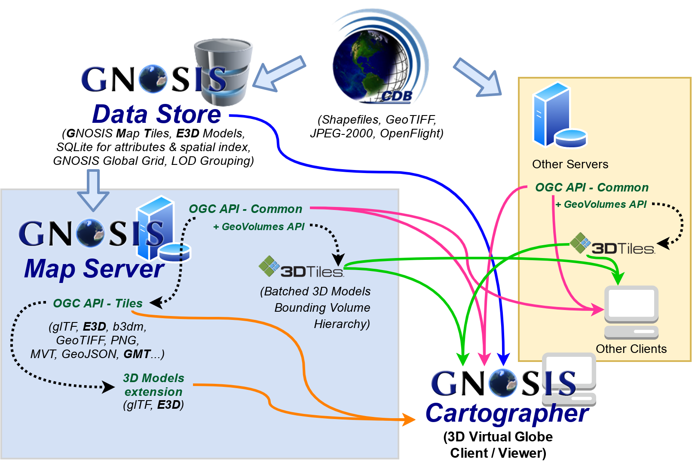

=== Server Implementation

The server provided by Ecere is based on its GNOSIS Map Server which implements support for the new OGC API family of standards.
The _GeoVolumes API_ defines the bridge between the _OGC API - Common - Part 2: Geospatial data_ and 3D data.
This 3D data is typically defined as Bounding Volume Hierarchy to facilitate culling out data outside the view frustum
as well as to retrieve and display the right amount of detail. This is the case with both the 3D Tiles and i3s OGC Community Standards.
However the same _collection_ of data could also be accessed using other OGC API specifications, such as _Features_ and _Tiles_,
as demonstrated in this implementation.
The GNOSIS Map Server implementation currently support generation of 3D Tiles on-the-fly from a source data store.

==== Improvements to CDB preprocessing

[#Ecere-Preprocessing,reftext='{figure-caption} {counter:figure-num}']
.Preprocessing step to import CDB into GNOSIS Data Store


Ecere's dynamic 3D data server is based on the GNOSIS Map Server, which can serve data from a number of data stores (e.g. GeoPackages),
but works best with the data optimized to its native http://docs.opengeospatial.org/per/17-041.html#_gnosis_data_store_to_hold_vector_raster_or_gridded_coverage_with_shared_tiling_structure[GNOSIS Data Store].
Content is stored in a way which bears many similarities with CDB, except the https://maps.ecere.com/ogcapi/tileMatrixSets/GNOSISGlobalGrid[GNOSIS Global Grid] is used for tiling, which compared to the
https://maps.ecere.com/ogcapi/tileMatrixSets/CDBGlobalGrid[CDB Global Grid] (i.e. CDB Zones and Level of Details), better approximates equal area for polar regions, and features more practical sizes for overview tiles.
Another advantage of the GNOSIS Data Store is grouping of Level of Details to balance file size and file count.
Both of these improvements, along with embracing GeoPackage and extensions, are being considered for a future revision of the CDB standard.
In the latest version of the GNOSIS Data Store, a SQLite database is used for attributes and spatial indexing, while tiled geometry (encoded according
to the https://docs.ogc.org/per/18-025.html#GMTSpecs[GNOSIS Map Tiles specifications]) is stored in
http://manpages.ubuntu.com/manpages/focal/man1/ear.1.html[Ecere archives].
For 3D models, point geometry tiles encode 3D positions, orientations, scaling and model identifiers to instantiate 3D models.
The 3D models themselves are encoded following the https://docs.ogc.org/per/18-025.html#E3DSpecs[E3D specifications].

Ecere's GNOSIS Cartographer can import CDB to a GNOSIS Data Store in a preprocesing step.
Issues with this process were identified and resolved during the Sprint.
Among these issues, one caused an inconsistent data store, which resulted in broken links from the _Features API_ access to the 3D buildings data.

==== Improvements to 3D Tiles generation

[#Ecere-3DTilesGeneration,reftext='{figure-caption} {counter:figure-num}']
.Generating Batched 3D Models 3D Tiles on demand
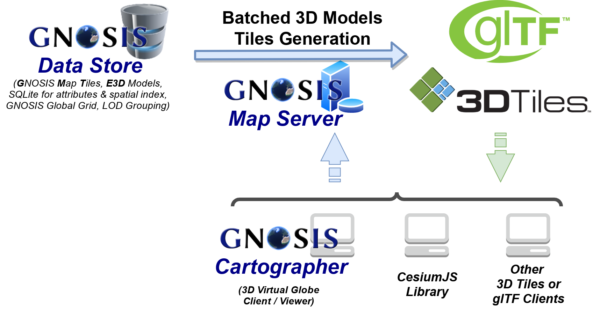

===== Improved functionality

One important improvement made to the 3D Tiles and glTF generation for the Sprint is support for textures, including referencing shared external textures
to minimize the amount of texture memory required, since many buildings in the San Diego CDB dataset re-use the same textures.

Another improvement concerned avoiding to list empty tiles in the tilesets, which resulted in error mesages being printed out in the CesiumJS console when
the library attempted to load these tiles and received an empty file.

The testing by other participants during the Sprint allowed us to identify and resolve other issues with the dymamic 3D data server.
This was a welcomed opportunity as this dynamic server was not ready in time for Technology Integration Experiments during the _3D Container & Tiles_ Pilot.

It was originally planned to improve additional aspects of the 3D Tiles tileset generation,
such as generating multiple Level of Details and improving the accuracy of the bounding volumes,
but as there was not enough time to complete this during the Sprint, it will be the subject of further development.

===== Vertical datum implications of CDB and 3D Tiles

Ecere also grasped a better understanding of the vertical datum implications of CDB and 3D Tiles, clarifying with the help of other participants that
the elevation model is always relative to the WGS84 ellipsoid. However, for the generated 3D Tiles of 3D models from the San Diego CDB to sit properly
on the CesiumJS world terrain mesh (a terrain provider created by the _Cesium.createWorldTerrain()_ method), the ECF coordinates translation tranformation for the 3D Tiles specified in the tileset
had to be based on the geoid (i.e. adding the geoid offset from the ellipsoid). This seems odd, as it would have been expected to be based on the ellipsoid,
since CDB elevation, and all transforms are Earth centric. It is still not clear whether this is an issue with the San Diego CDB, with the CesiumJS
_worldTerrain_ terrain provider, or a misunderstanding on Ecere's part.

===== Performance Improvements

Because the GNOSIS Map Server generates 3D Tiles on-the-fly as they are being requested, it can easily support dynamic updates.
However, this requires this generation capability to be very fast. Especially because multiple level of details are not yet provided, the performance
turned out to be an important issue with the TIEs.

Ecere identified that the https://assimp.org[Open Asset Import Library] (_libassimp_) currently used by the GNOSIS Map Server to export glTF 2.0 3D models
suffers from a number of critical performance issues. As an example of the scale of the problem, while exporting a 3D model to E3D takes a fraction of a second,
exporting the same model to glTF 2.0 using the _libassimp_ would take over a minute.

Ecere reached out to the developers community of that library and performed profiling to identify bottlenecks in the export process.
For the most important bottleneck (the library wasting a lot of processing power generating unique glTF buffer identifiers),
a work around was implemented, and an https://github.com/assimp/assimp/issues/3444[issue] was filed with the project.

The second most important bottleneck has also been identified as being the merging of all meshes of a single node (even if they use different materials),
prior to exporting to glTF 2.0. The meshes must be provided separately to _libassimp_, as its model definition structures require each mesh to have a single material.

To further mitigate the performance issues, caching of the glTF 2 models was implemented in the GNOSIS Map Server.
As a result, any affected cached model should be cleared when updates to the source data occur.

==== OGC API - Common end-points

The following end-points are implemented in the GNOSIS Map Server, based on OGC API - Common specifications.

===== Common - Part 1: Core

Landing Page: https://maps.ecere.com/ogcapi

NOTE: API description (`/api`) and conformance declaration (`/conformance`) end-points are still under development.

===== Common - Part 2: Geospatial Data

List of data layers: https://maps.ecere.com/ogcapi/collections

San Diego CDB composite data layer: https://maps.ecere.com/ogcapi/collections/SanDiegoCDB

The component layers making up the composite data layer are separate data layers, but hierarchy is implied from the `:` separator,
as proposed at https://github.com/opengeospatial/oapi_common/issues/11#issuecomment-677947387. Additional discussion on this topic
is found below under the _GeoVolumes API_ Considerations / Hierarchies of _collections_ topic.

San Diego CDB elevation data layer: https://maps.ecere.com/ogcapi/collections/SanDiegoCDB:Elevation

San Diego CDB geotypical trees data layer: https://maps.ecere.com/ogcapi/collections/SanDiegoCDB:Trees

San Diego CDB Coronado bridge data layer: https://maps.ecere.com/ogcapi/collections/SanDiegoCDB:CoronadoBridge

NOTE: It is odd that this 3D model of a very specific bridge was found in the geotypical man-made features CDB dataset component selector.

San Diego CDB geospecific buildings data layer: https://maps.ecere.com/ogcapi/collections/SanDiegoCDB:Buildings

San Diego CDB hydrography vector data layer: https://maps.ecere.com/ogcapi/collections/SanDiegoCDB:Hydrography

San Diego CDB roads vector data layer: https://maps.ecere.com/ogcapi/collections/SanDiegoCDB:Roads

San Diego CDB medium resolution imagery data layer: https://maps.ecere.com/ogcapi/collections/SanDiegoCDB:ImageryL07

San Diego CDB higher resolution imagery data layer: https://maps.ecere.com/ogcapi/collections/SanDiegoCDB:ImageryL09

==== 3D Tiles Bounding Volume Hierarchy end-points

The following end-points implement a Bounding Volume Hierarchy tileset based on 3D Tiles specifications.

3D Buildings 3D Tiles tileset: https://maps.ecere.com/ogcapi/collections/SanDiegoCDB:Buildings/3DTiles/tileset.json

Example Batched 3D Models 3D Tile: https://maps.ecere.com/ogcapi/collections/SanDiegoCDB:Buildings/tiles/GNOSISGlobalGrid/13/5229/5730.b3dm

These tilesets can be used directly with clients based on CesiumJS, or other clients supporting 3D Tiles.

[#Ecere-API-3DTiles,reftext='{figure-caption} {counter:figure-num}']
.San Diego CDB 3D Tiles tileset visualized in CesiumJS
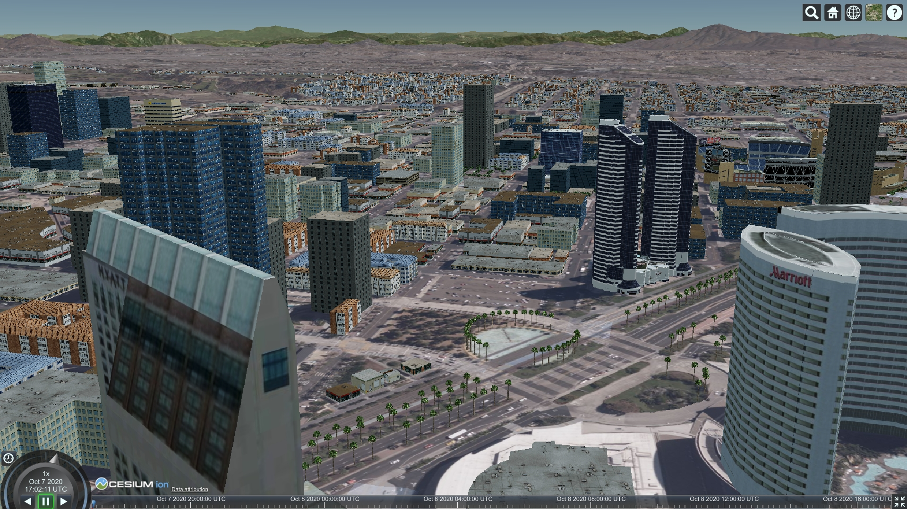

Although this is not required, since it follows a fixed tiling scheme (called implicit tiling in 3D Tiles), the individual tiles end-points
also coincide with the _OGC API - Tiles_ end-points described below.

==== OGC API - Tiles and 3D Models extension end-points

In additions to tilesets of 3D Tiles organized as a Bounding Volume Hierarchy, the GNOSIS Map Server implements an alternative approach to accessing the
3D data which is closer to the CDB access and data model. For example, tiles contain reference points with transformation information which reference
individual 3D models. These models are available at `/models/{modelID}` resources. This approach was first introduced and used in the
_OGC - Testbed 14 - CityGML and Augmented Reality_ work package, as a continuation of work done in _OGC - Testbed 13 - 3D Performance Clients_ https://docs.ogc.org/per/17-046.html#Experiment7[work package],
tested with a detailed CDB of New York City from Flight Safety, and detailed in the
http://docs.opengeospatial.org/per/18-025.html#ClientServerCommunication[engineering report].

It was demonstrated again in the _3D Container & Tiles_ pilot with the Camp Pendleton CDB from Presagis (see https://www.youtube.com/watch?v=mzGy2nRLgzY[video]),
and again in this ISG Sprint with the sample San Diego CDB from CAE.

A variation of this approach still implements a Tiles API, but rather than vector points referencing 3D models, the models contained within a tile
are all embedded in a single 3D model making up the whole tile. This is supported for E3D, binary glTF, and Batched 3D Models.
The batched 3D models resources are referenced by the 3D Tile tileset nodes, so the two approaches are not entirely separate.

A notable improvement to the implementation of this approach in the Sprint is the new support for glTF and Batched 3D Models 3D Tiles in addition to E3D,
including support for textures.

In both variations, as well as in the 3D Tiles tileset approach, the tiles and individual models reference shared textures at the `/textures` end-point.
Those textures are also available in different formats, e.g. pre-compressed as ETC2 mipmaps series (when requesting `etc2` format), and
different resolutions (currently implemented by appending `-512` or `-256` for 512 x 512 and 256 x 256 versions of the texture).

The Ecere service also serves other data layers (from the San Diego CDB dataset as well as others) using the Tiles API, including elevation data coverages,
imagery, vector features, and tiled rendered maps.

Sample _OGC API - Tiles_ end-points for the San Diego dataset are listed below:

===== Tiles API

The following end-points are standard 2D tiles end-points, but some also provide 3D information
(e.g. heights for elevation models and 3D points, scaling and orientations positioning 3D models).

3D Buildings Tiles API tilesets: https://maps.ecere.com/ogcapi/collections/SanDiegoCDB:Buildings/tiles

3D Buildings Tiles API GNOSIS Global Grid tileset: https://maps.ecere.com/ogcapi/collections/SanDiegoCDB:Buildings/tiles/GNOSISGlobalGrid

Example tile referencing models (Mapbox Vector Tile): https://maps.ecere.com/ogcapi/collections/SanDiegoCDB:Buildings/tiles/GNOSISGlobalGrid/13/5229/5730.mvt

[#Ecere-API-PointsTile,reftext='{figure-caption} {counter:figure-num}']
.Mapbox Vector Tile of points positioning 3D buildings visualized in QGIS
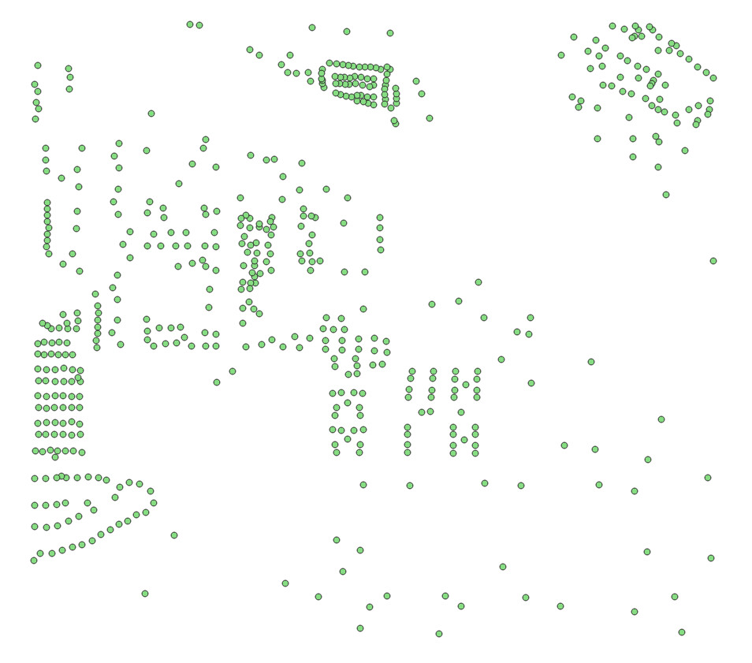

Example tile referencing models (GeoJSON): https://maps.ecere.com/ogcapi/collections/SanDiegoCDB:Buildings/tiles/GNOSISGlobalGrid/13/5229/5730.json

Example Elevation Tile (GeoTIFF): https://maps.ecere.com/ogcapi/collections/SanDiegoCDB:Elevation/tiles/GNOSISGlobalGrid/14/10425/11425.tif

[#Ecere-API-ElevationTile,reftext='{figure-caption} {counter:figure-num}']
.Elevation Tile visualized in QGIS
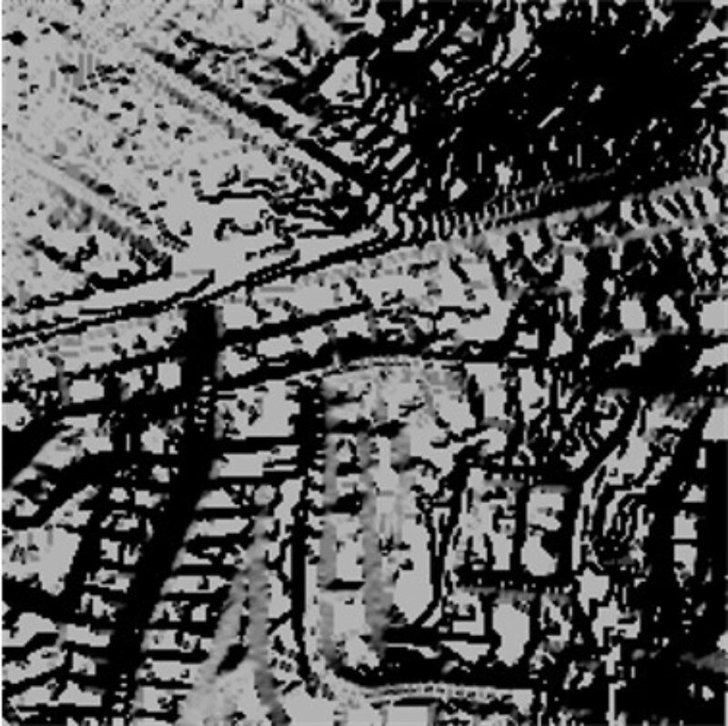

Example Elevation Map Tile (PNG): https://maps.ecere.com/ogcapi/collections/SanDiegoCDB:Elevation/map/tiles/GNOSISGlobalGrid/14/10425/11425.png

[#Ecere-API-ElevationMapTile,reftext='{figure-caption} {counter:figure-num}']
.Elevation Map Tile
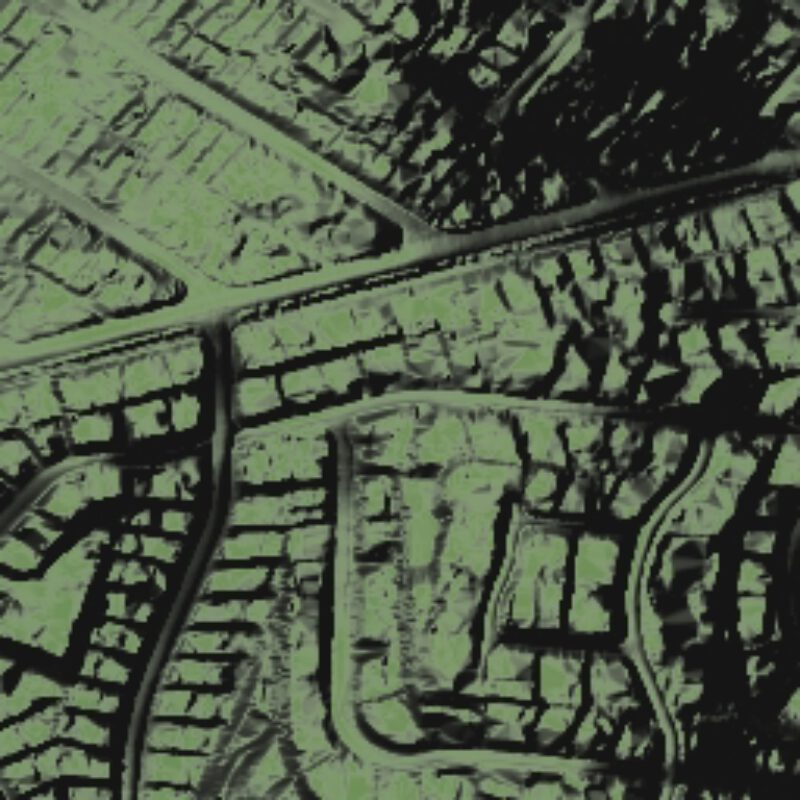

Example Imagery Tile (PNG): https://maps.ecere.com/ogcapi/collections/SanDiegoCDB:ImageryL09/tiles/GNOSISGlobalGrid/16/41700/45700.png

[#Ecere-API-ImageryTile,reftext='{figure-caption} {counter:figure-num}']
.Imagery Tile
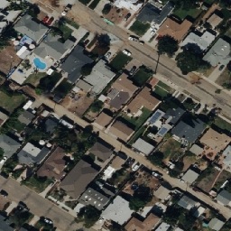

Example Roads Map Tile (JPG): https://maps.ecere.com/ogcapi/collections/SanDiegoCDB:Roads/map/tiles/GNOSISGlobalGrid/11/1300/1430.jpg

[#Ecere-API-RoadsMapTile,reftext='{figure-caption} {counter:figure-num}']
.Roads Map Tile
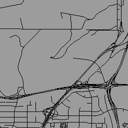

The following end-points also are standard 2D tiles end-points, but binary glTF and Batched 3D Models formats allow to retrieve 3D content tiled according
to a tile matrix set defined by the 2D Tiled Matrix Set http://docs.opengeospatial.org/is/17-083r2/17-083r2.html[standard]:

Example E3D Batched 3D Models tile: https://maps.ecere.com/ogcapi/collections/SanDiegoCDB:Buildings/tiles/GNOSISGlobalGrid/13/5229/5730.e3d

Example binary glTF Batched 3D Models tile: https://maps.ecere.com/ogcapi/collections/SanDiegoCDB:Buildings/tiles/GNOSISGlobalGrid/13/5229/5730.glb

[#Ecere-API-Tile,reftext='{figure-caption} {counter:figure-num}']
.glTF batched 3D models tile visualized in https://gltf-viewer.donmccurdy.com/#model=https://maps.ecere.com/ogcapi/collections/SanDiegoCDB:Buildings/tiles/GNOSISGlobalGrid/13/5229/5730.glb[glTF model viewer]
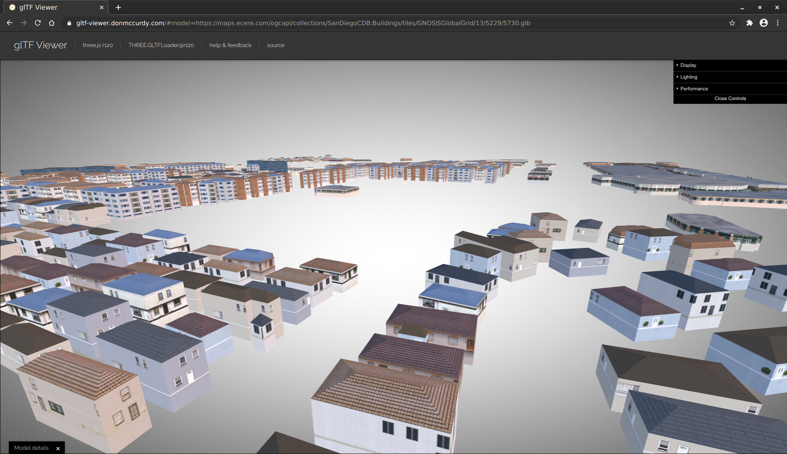

Example 3D Tile Batched 3D Models tile: https://maps.ecere.com/ogcapi/collections/SanDiegoCDB:Buildings/tiles/GNOSISGlobalGrid/13/5229/5730.b3dm
(the b3dm tiles are what the 3D Tiles tilesets refer to).

===== Referenced 3D Models Extensions

The following end-points implement a proposed extension specific to 3D Models, consisting primarily of `/models/{modelID}`:

Example Trees 3D Model (glTF): https://maps.ecere.com/ogcapi/collections/SanDiegoCDB:Trees/models/1207959554.glb

[#Ecere-API-TreeModel,reftext='{figure-caption} {counter:figure-num}']
.glTF Palm tree model visualized in https://gltf-viewer.donmccurdy.com/#model=https://maps.ecere.com/ogcapi/collections/SanDiegoCDB:Trees/models/1207959554.glb[glTF model viewer]
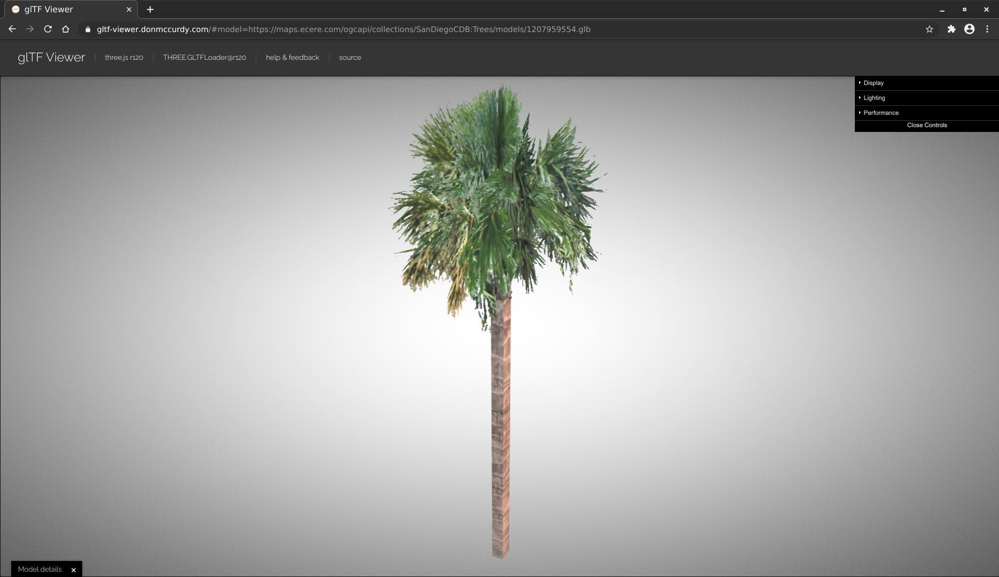
'''

Coronado Bridge 3D Model (glTF): https://maps.ecere.com/ogcapi/collections/SanDiegoCDB:CoronadoBridge/models/1207959553.glb

[#Ecere-API-BridgeeModel,reftext='{figure-caption} {counter:figure-num}']
.glTF Coronado Bridge visualized in https://gltf-viewer.donmccurdy.com/#model=https://maps.ecere.com/ogcapi/collections/SanDiegoCDB:CoronadoBridge/models/1207959553.glb[glTF model viewer]
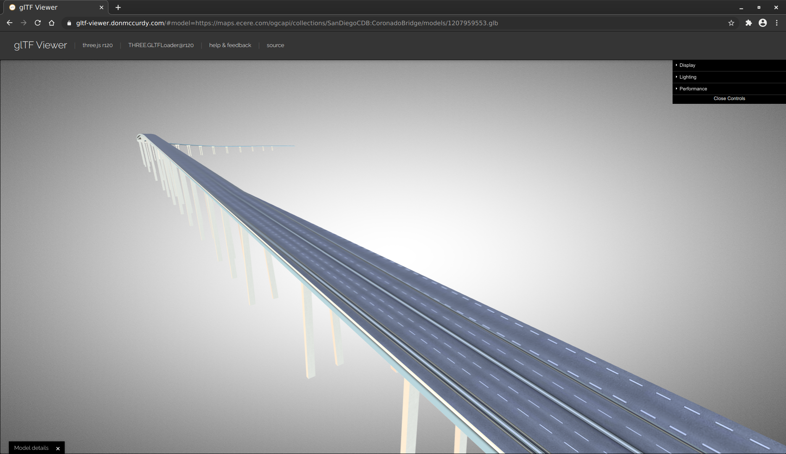
'''

Petco Park (Buildings) 3D Model (E3D): https://maps.ecere.com/ogcapi/collections/SanDiegoCDB:Buildings/models/1208101246.e3d

Petco Park (Buildings) 3D Model (glTF): https://maps.ecere.com/ogcapi/collections/SanDiegoCDB:Buildings/models/1208101246.glb

[#Ecere-API-BuildingModel,reftext='{figure-caption} {counter:figure-num}']
.glTF 3D building visualized in https://gltf-viewer.donmccurdy.com/#model=https://maps.ecere.com/ogcapi/collections/SanDiegoCDB:Buildings/models/1208101246.glb[glTF model viewer]
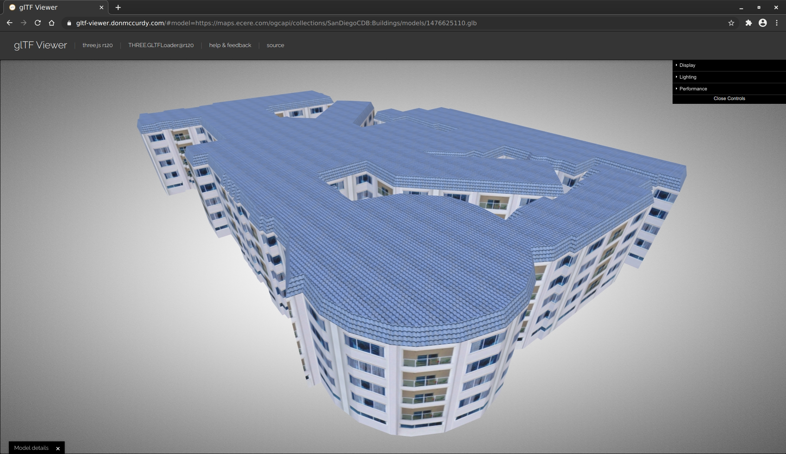
'''

_Currently, model identifiers are stored in `model::id` property of vector points, while orientation is stored in `model::orientation`, and scaling
in `model::scaling`._

Example texture: https://maps.ecere.com/ogcapi/collections/SanDiegoCDB:Buildings/textures/59.png

[#Ecere-API-Texture,reftext='{figure-caption} {counter:figure-num}']
.Texture for San Diego CDB Petco Park 3D model
image::images/Ecere/texture59.png[align="center",width="512"]

The textures references are encoded as relative paths within the glTF 3D models.

==== Other OGC API end-points

The GNOSIS Map Server offers access to the San Diego CDB data through additional OGC API access mechanisms, including the
_Features_, _Maps_ and _Coverages_ APIs.

===== Features

Buildings Features: https://maps.ecere.com/ogcapi/collections/SanDiegoCDB:Buildings/items

Trees Features: https://maps.ecere.com/ogcapi/collections/SanDiegoCDB:Trees/items

Roads Features: https://maps.ecere.com/ogcapi/collections/SanDiegoCDB:Roads/items

Hydrography Features: https://maps.ecere.com/ogcapi/collections/SanDiegoCDB:Hydrography/items

===== Maps

Hydrography Map: https://maps.ecere.com/ogcapi/collections/SanDiegoCDB:Hydrography/map/default.jpg

[#Ecere-API-Hydro,reftext='{figure-caption} {counter:figure-num}']
.San Diego CDB hydrography map
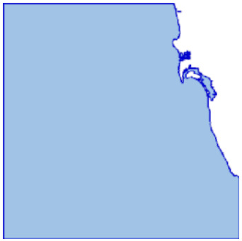
'''

Roads Map: https://maps.ecere.com/ogcapi/collections/SanDiegoCDB:Roads/map/default.jpg?width=2048

[#Ecere-API-Roads,reftext='{figure-caption} {counter:figure-num}']
.San Diego CDB roads map
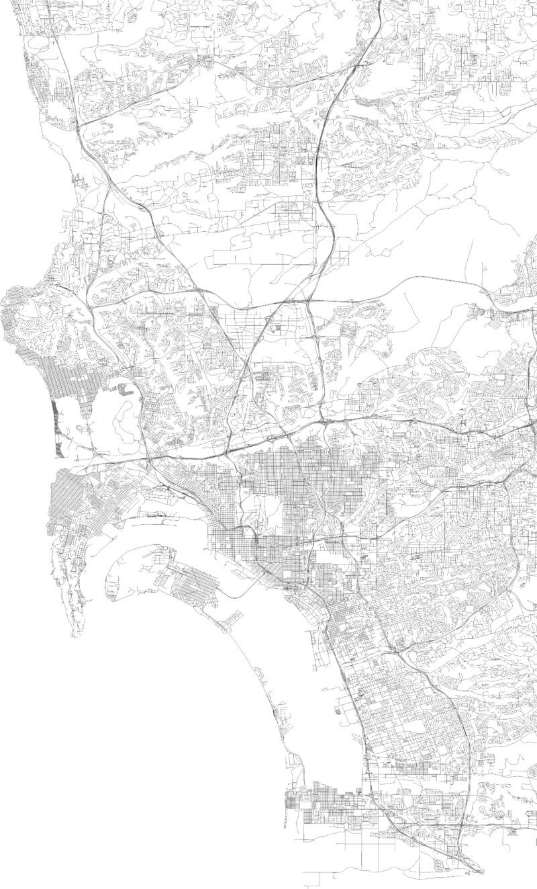
'''

Imagery Map: https://maps.ecere.com/ogcapi/collections/SanDiegoCDB:ImageryL09/map/default.png

[#Ecere-API-Imagery7,reftext='{figure-caption} {counter:figure-num}']
.San Diego CDB medium resolution imagery
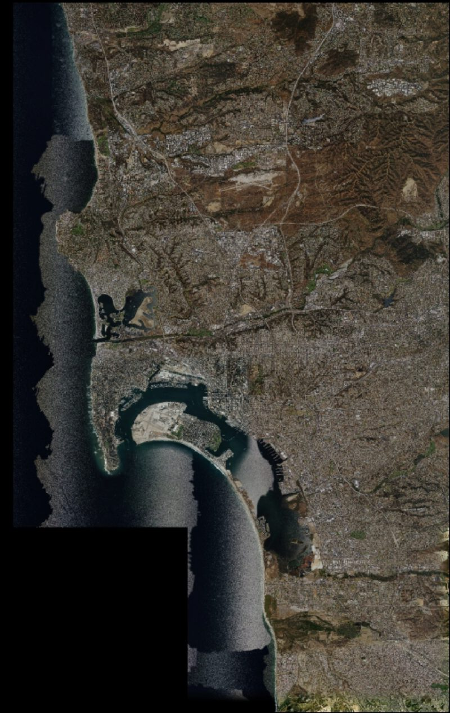
'''

[#Ecere-API-Imagery9,reftext='{figure-caption} {counter:figure-num}']
.San Diego CDB high resolution imagery
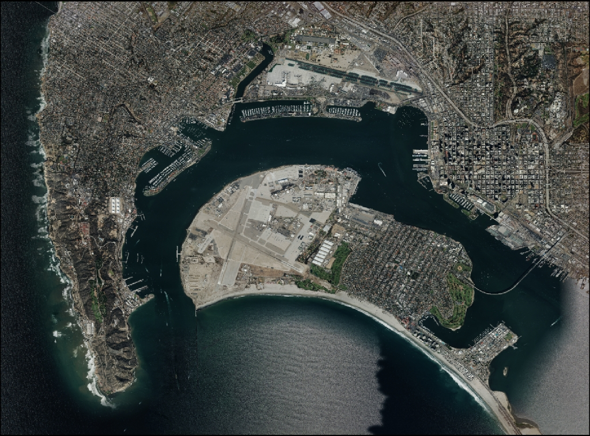
'''

Elevation Map: https://maps.ecere.com/ogcapi/collections/SanDiegoCDB:Elevation/map/default.png

[#Ecere-API-Elevation,reftext='{figure-caption} {counter:figure-num}']
.San Diego CDB elevation map
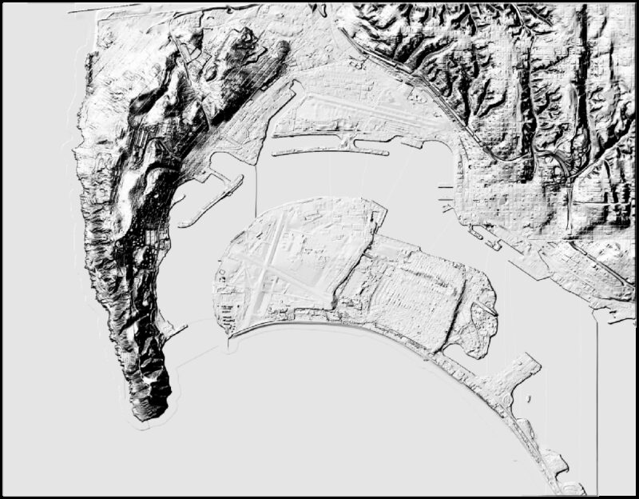

===== Coverages

Elevation (GeoTIFF): https://maps.ecere.com/ogcapi/collections/SanDiegoCDB:Elevation/coverage.tif

[#Ecere-API-Coverage,reftext='{figure-caption} {counter:figure-num}']
.Coverage for San Diego CDB elevation visualized in QGIS
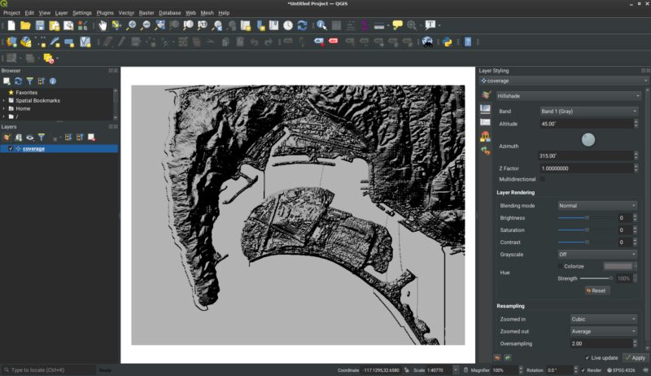

==== Technology Integration Experiments

Several of the other Sprint participants were able to succesfully access and display the dynamic 3D Tiles tilest generated from the San Diego CDB
data on-the-fly by the new Ecere service end-point (https://maps.ecere.com/ogcapi) for the GNOSIS Map Server, specfically the
https://maps.ecere.com/ogcapi/collections/SanDiegoCDB[San Diego CDB set of data layers].
Hexagon, InfoDao, Simblocks and Steinbeis all reported that their clients were able to successfully access and visualize the data.

Sample screenshots of some participants clients follow.

[#Ecere-TIE-InfoDao,reftext='{figure-caption} {counter:figure-num}']
.InfoDao Client accessing San Diego CDB data as 3D Tiles from Ecere's GNOSIS Map Server
image::images/InfoDao/ecereSanDiegoPassing.png[align="center",width="800"]
'''

[#Ecere-TIE-Steinbeis,reftext='{figure-caption} {counter:figure-num}']
.Steinbeis Client flying over San Diego CDB data accessed as 3D Tiles from Ecere's GNOSIS Map Server
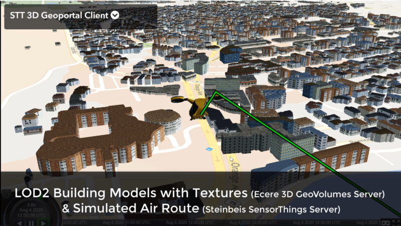
'''

[#Ecere-TIE-Steinbeis2,reftext='{figure-caption} {counter:figure-num}']
.Steinbeis Client accessing San Diego CDB data as 3D Tiles from Ecere's GNOSIS Map Server
image::images/Steinbeis-Client-to-Ecere-Server-LoD2Texture.png[align="center",width="800"]
'''

Participants also re-tested the older _GeoVolumes API_ end-point from 3D Container & Tiles pilot (https://maps.ecere.com/3DAPI) which was
a simple instance of Apache serving the New York 3D Buildings 3D Tiles dataset as static content.

[#Ecere-TIE-InfoDaoNYC,reftext='{figure-caption} {counter:figure-num}']
.InfoDao Client accessing New York CDB as 3D Tiles from Ecere's static 3D Tiles server
image::images/InfoDao/ecereNewYorkPassing.png[align="center",width="800"]
'''

Additionally, Ecere performed a number of TIEs with a simple CesiumJS client using the https://sandcastle.cesium.com/[Cesium Sand Castle] setup.
Sample client JavaScript code, which can simply be copied there and used to run the test, follows.
It sets up the buildings, trees as well as the Coronado Bridge, together with the Cesium world terrain.

```js
var worldTerrain = Cesium.createWorldTerrain({ requestWaterMask: true, requestVertexNormals: true });
var viewer = new Cesium.Viewer("cesiumContainer", { terrainProvider: worldTerrain });
var scene = viewer.scene;
var trees = scene.primitives.add(new Cesium.Cesium3DTileset(
   { url: "https://maps.ecere.com/ogcapi/collections/SanDiegoCDB:Trees/3DTiles/tileset.json" }));
var bridge = scene.primitives.add(new Cesium.Cesium3DTileset(
   { url: "https://maps.ecere.com/ogcapi/collections/SanDiegoCDB:CoronadoBridge/3DTiles/tileset.json" }));
var buildings = scene.primitives.add(new Cesium.Cesium3DTileset(
   { url: "https://maps.ecere.com/ogcapi/collections/SanDiegoCDB:Buildings/3DTiles/tileset.json" }));
```

[#Ecere-TIE-CesiumJS1,reftext='{figure-caption} {counter:figure-num}']
.CesiumJS Client accessing San Diego CDB data as 3D Tiles from Ecere's GNOSIS Map Server (Petco Park)
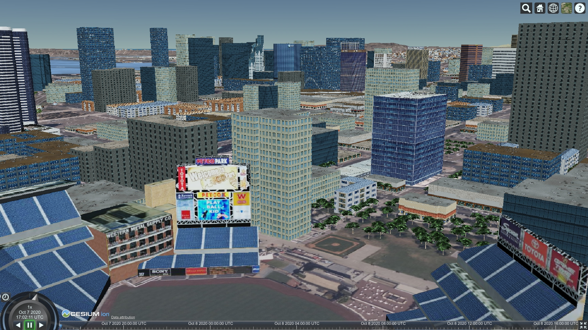
'''

[#Ecere-TIE-CesiumJS2,reftext='{figure-caption} {counter:figure-num}']
.CesiumJS Client accessing San Diego CDB data as 3D Tiles from Ecere's GNOSIS Map Server (houses and cape)
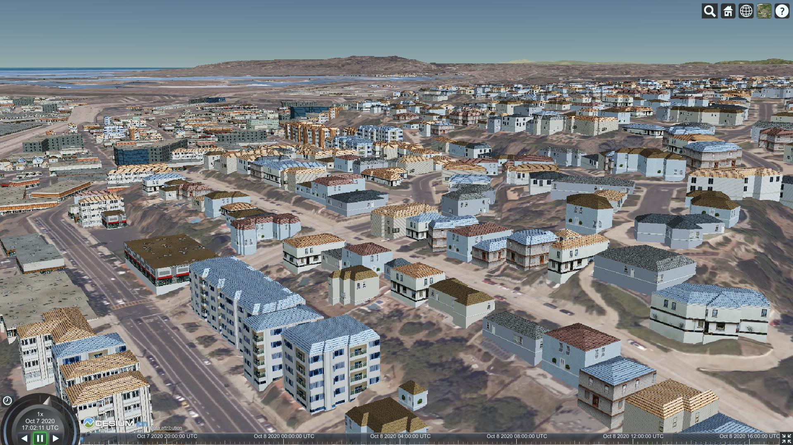
'''

[#Ecere-TIE-CesiumJS3,reftext='{figure-caption} {counter:figure-num}']
.CesiumJS Client accessing San Diego CDB data as 3D Tiles from Ecere's GNOSIS Map Server (houses up close)
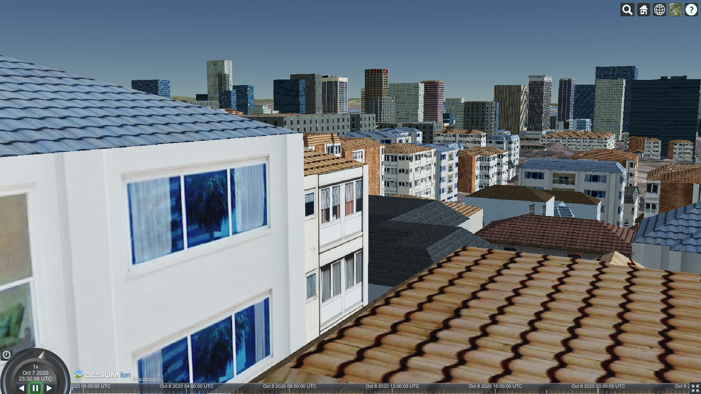

=== Updating the 3D content

==== Simple Transactions

Ecere proposed that a straightforward way to support updates of 3D models would be to support the _Simple Transactions_ extension originally defined for _OGC API - Features_.
This is especially appropriate if the server exposes the collection of data as both a GeoVolumes / Bounding Volume Hierarchy, and vector _Features_, as is
the case for the GNOSIS Map Server implementation. This would work well with data stores originating from different types of data sources, such as
CDB, CityGML or OpenStreetMap 3D buildings, which all involve vector features definitions for the data. In CDB, for both geotypical and geospecific models,
tiles of vector point features reference a 3D model by a unique identifier. This is very similar to the _Tiles API_ approach implemented in the Ecere service.

==== Updating 3D models

With _Simple Transactions_, those vector points would be represented at a `/items` end-point to which a GeoJSON document including a 3D position, an identifier
referencing a model, and an optional transformation including scaling and/or orientation could be submitted via `POST` to add a new item. Similarly, a `PUT` at a
`/items/{featureID}` resource could be used to update an existing feature (e.g. to move it, change its associated 3D model, or change attributes), and a
`DELETE` on that resource would remove it.

To add a whole new 3D model, a model encoded in a supported format could be submitted via `POST` to the `/models` end-point
(also used with GET for retrieving referenced individual models in the _OGC API - Tiles_ extension for 3D data discussed above).
Once added, the model could be retrieved in a different format than it was submitted as, e.g. an OpenFlight 3D model could be uploaded, which
the GNOSIS Map Server converts to its native E3D format internally, and a client could request and retrieve the model in binary glTF.
The `PUT` and `DELETE` methods could also be supported at the `/models/{modelID}` end-point.

Once an update is made, the server should either automaticaly trigger re-generation, or if generating on-the-fly any cached 3D Tile should be invalidated
so that the next time a client requests the data it will reflect the latest changes. When generating these tiles, if the 3D models position is relative
to the terrain, they can also be clamped to the latest terrain elevation model.

==== Updating terrain elevation

Transactions could also be supported to update the terrain elevation model, in a number of possible ways which a server could decide to support, based on
what best fits its data model:

- Updates could be done on a tile-by-tile basis, i.e. doing a `PUT` on `/tiles/{tileMatrixSetID}/{{tileMatrix}/{row}/{column}`.
- The concept of _coverage scenes_ (gridded elevation coverage parts covering arbitrary extents) could be used to add, remove or update specific regions of the data.
  This concept was explored in the _Testbed 15 - Open Portrayal Framework_ http://docs.opengeospatial.org/per/19-070.html#ogc-api-images-transactional[_Images API_], where those scenes were called images.
- A _Coverages Transactions_ extension could also potentially be specified which maps an array of new elevation values to a spatial extent.

Regardless of the approach used to update, the server can provide the latest version of the terrain elevation in the same way, whether as 2D coverage tiles, or
3D Tiles quantized terrain mesh. As of the time of the Sprint, the GNOSIS Map Server only generates 3D Tiles for the models, but support for generating
quantized terrain mesh from the gridded elevation is planned, based on the internal terrain tesselation capabilities used in Ecere's GNOSIS library.

==== Change Sets

Because the history of the changes introduced by these transactions could also be recorded, it would be possible for a client to request the list
of all tiles affected by the changes since a certain checkpoints, or between two checkpoints. It could also be possible to retrieve the data at a certain
checkpoint if the full changes history are preserved. Part of this approach was explored in the context of the _Testbed 15 - Open Portrayal Framework_
http://docs.opengeospatial.org/per/19-070.html#_requirement_class_changeset_core[Change Sets] alongside the Images API.

==== Implementation progress

During the ISG Sprint there was not enough time to implement these Transactions on the server, however development towards that goal started the following week
during the OGC Sprint for _OGC API - Features Simple Transactions_.
Some progress on the implementation of the addition, replacement and removal of point features placing 3D models at the data store level was achieved,
testing with the San Diego CDB datasets, as seen in the following screen captures.

[#Ecere-Add,reftext='{figure-caption} {counter:figure-num}']
.Model instance added via a `POST` of a GeoJSON feature to `.../SanDiegoCDB:Buildings/items`
image::images/Ecere/add.jpg[align="center",width="800"]

The following GeoJSON was used to describe the feature to be added:

```JSON
{
   "type": "Feature",
   "geometry": {
      "type": "Point",
      "coordinates": [
        -117.14098258,
        32.73238869,
        76.24
      ]
   },
   "properties": {
      "model::id": 1745156899,
      "model::orientation": [ 0, 0, 0 ]
   }
}
```

'''

[#Ecere-Update,reftext='{figure-caption} {counter:figure-num}']
.Model instance updated (re-oriented) via a `PUT` to `.../SanDiegoCDB:Buildings/items/651450` (the feature ID)
image::images/Ecere/update.jpg[align="center",width="800"]

The following GeoJSON was used to update the feature:

```JSON
{
   "type": "Feature",
   "geometry": {
      "type": "Point",
      "coordinates": [
        -117.14098258,
        32.73238869,
        76.24
      ]
   },
   "properties": {
      "model::id": 1745156899,
      "model::orientation": [ 180, 0, 0 ]
   }
}
```

'''

[#Ecere-Remove,reftext='{figure-caption} {counter:figure-num}']
.Model instance removed via a `DELETE` on `.../SanDiegoCDB:Buildings/items/651450`
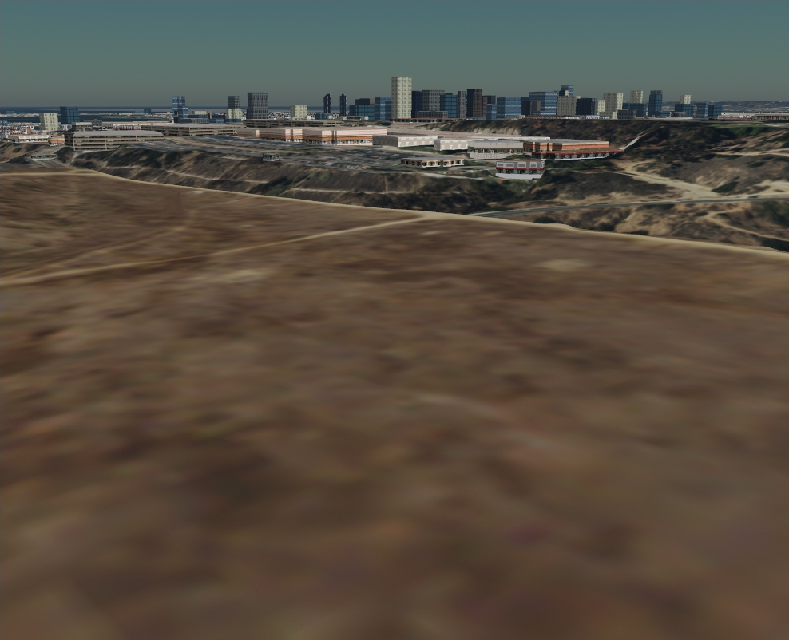

'''
[#Ecere-AddedCesim,reftext='{figure-caption} {counter:figure-num}']
.Added model retrieved within a 3D Tile, shown in CesiumJS
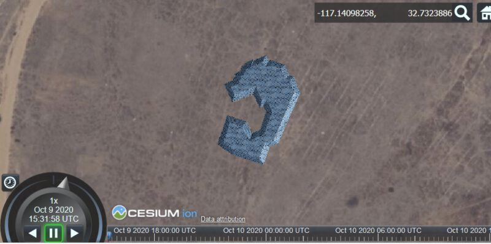

=== Client Implementation

In the _3D Container and Tiles Pilot_, Ecere improved client-side support for visualizing 3D Tiles and performed
a number of TIEs with _GeoVolumes API_ implementations from all other participants of the pilot, as well as with
the GNOSIS Map Server using the Tiles API and associated extensions for 3D data.
The result of those TIEs are demonstrated in a https://www.youtube.com/watch?v=mzGy2nRLgzY[video] and discussed in the _3DC&T_ engineering report.

For the ISG Sprint, Ecere spent efforts mainly on improving the server component and investigating a mechanism to update the 3D data.

However some performance improvements were done on the client to better accommodate the large amount of detailed models and
full resolution textures of the San Diego CDB dataset. An issue with the rendering of referenced 3D models, where an applied orientation
was not taken into account to light it properly, was also resolved.

Sample screenshots of GNOSIS Cartographer visualizing the imported San Diego CDB follow.
In addition to this dataset, worldwide elevation data from http://viewfinderpanoramas.org/[Viewfinder Panoramas] by Jonathan de Ferranti
and imagery from NASA Visible Earth's https://earthobservatory.nasa.gov/features/BlueMarble[Blue Marble] are used outside of the extent covered by the San Diego dataset.

[#Ecere-Client-1,reftext='{figure-caption} {counter:figure-num}']
.San Diego CDB data visualized in Ecere's GNOSIS Cartographer (cape)
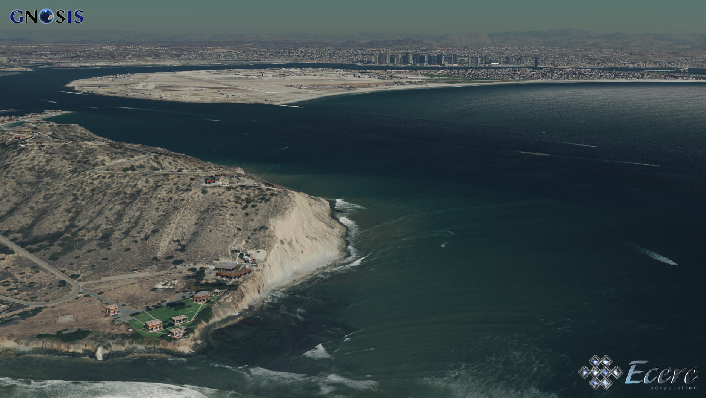
'''

[#Ecere-Client-2,reftext='{figure-caption} {counter:figure-num}']
.San Diego CDB data visualized in Ecere's GNOSIS Cartographer (hotels and palm trees)
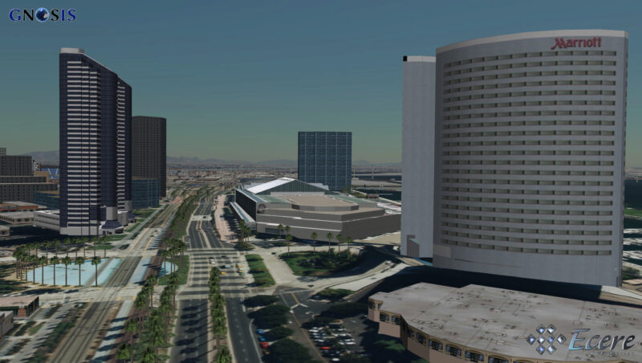
'''

[#Ecere-Client-3,reftext='{figure-caption} {counter:figure-num}']
.San Diego CDB data visualized in Ecere's GNOSIS Cartographer (skyscrapers)
image::images/Ecere/SanDiego5.jpg[align="center",width="800"]
'''

[#Ecere-Client-4,reftext='{figure-caption} {counter:figure-num}']
.San Diego CDB data visualized in Ecere's GNOSIS Cartographer (Coronado bridge)
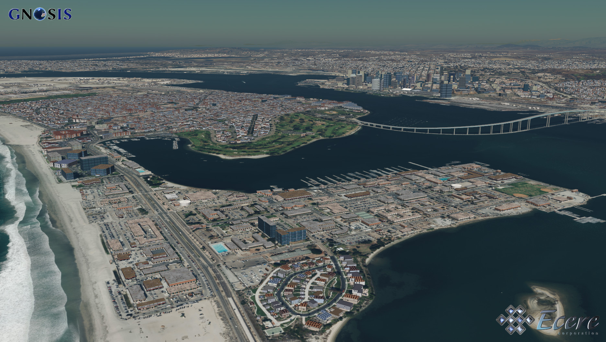
'''

[#Ecere-Client-5,reftext='{figure-caption} {counter:figure-num}']
.San Diego CDB data visualized in Ecere's GNOSIS Cartographer (airstrip)
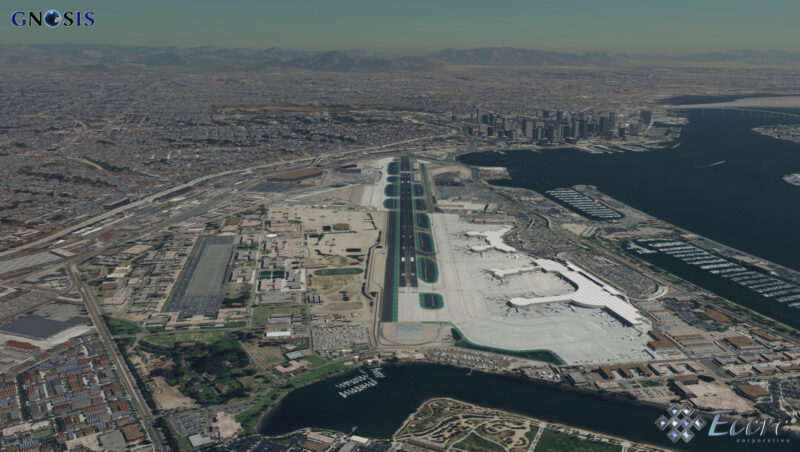

'''
[#Ecere-Client-6,reftext='{figure-caption} {counter:figure-num}']
.San Diego CDB data visualized in Ecere's GNOSIS Cartographer (high above, showing 3D globe)
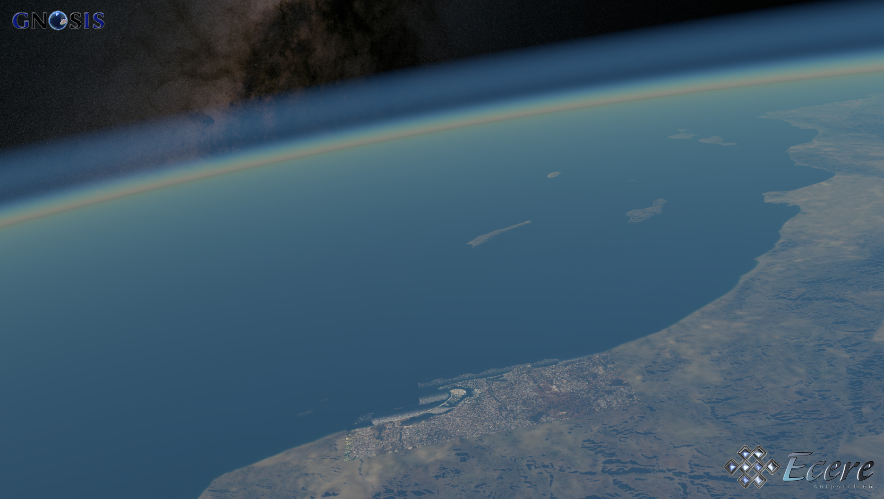

This last image features ESA https://sci.esa.int/web/gaia/-/60196-gaia-s-sky-in-colour-equirectangular-projection[Gaia's Sky in colour] (Gaia Data Processing and Analysis Consortium (DPAC); A. Moitinho / A. F. Silva / M. Barros / C. Barata,
University of Lisbon, Portugal; H. Savietto, Fork Research, Portugal.) CC BY SA 3.0.

=== GeoVolumes API Considerations

Ecere feels that there are still important adjustments to be made, and questions to answer with regards to the _GeoVolumes API_ draft specifications
for it to progress towards becoming an OGC standard, and in particular to integrate well within the new OGC API family of standards.

==== Building upon OGC API - Common foundations

First, the draft specifications very heavily borrowed from what is now the _OGC API - Common - Part 2: Geospatial data_ specifications, which define
among other things the response schema for the information on a given _collection_.
Therefore, ideally the specifications should reference as a dependency these _Common - Part 2_ specifications, and ensure to remain fully compatible.
This has the tremendous benefits of making any geospatial data easily accessed in the same manner, regardless of whether it is vector data, raster data,
or 3D datasets, and greatly simplifies the development of both servers and client.

The main new capabilities introduced by _GeoVolumes_ are:

1. a relation type to identify 3D data,
2. media types for 3D content, and
3. and a way to subset the 3D content itself.

==== Proper relation types, registered media types and links

Following the _GeoVolumes API_ draft specifications, the relation type is currently specified as `items`.
However, per the resolution of _OGC API - Common_ issue https://github.com/opengeospatial/oapi_common/issues/140[#140], the relation type
should be distinctive for the specific API, `items` being  reserved for the use of the `/items` end-point as used in _Features_ and _Records_.
The OGC Naming Authority has also clarified that new relation types should consist of a fully resolvable URL.
Instead, relation types such as `http://www.opengis.net/def/rel/ogc/1.0/3ddata` or `http://www.opengis.net/def/rel/ogc/1.0/bvhtileset`
(if intended specifically for bounding volume hierarchy tileset distributions) could be used instead.

The media type for 3D Tiles is specified as `application/json+3dtiles`, and the one for i3s as `application/json+i3s`.
However media types probably need to be properly officially registered with IANA before being specified in the standard.

The concept of `alternate` and `original` are also something which should be brought to the attention of the _Common_ SWG.
In particular, it has been mentioned multiple times (e.g. see https://github.com/opengeospatial/oapi_common/issues/160#issuecomment-679198581[this comment])
that APIs should avoid adding new properties to the OGC APIs links to maximize compatibility with standard web tooling.

==== Common bounding boxes

In the _3D Container & Tiles pilot_, `bbox` was used as the mechanism to subset the 3D content, but there is a
https://github.com/opengeospatial/oapi_common/issues/167[proposal] in _Common_ to make `subset`
the standard mechanism by which to subset geospatial data, which has the advantage of an unambiguous syntax with regards to axis order.

In the GeoVolumes specifications, the list of collections can also be filtered by `bbox`, but this is functionality already covered by
_Common - Part 2_, so the _GeoVolumes_ would not need to specify anything additional for this purpose, although the specifications in _Common_ should
probably be reviewed in light of the _GeoVolumes_ use case.

==== Hierarchies of _collections_

The current specifications also define collections hierarchies, but the way it does so breaks compatibility with _Common - Part 2_, which explicitly avoids
making hierarchies of collections part of the core. This allows both a client which understands hierarchies, and one which is oblivious to them
to properly access all _collections_ on a server, regardless of whether the server implements the hierarchy extension or not.
An approach to implement hierarchies in this extensible manner is proposed in
https://github.com/opengeospatial/oapi_common/issues/11#issuecomment-677947387[_Common_ issue #11],
and was also the original demonstration of hierarchies in the _3D Container & Tiles_ pilot in TIEs between Ecere and Helyx
(though at the time `/` was used rather than `:` as hierarchy separators).
In the Sprint this was also discussed with Steinbeis in https://github.com/opengeospatial/OGC-ISG-Sprint-Sep-2020/issues/5[issue #5].

==== GeoVolumes API's raison d'être and name

What the GeoVolumes / 3D data API does _not_ define (at least currently), is how one actually explores the Bounding Volume Hierarchy,
asks for specific nodes, or how to encode 3D content.

The _GeoVolumes API_ has sometimes been presented as being a space-centric API, meaning that the collections and the space they define can exist
without any content. However, Ecere does not find this description accurate in terms of how the current specification, based on _OGC API - Common - Part 2_,
are defined and used. In _Common - Part 2_ (like in _Features_) the extent is always the space occupied by the data, not something that exists conceptually
without data. Even if data layers or data sets can be organized in hierarchies using geographic names of cities or states or countries,
those are always a human-friendly convenient way to organize the data, rather than a strict definition of space.

It is not clear whether a space-centric API, or a new way to access 3D content which is neither i3s nor 3D Tiles, are part of what the _GeoVolumes API_ aims
to be, but in Ecere's opinion it is not what those specifications define, so if it is indeed the intent, perhaps additional conformance classes could be
defined to fulfill those objectives.

Although extremely simple, the current specifications have proven to be very successful in establishing a bridge between 3D data
(e.g. defined in OGC 3D Tiles or i3s standards) and the OGC API family of standards, and so could form a very good basis for a first _Core_
part for the standard. It would be essential however to address the aforementioned issues relating to integration with _Common - Part 2_.

Partly because of disagreeing with the fact that the API is space-centric, Ecere also feels that the name _GeoVolumes_ does not properly describe the API at all.
Just like 2D content is retrieved via _OGC API - Features_ or _OGC API - Coverages_, and those APIs are not called _GeoExtents_. In fact, those APIs can also
deliver 3D features or 3D coverages content in vector or raster form. A better name for the new API might be something like _3D Data_.

It would also be worthwhile to note that all that the specifications define so far are a relation type and media types, which would be also be defined by the
OGC Naming Authority and/or IANA.
Therefore, until more advanced capabilities specific to 3D are defined as part of the specifications, perhaps the _3D Data API_ could consist simply of a
Best Practice document on how to use _OGC API - Common_ (_Part 1: Core_ and _Part 2: Geospatial data_), as well as the 3D Tiles and i3s OGC community standards to
efficiently deliver 3D content in an interoperable manner?

==== Tiles API & 3D Models Extension

During the Sprint and the 3D Container & Tile pilot, other participants did not directly experiment with the _OGC API - Tiles_ approach and extensions
as implemented by the Ecere service (such as the `/models` end-point) to deliver and access 3D content, although they were used by others in Testbed 14.
Ecere feels that these end-points would be excellent candidates for defining additional conformance classes which could be tested in future interoperability
experiments. Specifically, these end-points are much closer to the CDB data model, yet provide much more efficient access mechanism to visualize the 3D data
than merely serving CDB from the file system, and can be implemented in parallel to distributing the data using the Bounding Volume Hierarchy approach
as i3s and/or 3D Tiles.

Additional detailed feedback on the _GeoVolumes API_ was also provided by Ecere in response to the questionnaire set up by Helyx.
