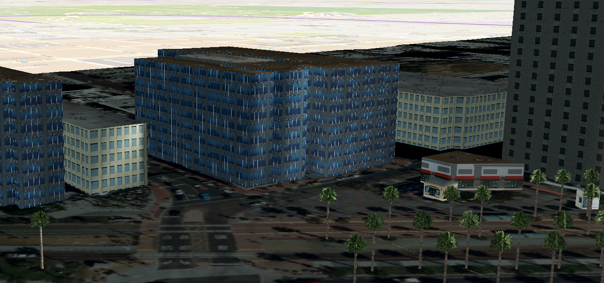
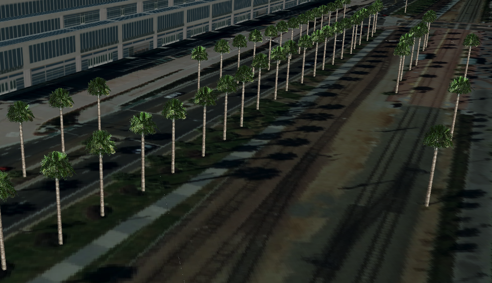
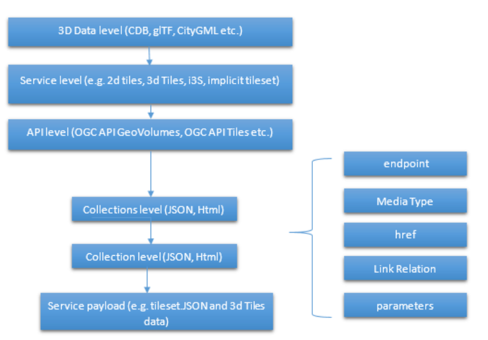

[[Helyx]]
== Component Implementation: Helyx

For the OGC Interoperable Simulation and Gaming (ISG) Sprint with glTF, Helyx took 3D Tiles data, that had been converted from CDB data by CAE, and incorporated this 3D Tiles dataset (around San Diego) into a http://helyxisg.eastus.azurecontainer.io/[Helyx Server].
The San Diego dataset was incorporated in two formats, in the 3D Tiles format and the CDB format. This was alongside the previously added data for New York and Montreal, in the i3s and 3D Tiles formats. The API used to expose the data in the server was the draft specification of the GeoVolumes API cite:[GeoVolumesAPI].

Helyx then tested their server using the Steinbeis STT client. Results from the test proved fruitful with all of their datasets served in their server displaying correctly in the client, meaning the server was able to provide data in the format expected from the client. Helyx has therefore shown that the draft specification of the GeoVolumes API could work end to end from the backend server to the frontend client whilst also displaying relevant data to the user of the client. The conversion of CDB data to 3D Tiles proves the interoperability and efficiency by which data could be transformed and served, even by simple static servers.

[#img_Helyx-1,reftext='{figure-caption} {counter:figure-num}']
.CAE CDB data displayed as 3D Tiles from the Helyx server, with textures

[#img_Helyx-2,reftext='{figure-caption} {counter:figure-num}']
.The stadium in San Diego
image::images/HelyxSanDiegoStadium.PNG[width=800,align="center"]

[#img_Helyx-3,reftext='{figure-caption} {counter:figure-num}']
.CDB tree data converted to 3D Tiles

As well as the 3D Tiles version of the data being published to the server, the original data was also served. When considering how the CDB data could be shared, Helyx decided to treat the CDB format as another 3D media type that could be served using the https://github.com/opengeospatial/oapi_common[OGC API - Common] core structure, on the same footing as i3s and 3D Tiles. In this way, a client could just pull in or download the raw data as opposed to the 3D Tiles version. However, 3D Tiles and other specifications such as the 2D Tiles standards are used due to their lightweight and efficient serving versus the raw data. For this reason it is recommended that a 2D Tiles API front end may be the better route to serve this data in future than the raw data.

No testing was possible for the data in the server. However it did raise questions such as whether CDB could be treated as a media type (or CDB X), and whether a JSON response to an endpoint calling the CDB data, could be used to describe the CDB data structure.

TIP: Helyx feels that these questions have not been addressed previously and should be considered before a ratified version of the GeoVolumes API is released.

=== Types of alternate distribution in scope of GeoVolumes API

The formats that were handled by the draft GeoVolumes API in the previous pilot were i3s and 3D Tiles. These are community standards that serve out 3D data through a particular bounding volume hierarchy. But there are a wider range of formats that can be served directly (such as CDB or CityGML), or can be transformed to an intermediate state for easier transmission over the web - for instance a 2D tile matrix set or implicit tiling tileset. The structure of these datasets should lend itself to the OGC Tiles API. So an important question is where is the boundary between APIs in the OGC ecosystem – is it a fuzzy boundary? Is there no problem with having both types of API under the same collection, as long as everyone uses OGC API Common as the core consistently? So far the structure of the GeoVolumes API follows OpenAPI Common Part 2: Geospatial data, which includes a landing page, a list of collections (including filtering by bbox), a collection description (including a link to the data) and filtering on the data itself (e.g. through a bounding box). Any future extensions to this part of the specification should be made with caution so as to not break interoperability with the other nascent OGC APIs.

The term used here for serving different representations of the same data as different services, formats or links is an _alternate distribution_. In the sprint the team considered some issues around alternate distributions.

This was done with the assistance of a survey tool, to poll sprint participants on their views of how the draft specification was structured, and what defines an alternate distribution. Unfortunately there was not a lot of uptake of the survey, however some useful information was gained. It is recommended that if this type of survey were used more widely, it could provide useful insight into the general consensus around specification issues.

TIP: It is suggested that the OGC community could use these type of polls more to understand the nuances of opinions and consensus when building new specifications.

=== What is an alternate distribution?

At the OpenAPI Common level, alternate distributions are only really discussed in terms of JSON or HTML representations of server responses. However, it can be posited that the different OGC API standards are all alternate distributions of a collection of geospatial data. So the same source data could be converted and served in different ways – either with a manual conversion or on the fly (e.g. to 3D Tiles, i3s, a 2D representation of the data, or as features).

The following sections discuss how alternate representations can be found at different levels, and potential issues and recommendations around this that can be put forward to the DWG.

The below diagram summarizes what is believed to be the different levels of decision point when creating a GeoVolumes resource, of which all of them have the potential to represent the same data in different ways, thus creating alternate distributions.

[#img_Helyx-4,reftext='{figure-caption} {counter:figure-num}']
.Exploration of alternate distributions throughout the workflow

=== Representing Alternate Distributions at the Data Level

The most instinctive way to thing about alternate distributions is to think about alternate data types. For instance in terms of 3D data this may be gLTF data, it may be CityGML, it may be as CDB, or as a tileset. It could be that the same city model can be presented using different formats. In this way, an alternate distribution can occur purely considering the data level.

=== Representing Alternate Distributions at the Service Level

One step on from representing alternate distributions at the data level is at the service level. When considering 3D, this relates to community standards such as 3D Tiles or i3S – where data is transformed into an efficient format for serving over the web. Serving these alternate representations has been explored for a few years and has culminated in two community standards.

Turning the data level into the service level could be a pre-processed event, such as with our static server, or could use an on-the-fly conversion service such as some of the other participants in the sprint.

=== Representing Alternate Distributions at the API Level

Another step further from the service level, is the means by which these services are structured for clients to interact with it. This considers the mechanism by which clients request and get responses from a server as a particular type of distribution. The goal is to have a common starting point and landing page, and to display the collections within, but then to differentiate based on the particular structure of the distribution format.
In order to bring both 3D Tiles and i3s under the same banner, the draft GeoVolumes API was designed, folding both of these community standards into an OpenAPI common structure. Other draft specifications include https://ogcapi.ogc.org/tiles/[OGC API - Tiles] and https://ogcapi.ogc.org/features/[OGC API - Features].

=== What Datasets, Services or Tiling Schemes are ‘In Scope’ of the GeoVolumes API?

The draft specification built in the pilot mainly dealt with the structure of the landing page, what is considered a resource, and provided demonstration services broken out by geography. It concerned itself primarily with 3D Tiles and i3s, with the departure from OGC API Common being the bounding volume hierarchy and specific community standard formats from this point on.

In terms of what is in scope of the GeoVolumes API from an alternate distribution perspective, it was considered that many of the 3D data formats could ultimately be served using the GeoVolumes API, however whether serving them directly as raw data (such as the CDB example) counts that need to be clarified in the draft specification. In addition, there was talk that the GeoVolumes API could be extended with for instance the draft 3D Tiles implicit tiling scheme cite:[ThreeDImplicitTiles] discussed by Cesium. This would be the equivalent of the tiling schemes that fall under the Tiles API, but tailored for working with 3D data. A further discussion should be had to decide whether a 2D Tile map scheme served through the 3D Tiles implicit tiling scheme falls under the GeoVolumes API or not. Key questions are:

•	Whether only the source data needs to be 3D (this doesn’t preclude 2D tiling scheme or raw data being in scope),
•	Whether what is being served has to have a bounding volume hierarchy (which excludes raw data, the 2D tiling schemes and also the implicit tiling scheme), and
•	Whether the end client simply needs to be able to extract 3D data from the API call.

The team's thoughts are that what differentiates the GeoVolumes API is the ‘bounding volume hierarchy’ structure of the two community standards. If this were the distinction, in this case neither does serving 3D data as 2D tiles, and so the OGC Tiles API, despite serving 3D data, would also not be in scope of the GeoVolumes API. Indeed the Features API could also serve features that have 3D content, but does not have a bounding volume hierarchy.

TIP: The team's recommendation is that the precise definition and its separation or aggregation with the other related OGC APIs is taken forward to the appropriate DWG.

[[RepresentingAlternateDistributionsAtCollectionsLevel]]
=== Representing Alternate Distributions at the Collection(s) Level.

At the collections and collection level, the response from the API is typically either a JSON or HTML response. This is the most common case where alternative distributions are found within many APIs. At this point in the GeoVolumes API, the collections are listed, along with link relations and media types that tell the client what format to expect.

=== Representing Alternate Distributions within one API – endpoints

Once the data, the service and the API are chosen, there are still more decisions to be made on how to represent alternative distributions within the GeoAPI structure.  In the pilot, each sub-resource on the server had its own endpoint such as the below:

http://server.com/collections/SanDiego/SanDiego-buildings/3dTiles

http://server.com/collections/SanDiego/SanDiego-buildings/i3s

This could then be expanded as other community standards are embraced – for instance if the implicit tiling scheme was decided to be in scope by the working group, this too could have its own endpoint:

http://server.com/collections/SanDiego/SanDiego-buildings/iTiles

(or whatever the implicit tiling scheme is named).

=== Representing Alternate Distributions within one API – parameters

However there is a separate school of thought that there could also (or instead) be a common endpoint with a parameter instead deciding which representation of the resource to return, so that the client can use content-negotiation (Accept: header) to select the desired representation. For instance:

http://server.com/collections/SanDiego/SanDiego-buildings/bvh?f=3dTiles

http://server.com/collections/SanDiego/SanDiego-buildings/bvh?f=i3s

http://server.com/collections/SanDiego/SanDiego-buildings/bvh?f=iTiles

(or whatever name the implicit tiling scheme is named).

The use of parameters for content negotiation of the resource is currently not discussed in the draft GeoVolumes API but could be elaborated upon. Whether this is used in addition to the current API structure, or is even taken back a level so that:

http://server.com/collections/SanDiego/SanDiego-buildings?f=3dTiles

referenced the 3D Tiles endpoint is not agreed upon. Also please note that this does not preclude also changing the parameter value further down the path (for instance f=b3dm to bring back the final bounding volume).

TIP: It is recommended that the DWG discuss and provide more guidance on endpoints and parameter use with 3D data and services.

[[NoteOnPathFormat]]
=== A note on path format

It has also been discussed that the collectionId cannot contain slashes and the GeoVolumes API is currently not compatible with the OGC API family of standards if they currently allow slashes. A ‘:’ structure has been proposed for hierarchy structures cite:[CommonHierarchy], however for the most simple web servers hosted on Windows, folder names that will be served cannot contain ‘:’ in their name and therefore may cause issues with interoperability. It is suggested this is discussed further in the Domain Working Group. As servers become more complicated with different data levels, this will need to be standardized.

TIP: It is suggested this is discussed further in the Domain Working Group as servers become more complicated with different data levels, this will need to be standardized.

=== Representing Alternate Distributions within one API - Link Relations

As discussed, from within a single API, defining a resource or sub-resource as an alternate distribution can typically be done using a link relation. OGC API Common refers to IANA’s definition that an ‘alternate’ link relation is ‘a substitute for this context’. Link relations are also discussed within the 3D Container ER, with a slight extension to include parent and root link relation types cite:[LinkRelations]. If the W3C guidance around link relations are considered, a couple of points are made:

____
The *alternate* keyword creates a hyperlink referencing an alternate representation of the current document. The nature of the referenced document is given by the *href*, and *type* attributes. If the *alternate* keyword is used with the type attribute, it indicates that the referenced document is a reformulation of the current document in the specified format.

The *href* and *type* attributes can be combined when specified with the alternate keyword.

This relationship is transitive — that is, if a document links to two other documents with the link type "alternate", then, in addition to implying that those documents are alternative representations of the first document, it is also implying that those two documents are alternative representations of each other cite:[LinkTypeAlternate]._"
____

The last paragraph is interesting, as it suggests that more than one alternate distribution can be present for a particular resource, but that they are all alternative representations of the original. So the original could be served as 3D Tiles, but a second alternative distribution could be served as i3s, and a third as an implicit tiling scheme, for instance.
So putting endpoints, parameters and link relations together the endpoint of each alternate distribution should also reference the endpoint of other representations of the same data using link relations. These can be chosen using the href of the link or by a url parameter.

=== Representing Alternate Distributions as Media Types

As discussed above, alongside the ref: alternate link relation, should be a related type attribute, which relates to the media type (previously MIME type). The media types explored in the pilot were predominantly application/json+i3s and application/json+3dTiles. These are not currently registered with IANA, and as such need to be officially / successfully registered to be official.

Note that this doesn’t preclude other media types being used further down the path (e.g., application/json).

Ecere suggested that if this were not possible, an alternative would be to use the application/JSON type, with a particular approach agreed upon in OGC API – Common that was common to all, to lay out the schemas in a standardized way.

What is suggested based on this understanding is that there is a hierarchy of alternate distributions for 3D content:

-	Data Level Alternative Distribution (gLTF or City GML),
-	Service Level Alternative Distribution (e.g. 3D Tiles or i3s),
-	API Level Alternative Distribution (e.g. GeoVolumes or Tiles API), and
-	Sub-API Level Alternative Distribution (e.g. alternate link relations).

=== What is the difference between an alternate distribution and an alternate resource?

There are some cases which could be construed as an alternate distribution such as:

1.	A resource that is the same as another resource on the server, but is in a different co-ordinate system,
2.	A resource that is the same as another resource on the server, but is served through from another location,
3.	A resource that is a different version of an original resource on the server, or
4.	A resource which is a link to translate an original resource on the server to another format.

It is suggested that 1-3 are different resources instead of different distributions. Number 2 is tricky, as if the same resource were served as 3D Tiles from different servers, but once is federated or daisy-chained through to the second server, it is suggested that this is a different resource. However if it was presented to the client as a different distribution type (3D Tiles whereas data on the server is i3s), such as number 4, it could instead be interpreted as an alternate distribution of the same resource, and the endpoint and link relations would need to reflect this.

This could be defined more by the working group to understand better the scope and differentiation of the ‘original’ and ‘alternate’ link relation tag.

=== Practical use of alternate distributions at the client side

During the survey, the team also asked whether the link relation was used by the clients to identify which was an ‘original’ resource or which was an ‘alternate’ distribution. It wasn’t directly used from the small response received, and instead, it would need to be reflected in the resource title or associated metadata. This may need further consideration as servers become larger with many links to alternate distributions, as it might start to become confusing in the client which is the ‘original’ resource if it is not published with it in the title.

=== OpenAPI Shapechange Workflow Perspective

The draft specification was also considered to see if it was compatible with the OpenAPI conversion tool Shapechange. The draft specification was compared to recent work done in https://www.ogc.org/projects/initiatives/t-16[OGC Testbed-16], which considered OpenAPI Common and OpenAPI Features: part 1 Core. As the GeoVolumes specification essentially takes its core from OpenAPI Common, the draft specification is considered to be compatible with this workflow. This means that a UML model of the draft specification can be created, and then this can be imported into Shapechange to convert it to JSON. This JSON can then be used as an API template for Swaggerhub or another API tool. This process is currently in draft for Testbed 16, but more will be released soon.

=== Benefits

Having a clear understanding of the alternate distribution options available at each stage of the standardization process, knowing where to standardize, and where to provide tailored structure for particular distribution types helps to demonstrate how flexible and adaptable the OGC OpenAPI model is. We hope these discussions have highlighted a few areas where questions may occur in future, that could be clarified as part of development of the draft API. It was encouraging that the pieces of OGC API Common fitted well with the 3D data handover in the pilot, and that the conversion from CDB to 3D Tiles has been equally smooth in this sprint, suggesting a promising way forward for the GeoVolumes API.
