[[Hexagon]]
== Component Implementation: Hexagon GSP

[#img_Title_HEXAGON,reftext='{figure-caption} {counter:figure-num}']
.San Diego CDB meshes converted and served by the Luciad Fusion platform.
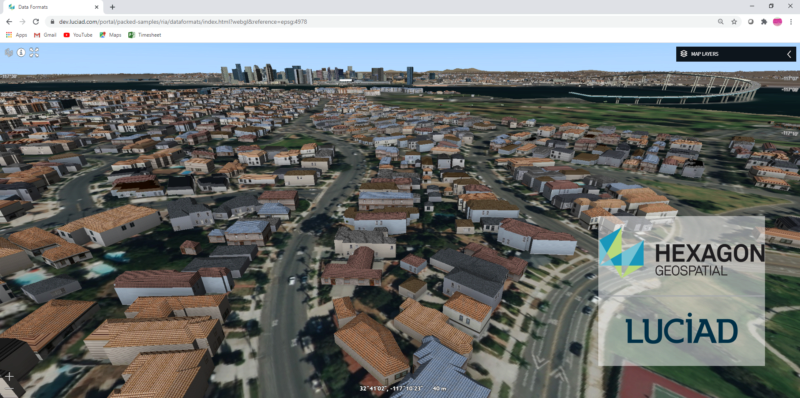

=== Abstract

This chapter investigates how model and terrain updates, originating from a CDB data
store and delivered as glTF or elevation, were integrated with background elevation and OGC 3D Tiles
into the client environment.

For a large data set, all the meshes from the CDB data store were converted to an OGC 3DTiles tileset.
Displaying the resulting pre-processed OGC 3DTiles offers performance and visual quality advantages over reading the
CDB data store directly. The increased efficiency was due to a better tiling scheme and mesh simplification.

The question of generating tiles on the fly from the CDB data store was explored, but the implementation could not
be finished in time for the Sprint.

OGC 3DTiles can be automatically adapted to elevation updates, whether they come from a CDB data store or another source.
This was achieved through a proxy service that reads B3DM files and
adjusts the height of the vertices before forwarding them to the client. The possibility to do this at render time,
on the client, using GPU evaluated expressions was also explored.

Using GPU evaluated expressions, deletions/updates/additions in the CDB data store were handled by pushing down
background OGC 3DTiles. The old and new models integrated seamlessly, and there was no need to reprocess the entire
dataset to create a single coherent OGC 3DTiles tileset.

[#img_Architecture,reftext='{figure-caption} {counter:figure-num}']
.Architecture of the OGC server with proxy for on the fly 3DTiles height adjustment.
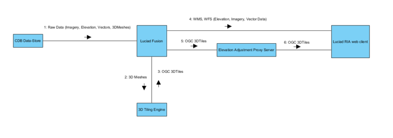

=== Test Data

The research was based on the San Diego CDB sample dataset provided for this Sprint. It provided imagery, elevation, 3D
models and a variety of vector data.

[#img_CDB_ORGANIZATION,reftext='{figure-caption} {counter:figure-num}']
.CDB organization in file system.
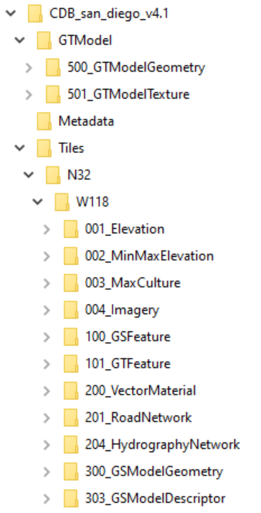

=== Organization of CDB for 3D Models

This section recaps the organization of CDB data for 3D models.

==== GSFeatures and GSModelGeometry

GSFeatures and GSModelGeometry were two folders containing matching Level Of Detail (LOD) folders.
In the GSModelGeometry folder, OpenFlight cite:[OpenFlight] files were zipped in groups corresponding to a tiling schema.

GSModelGeometry items were unique in the sense that OpenFlight files were used only once (one file per building) while
textures could be reused many times.

LOD folders were additive, meaning that each LOD adds more data relative to it's parent rather than replacing it.

The GSFeature contains point features that have a parameter "MODL" giving the name of a model geometry in the
OpenFlight format. This was not the full path or even relative path to the geometry but rather a name that must be
matched with one of the files (zipped) at the corresponding LOD level if present at all.

===== SHP and DBF files

GSFeature folder was made up of Esri SHP files linking to DBF files where the DBF files had many-to-one relationships
amongst themselves.

==== GTFeature and GTModelGeometry

GTFeatures were similar to GSFeatures except that the GTmodels were instanced and a single GTModel could be referenced by
many GTFeatures.

==== CDB Technical Specification Recommendations

Based on the San Diego CDB data set, the compression of
OpenFlight data through zip led to a minimal gain in hard-drive memory usage (on the order of 5%).

A much greater compression could be achieved on textures that in this case were mostly encoded in SGI .rgb format.
The SGI .rgb format isn't a default format like JPEG or PNG which means developers will usually need to
include 3rd party libraries or write extra code.

The relative path to the 3D model could be inserted in the parameters of the GSFeatures rather than
a short name. This would waste a few bytes of memory but would reduce the complexity of the decoder code.

A flat single DBF file accompanying every feature SHP file could be envisaged rather than multiple ones with
many-to-one relations. This would help with the limited capabilities offered by some APIs relative to this format and
this might be a case where it was better to waste a few bytes of data for the sake of simplifying decoder code.

=== Pre-processing CDB 3D Models to OGC 3DTiles

[#img_SANDIEGO_ILLUSTRATION_1,reftext='{figure-caption} {counter:figure-num}']
.San Diego as 3DTiles with background imagery.
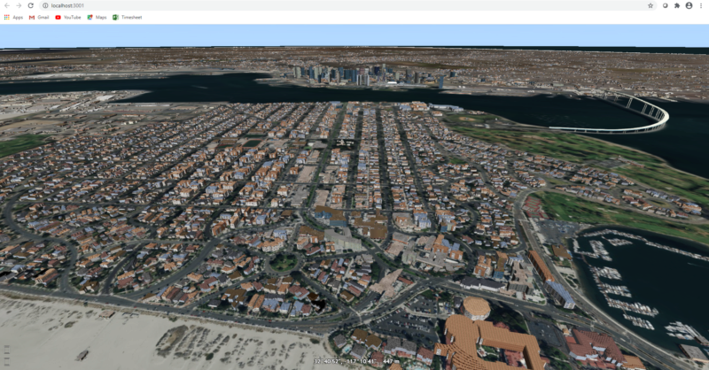

CDB uses a tiling system where higher Levels Of Detail (LOD) add mesh models. Single buildings also had
several LODs embedded in a single file. While this gave the flexibility to achieve anything visually, it was complex to
decode on the client or to process on the fly. This section describes an approach to convert the entire CDB 3D
models to a more efficient OGC 3DTiles tileset through a pre-processing stage.

When converting to 3DTiles, only the highest LOD for every 3D model was taken into account to re-generate a complete
tileset.

[#img_Octree,reftext='{figure-caption} {counter:figure-num}']
.Octree data structure
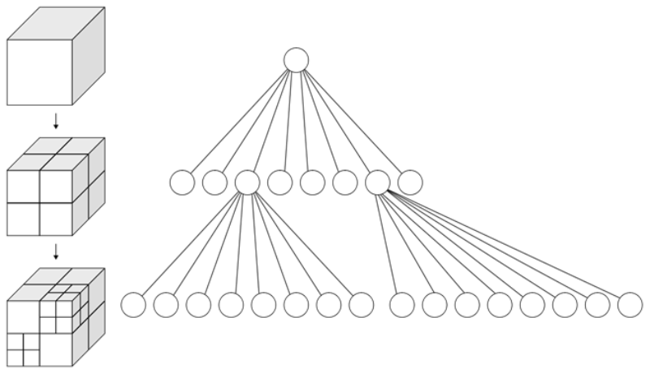
The new LOD structure was an octree where child nodes entirely replaced parent nodes.

Creating this structure was recursive process that repeated the following steps:
tiling -> grouping tiles -> simplifying -> re-texture

[#img_SANDIEGO_ILLUSTRATION_2,reftext='{figure-caption} {counter:figure-num}']
.San Diego as 3DTiles with background imagery.
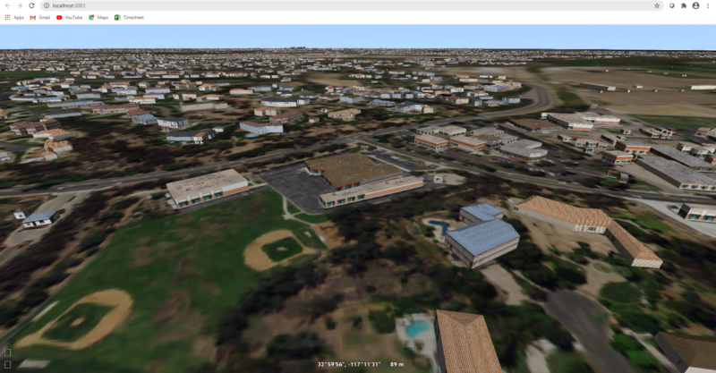
The pre-processed tileset could display more buildings at low LODs than would be possible by loading the raw files from
the CDB data store even if the distant buildings were simplified meshes with just a basic texture.

==== Mesh Simplification

[#img_MESH_SIMPLIFICATION,reftext='{figure-caption} {counter:figure-num}']
.Mesh simplification
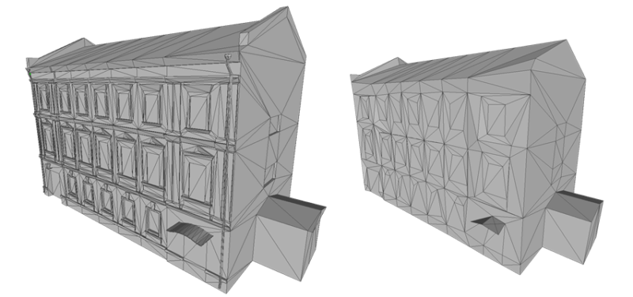
In lower LODs, the models were simplified using quadric edge collapse decimation.

Cluster simplification or dropping out smaller independent groups of faces were faster alternatives.

==== Parameterization and texture baking

[#img_MESH_Parameterization,reftext='{figure-caption} {counter:figure-num}']
.Mesh parameterization
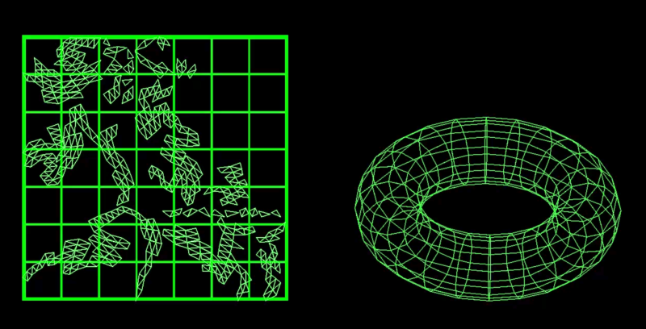

Meshes were re-parametrized (compute new texture coordinates). This was a
process of unfolding 3D meshes to 2D space while splitting it in the least amount of pieces and wasting the least
amount of space.

[#img_TEXTURE_BAKING,reftext='{figure-caption} {counter:figure-num}']
.Texture baking
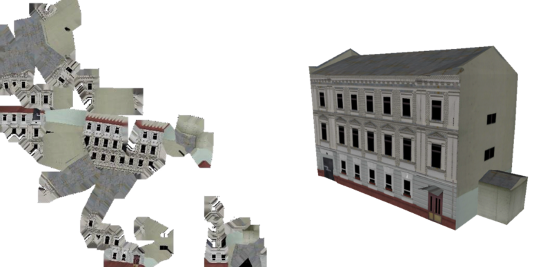

Texture baking was the process of using bits and pieces from the original textures to create a texture atlas. Having a
single texture per tile rather than one or more texture for every building decreased the overhead of having to pass
several textures to the GPU.

[#img_Repeating textures,reftext='{figure-caption} {counter:figure-num}']
.Examples of repeating textures.
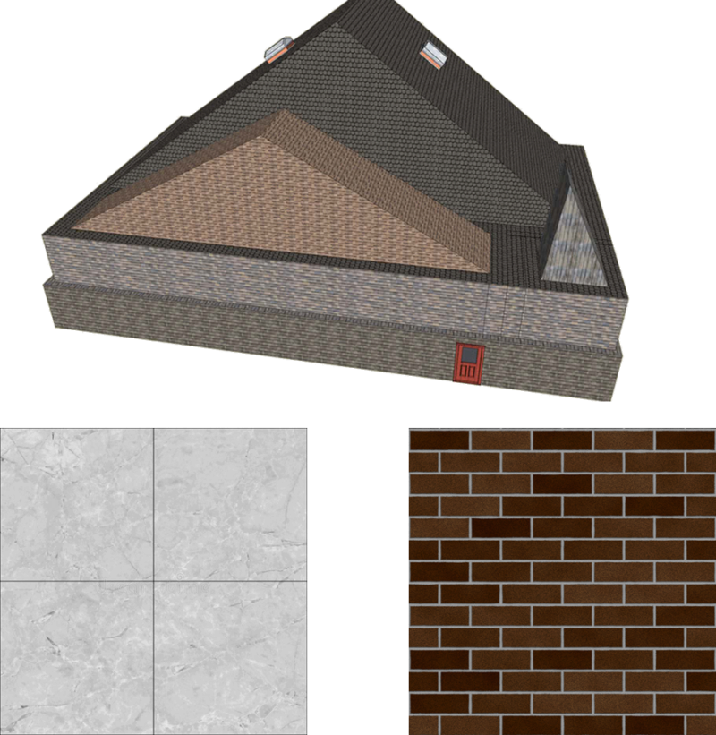
This task was made more complex by the use of repeating textures where UV texture coordinates went beyond the normal
0 to 1 range as in the example above. Repeating textures were common and seemed appealing because they could cover a large
area with apparent detail. However, they could not be used to create texture atlases and look unrealistic if overused.

Another drastic approach to solving repeated textures was to convert textures to color by taking the average pixel
color of a texture and using it instead. This gave the tileset a rather cartoony feel which could be amplified with
certain postFX.

==== Tile size

Every tile at every LOD used approximately the same size in memory.
At any given point of view, the client application loaded roughly the same amount of data.

==== Metadata and selection

The tiling may have cut buildings in pieces but this did not impact selection or access to metadata because an index was encoded inside the mesh faces linking them to the original model they belonged to.

==== Conversion speed

The drawback of this approach was the time it took. It was impossible to achieve this conversion on the fly and converting the entire San Diego dataset took several hours.

==== Referencing

CDB provided referencing and orientation of 3D models through point features. The height of the 3D models was either
given as a parameter of the point-features or could be inferred from elevation data provided in the CDB data store.

The referencing information was used but the heights were dismissed during creation of OGC 3DTiles. The height was
inferred at render time through GPU evaluated expressions on any loaded elevation data.

==== 3D data organization recommendations

The ideal pre-processed dataset didn't use the raw files but rather simplified, split and merged them into tiles of varying levels of detail. The LODs embedded inside OpenFlight files could not be used because the ideal level of simplification for a given tile depended on the entire dataset. This removed the need for a complex structure within the CDB data store. There were still certain recommendations that could help improve the pre-processing speed.

As a general recommendation, it does help to deal with files that have a moderate size. When dealing with millions of files
that are just a few kilobytes, the overhead of reading from the hard drive can become a bottleneck. At the same time,
dealing with very large files can use too much memory and they need to be split in advance.

It was also helpful if meshes covered a limited area. Consider the following scenario:

[#img_BAD_MESH_ORGANIZATION,reftext='{figure-caption} {counter:figure-num}']
.Sub-optimal repartition of meshes between files.
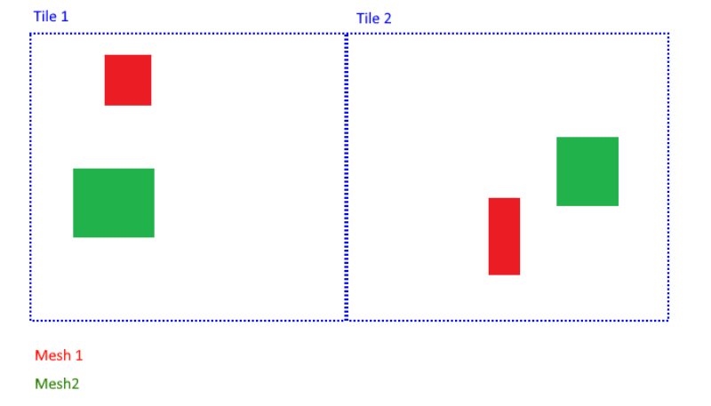
The 2 meshes were made up of several parts that span a large area and as a result, when Tile 1 or Tile 2 was generated,
both mesh files need to be loaded, split and merged.

[#img_GOOD_MESH_ORGANIZATION,reftext='{figure-caption} {counter:figure-num}']
.Optimal repartition of meshes between files.
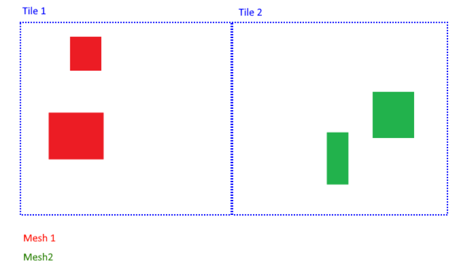
In this scenario, the mesh files were also made up of several parts, but because they were close to each other,
generating a tile only required loading one file at a time.

=== Serving OGC 3DTiles from CDB with on the fly tiling

Serving 3D Models on the fly meant that whenever a client application looked at the data from a certain angle, it would
send a request to the server that must gather the data to be visualized and convert it to glTF on the fly. This task helped handle updates more easily than using the previously described pre-processing approach.

At startup, the server created a tileset.json file by decoding and indexing the bounds of all the 3D models into an
octree structure. This process took around 5 minutes on the San Diego Dataset which contains about 6Gb of mesh data.
Each node was given a name and a tileset.json file was generated. The client therefore requested tiles that didn't
exist yet because the server generates them on the fly.
The LOD structure of the CDB data store wasn't used because in this particular case, it was inadequate. If the CDB
data store LOD structure could be used, the process would become almost instantaneous. A good LOD structure was one
that was deep and has small tiles of approximately the same size.

When a tile was requested, the relevant meshes were loaded, converted to glTF, wrapped in a B3DM file and sent back to
the client. This last part could not be integrated in an OGC 3DTiles service in time for the Sprint.

The approach of simplifying meshes for lower LODs could not be done in real-time because it was too slow. Simply dropping
out smaller buildings for lower LODs would have to be used.

==== Speed

The speed of the server was expected to be good enough to call real-time.

==== Quality

Mesh simplification was too slow to generate tiles on the fly. Instead, dropping out smaller models at low LODs
had to be used. If the tiles were additive, it was impossible to use different levels of detail for
textures. It's expected that a compromise would have to be adopted with respect to texture quality. A replacement tactic
would be better suited but requires more computation on the server.

==== Updates

Updates may be implemented by having a file watcher on the CDB GSFeature and GTFeature folders.
An update would trigger rebuilding the tileset.json and a notification to the client application.

This process could be almost instantaneous if an efficient tiling was implemented within the CDB data store. If the
tiling structure has to be re-built entirely, the time for an update rises but isn't prohibitive.

It's also possible to rebuild only certain branches of the LOD tree in case of an update but this was not usually done
for deep trees because the gain was minimal in comparison to the complexity of the implementation.

==== Server Caching

Tiles were automatically cached on the client using the browser's cache. Tiles could also have been cached on the server.

==== Data Structure

Depending on the dataset, an octree, quadTree or even an R-tree could be used for the LOD structure. Another data
structure that was ideal for frequent updates was a regular grid of cells. The grid of cells didn't need to be rebuilt
for every update, but it was uncertain if such a structure could be leveraged to serve 3D-tiles efficiently.

==== CDB 3D data organization recommendations

In this approach, a tileset.json tree was generated on the fly at startup of the server or when an update happens.
The tiles themselves were generated upon request.
Having OpenFlight meshes that were already organized in coherent LODs can improve the time it takes to build the
tileset.json.

A general recommendation was to split LODs into a regular grid of cells and to make sure that cells were small. A general
guideline would be about 500Kb per tile (mesh and texture included).

It's important to take into account that in the case of an additive approach, higher LODs were added to lower LODs
meaning that when the client loads a high LOD tile, it must also load all of its parents even if, for the largest part,
they were out of view. This also means that using different levels of detail for textures was impossible.

A Replacement approach was better in that respect. It implies that some features were repeated at several levels of
detail (only the point features were repeated, not the 3D models inside the CDB data store). A drawback was that updating
the CDB data store becomes more complex.

=== Handling terrain updates

A common issue was mismatch between terrain and 3D models that were typically served through different services.

In order to circumvent this issue, CDB datastores provided the elevation model that the 3D meshes should fit onto.

However, In order to serve very large 3D mesh datasets, they were pre-processed with embedded elevation.
When the elevation model in the CDB datastore was updated, the 3D Meshes needed to be re-processed accordingly and this
was a time-consuming task that could have been avoided.

[#img_ELEVATION_MISMATCH,reftext='{figure-caption} {counter:figure-num}']
.Mismatch between the elevation and the meshes on the left vs perfect match on the right.
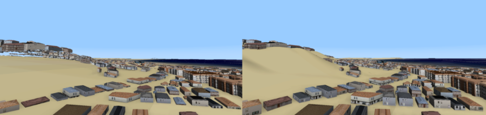
The image on the left shows a mismatch between the elevation model and the 3DTiles. The image on the right shows a
perfect match between the two.

==== Proxy Server Approach

The solution was to start by processing the 3D Meshes to OGC 3DTiles without taking the elevation into
account. Buildings were therefore on the ellipsoid with the assumption that the ellipsoid stayed constant. When the
client requested tiles, they were automatically shifted up or down according to a loaded elevation model, therefore
providing a perfect match.

Practically, this was achieved through a proxy server that forwarded requests to the OGC 3DTiles dataset but before
returning the B3DM files, shifting all the vertices according to an elevation model.
The server also had to decode the tileset.json files and shift the bounding boxes of the tiles.

[#img_On_THE_FLY_ELEVATION,reftext='{figure-caption} {counter:figure-num}']
.Adapting pre-processed 3DTiles to an elevation model on the fly.
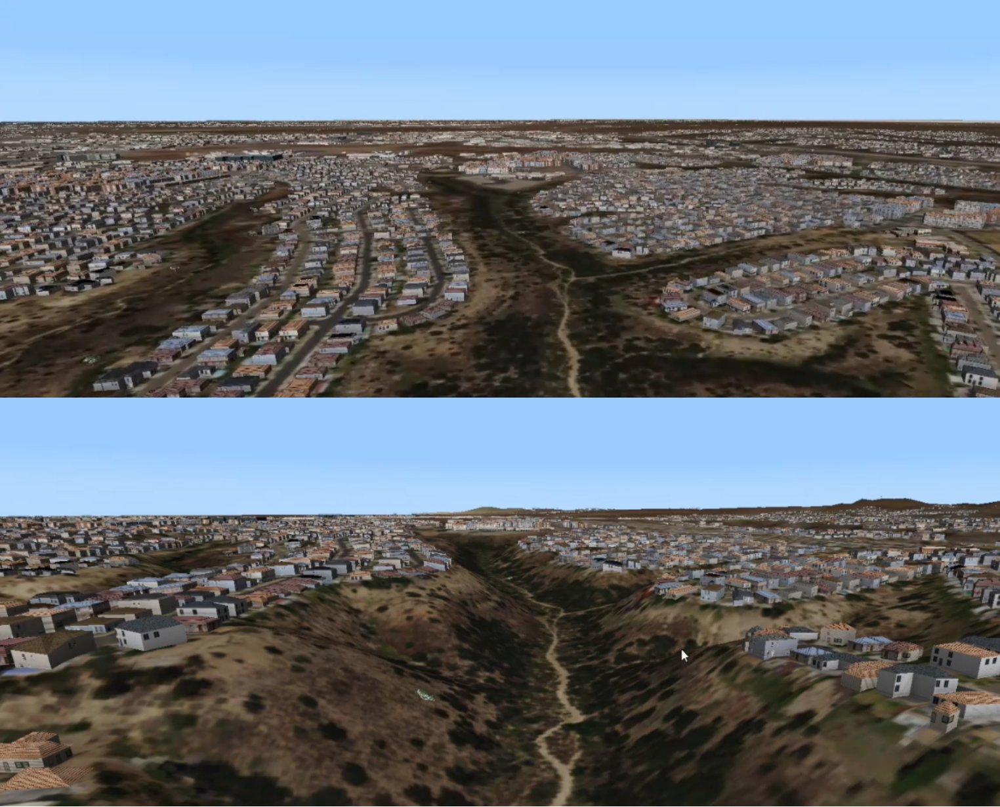
The top image shows the raw OGC 3DTiles that had no elevation. The bottom image shows the same dataset that
automatically adapted to the loaded elevation model on the fly.

The result was highly efficient with minimal performance impact.

The disadvantage of this approach was that the proxy server needed to be made aware of the elevation model loaded in
the client.

==== GPU Expression Approach

It was possible to match 3DTiles with elevation without a proxy server by using GPU evaluated expressions to
shift vertices up or down at render time, although this was not achieved. This was a similar approach to the one used
to handle <<Handling CDB Model Updates,CDB model updates>>.

A Proxy server wouldn't be needed anymore and the client could consume the original 3DTiles.
The solution would also be more efficient since the vertex shifting operation would be done on the highly efficient GPU.

This was not achievable in this Sprint on technicalities. The GPU needed to have access to the elevation when
rendering a 3D tile but in the system used, elevation and meshes were rendered in different passes and the GPU never
had access to both at the same time. It would take deeper modifications to the rendering engine in order to achieve
this.

=== Handling CDB Model Updates

3D Meshes could be displaced at render time using GPU evaluated expressions. This technique allowed handling 3D model
updates and ensuring that there was no overlap or mismatch between data sets.

When 3D data was served <<Serving OGC 3DTiles from CDB with on the fly tiling, on the fly>> from a CDB data store,
updates were taken into account automatically.
However, <<Pre-processing CDB 3D models to OGC 3DTiles, pre-processing>> a large data set has several advantages in
terms of visual appearance and performance. In addition, model updates may originate from other sources than the CDB
store itself.

On the fly vertex displacement offered a solution for small model updates where the new data was processed into a
separate 3DTiles tileset. The original vertices that were part of the base 3DTiles tileset were squashed below the new
data and the result was a perfect integration. This tactic was only useable for smaller updates like a single building
or a small area. For a more general solution, <<Serving OGC 3DTiles from CDB with on the fly tiling>> offered the most
flexibility.

[#img_ADD_UPDATE_DELETE,reftext='{figure-caption} {counter:figure-num}']
.Small updates to the CDB datastore could be handled in separate 3DTiles tilesets.
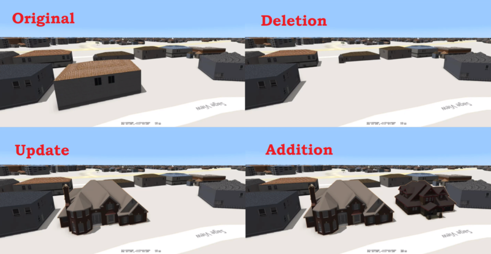

==== Deleted Model

When a model was deleted, it needed to be removed from the pre-processed background dataset. This was achieved by pushing
the vertices that correspond to the deleted model down.

==== Updated Model

In the case where a model was updated with a newer version, the new version was processed in a separate 3DTiles tileset.
The new tileset could not simply be loaded alongside the background 3DTiles because it would have overlapped with the previous version of itself. To resolve this, the vertices of the background data set that were inside the bounding box of the new model were squashed below the new one.

==== Added Model

In the case that a completely new model was added, it was converted into a separate OGC 3DTiles tileset and loaded
alongside the background data. This conversion to 3D Tiles was very fast for small models.

=== Future Work

On the fly tiling of CDB 3D data would have been the next step. Although it couldn't be achieved in this Sprint, there was
no blocking issue going forward. On the fly tiling would remove the overhead of the slow conversion to OGC 3DTiles and
would offer a more elegant solution to handling data-store model updates.

Automatically adapting 3DTiles tilesets to elevation model updates has been proven to work. More effort would be needed to
achieve this as a client-only solution which would make the implementation simpler.
