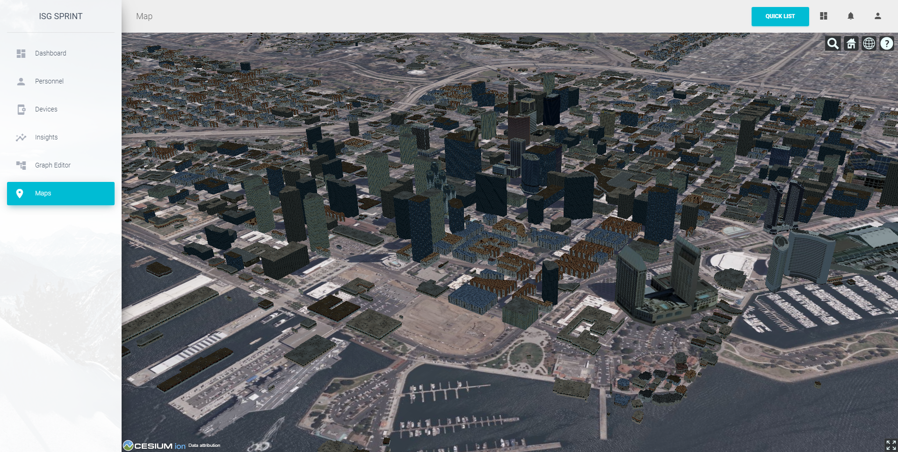
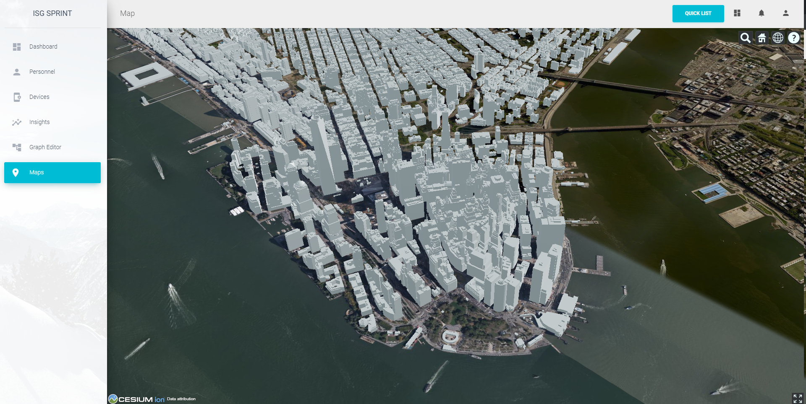
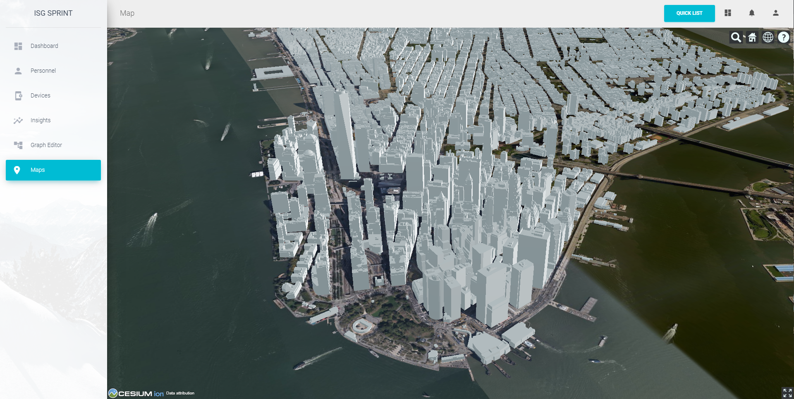
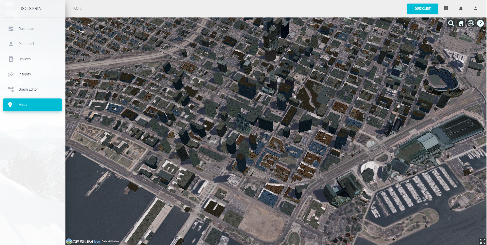
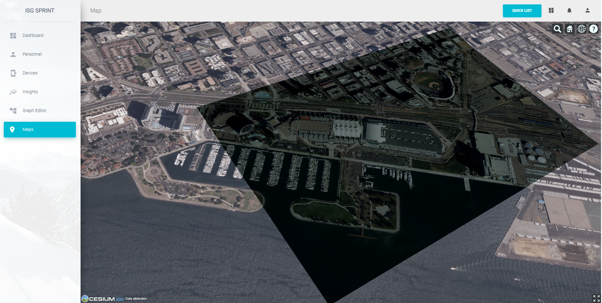
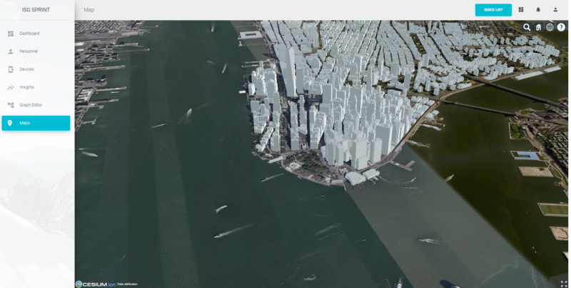

== InfoDao Sprint Report

=== GeoVolumes API and its role in the ISG Sprint
GeoVolumes API is a standardized API that allows for querying geospatial data based on properties like bounding box, data format, and other extents of the data. The main goal of the ISG Sprint was to test interoperability among various server-client interactions facilitated via GeoVolumes API. In short, participants tested how the GeoVolumes API could be served to reliably request and display data among different clients.

All participants were given access to the San Diego CDB, and the standards for the GeoVolumes API and CDB standards were given. Participants were also expected to visualize the data contained within the CDB. Over the course of the event, participants were able to discuss a range of potential uses as well as concerns over the specific role of GeoVolumes. This report will cover InfoDao's experience during the sprint and will reference side conversations with other participants.

As a quick summary, InfoDao was able to use the GeoVolumes API to quickly and reliably retrieve information. The ease of query generation coupled with the accessibility of 3D Tiles (e.g. GLTF/GLB as 3D data and Transform matrix as location data) allowed InfoDao's clients to visualize the CDB data with minimal development overhead. When compared to a standard like the CDB, the simplicity and accessibility of the data were greatly highlighted; taking implementation from 1 week for CDB to less than a day for 3D Tiles.

Resulting from the conversion of CDB to 3D tiles, a theme arose in discussion about how to ameliorate the differences among these standards. For instance, while InfoDao's client was able to access and display content from a CDB (utilizing the STAC specification from an OGC API implementation), it was not immediately accessible from a GeoVolumes perspective. On the other hand, CAE produced a seperate 3D Tiles distribution that allowed participants to more easily serve the GeoVolumes API. This worked well for the purposes of the Sprint, however, there is a question of the methods of supply multiple data distributions from one source of data. 
Helyx's sprint report contains great starting discussion on the various formats and delivery methods the OGC has standardized, and conversations with Ecere also highlight the similarities and potential future work actions that could resolve these issues.

But before we get into the weeds, let's show the results.

=== Source Data: Display and Tie Tables

Here are the images from the TIE table

*_Need title_*
[#img_InfoDao-1,reftext='{figure-caption} {counter:figure-num}']
.Ecere's San Diego 3D Tiles

////
.Ecere's San Diego 3D Tiles

////

*_Need title_*
[#img_InfoDao-1,reftext='{figure-caption} {counter:figure-num}']
.Ecere's New York 3D Tiles

////
.Ecere's New York 3D Tiles

////

*_Need title_*
[#img_InfoDao-1,reftext='{figure-caption} {counter:figure-num}']
.Steinbeis' New York 3D Tiles

////
.Steinbeis' New York 3D Tiles

////

*_Need title_*
[#img_InfoDao-1,reftext='{figure-caption} {counter:figure-num}']
.Steinbeis' San Diego 3D Tiles

////
.Steinbeis' San Diego 3D Tiles

////

*_Need title_*
[#img_InfoDao-1,reftext='{figure-caption} {counter:figure-num}']
.Helyx's San Diego 3D Tiles

////
.Helyx's San Diego 3D Tiles

////

*_Need title_*
[#img_InfoDao-1,reftext='{figure-caption} {counter:figure-num}']
.Helyx's New York 3D Tiles

////
.Helyx's New York 3D Tiles

////

*_Need title_*
[#img_InfoDao-1,reftext='{figure-caption} {counter:figure-num}']
.Cesium's New York 3D Tiles
image::images/InfoDao/cesiumNewYorkPassing.png[width=800,align="center"]

////
.Cesium's New York 3D Tiles
image::images/InfoDao/cesiumNewYorkPassing.png[align="center",width="800"]
////

=== Future Discussion

GeoVolumes performs well and is easy to implement, however it is not free from issues. While it is easy to see it as a wrapper for accessing geospatial data, the OGC already has such containers (via the OGC API for instance) for other data formats. This sprint highlights the roles and limits of GeoVolumes and its supported data formats (GLTF and JSON) by taking its contrast with CDB. InfoDao's experience with the sprint also discovered similar enquiries to Ecere's issues in using the OGC API as a potential bridge between the two standards (whether by extension specification or with the core specification)

==== GeoVolumes API Discussion: CDB comparisons and OGC API discussion

InfoDao stood up a test server to quickly simulate server client transactions for consuming the data. The OGC API compliant PyGeoServer instance was configured to serve San Diego CDB through a STAC interface. Since our client could read CDBs and the dataset was easily traversable through the server's json responses, we could perform various operations of accessing and retrieving CDB data. The operations were

    1. Access the Metadata to get the extents of the data set. This was usually the boundaries as a polygon of LatLng points. Needed to convert from XML to JSON and also reference the CDB spec.
    2. Fetch raster tiles that were available at specific LODs. Because of the data formats of the tiles (JPEG2000 for raster imagery, and TIFF for elevation data), InfoDao also stood up a small conversion service that would convert imagery into a consumable format
    3. Fetch Geometry from the server. The 3D models were in OpenFlight format and not immediately accessible for 3D rendering in our clients. However, the related .flt and .rgb models were downloaded as described in the spec and converted on disk.
    4. Display convert geometry from the server and check for localization errors. Using the .dbf, .dbx, and .shp files, Geometry was able to be loaded and placed to the correct locations.
    
In comparison, we used the GNOSIS server hosted by Ecere to access the GeoVolumes version of the data during the sprint. The operations were:

    0. Query the root api to get metadata about the layers. This included bounding box information and a general short description.
    1. Fetch Raster tiles at a specific LOD, no conversion needed since two supported distributions were available (.jpg and .png)
    2. Fetch Geometry tiles at a specific LOD, no conversion needed since GeoJSON and GLTF were available.

While the CDB and GeoVolumes API are two separate OGC standards, participants showed that these standards have a pathway to become interoperable together rather than interoperability among members in each standard. During implementation of the CDB layer highlighted two problems:

    1. The server does not know what the CDB standard is. This leaves clients to understand how to access geospatial information in the CDB without any guidance or helper functions from the server.
    2. The client does not know what the data formats inside the CDB are. It was helpful to have an on-the-fly converter endpoint for images (e.g. JPEG2000 to JPEG/PNG), and it could be extended to other helper functions for 3D geometry, etc.
    
---Insert image here

==== Wrapping it up
In this sprint, GeoVolume API's straight forward approach to 3D data along with flexible helper functions at the core (bbox querys and data distribution methods) enabled the participants to consume data in convenient ways. There are great concurrent discussions about the more technical aspects of this proposition. Helyx's sprint report features investigations on how to handle multiple data distributions and which should be supported. Also, Ecere's works also highlight parallels between GeoVolumes and other OGC APIs like the Tiles and Features APIs. As a newcomer to the OGC, GeoVolumes API was straightforward to consume and did not lend itself to errors due to easily accessible data formats and the lack of conversion.

