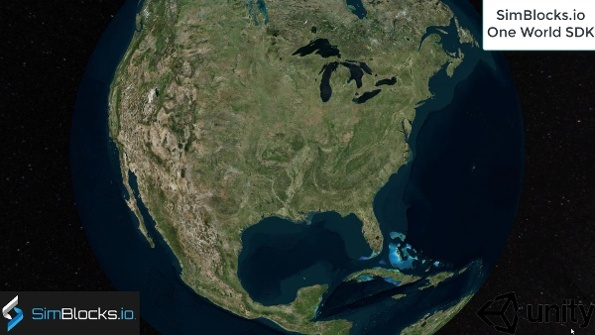
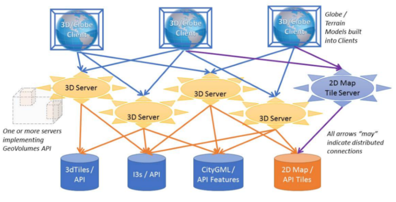
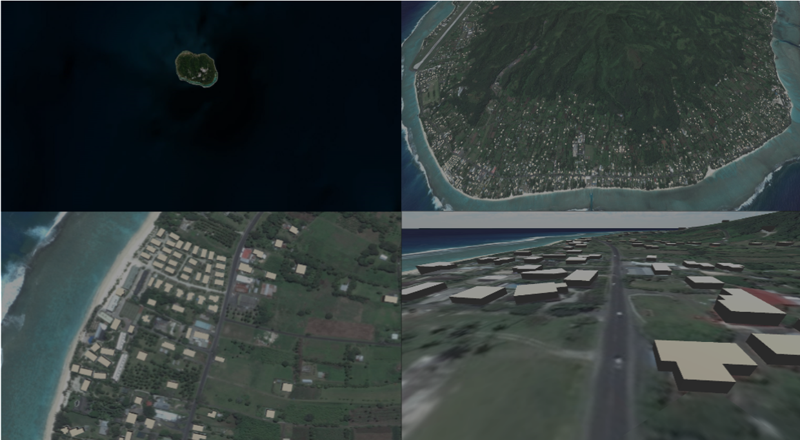
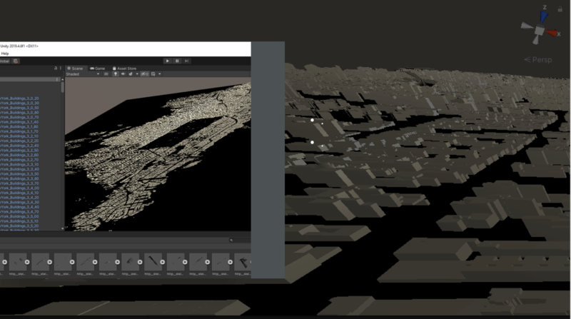
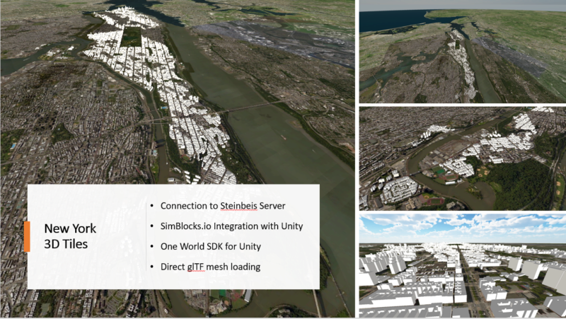

== SimBlocks.io Sprint Report

=== Subject

This Sprint Report reviews the participation of SimBlocks.io in the OGC Interoperable Simulation and Gaming Sprint, which was held from September 21 through September 25, 2020.

=== Summary

The purpose of the OGC Interoperable Simulation and Gaming Sprint was to advance the use of relevant OGC and Khronos standards in the modeling and simulation community through practical exercise and testing of the OGC GeoVolumes API draft specification, including data formats included in the processing of 3D models pass through the OGC GeoVolumes API such as 3D Tiles and CDB. The SimBlocks team submitted a proposal in August in response to an open call for participation in the sprint and was accepted within a week. SimBlocks agreed to participate in the sprint and also join the Open Geospatial Consortium as an Associate Small Company Member. This report will provide a fresh perspective on the OGC GeoVolumes API from a company that did not participate in the previous 3D Data Container and Tiles API Pilot.

=== Previous Work

SimBlocks specializes in connecting commercial gaming technologies with real-time 3D visualization applications by supporting industry standards for geospatial terrains, 3D models, and communication interoperability. SimBlocks has created a whole-earth visualization tool using the COTS Unity game engine capable of rendering the entire globe at any location at multiple levels of detail for imagery and elevation data. The One World SDK for Unity can consume geospatial data from cloud providers using web services APIs to process imagery, elevation data, and vector data. We have tested ingesting data over web services including as Microsoft Bing Maps, OpenStreetMap, and a CDB web service provider. The One World SDK for Unity also supports direct loading of high-detailed content insets using a variety of modeling formats, including OpenFlight, CDB, and GeoPackage. We have also recently prototyped solutions to integrate 3D Tiles and glTF models in Unity by connecting to Cesium Ion. Our team has found that Unity is a very capable development tool that is well suited for prototyping visual applications with deployment capabilities for virtual reality and augment reality devices.

[#img_SimBlocks-1,reftext='{figure-caption} {counter:figure-num}']
.One World SDK for Unity

SimBlocks has been operating for over 4 years and is located in Orlando, Florida at the University of Central Florida Business Incubation Program at Research Park.

=== Architecture
The OGC GeoVolumes architecture separates visual client applications from servers holding the 3D model content. The exact format of the models is hidden from the client. From the perspective of the client, the main benefit of the GeoVolumes API is that fewer 3D model formats need to be supported and accessing the models for a known area becomes very simple. From reviewing the 3D models provided by the servers, 3D Tiles content (including glTF) is the primary format that was necessary to be supported by our Unity-based client.

[#img_SimBlocks-2,reftext='{figure-caption} {counter:figure-num}']
.OGC GeoVolumes Architecture

=== Proposed Activities
* Test models from multiple servers
** Identify model processing issues.
** Identify performance bottlenecks.
** Identify model loading and rendering optimizations.

* Implement selected features of OGC API – GeoVolumes draft specification
** Support loading 3D geospatial data in One World SDK for Unity.
** Investigate bounding volume scale and shape tradeoffs.

* Investigate potential issues with Virtual Reality device deployment.

=== Server Testing
SimBlocks agreed to review communicating with the various servers developed by other participants in the Sprint. We first checked if the URLs for the Landing Page, Conformance, api, Collections, and 3D Container pages existed. If so, each of the pages would appear as a webpage in a browser in the form of a human-readable JSON file.

Once the servers were reviewed, we attempted to retrieve the models from the servers and save the B3DM files. During this process we confirmed that we need to accommodate whether the server contains their models as URLs (Steinbeis) or URIs (Cesium, Cognitics, Ecere, Helyx, InfoDao). We identified that some servers with URIs intended for the B3DM files to be relative to the domain (Ecere) and others intended for the files to be appended to the URL of the current endpoint (Cesium, Cognitics, Ecere (Pilot), Helyx, InfoDao).

After successfully retrieving models from most of the servers, we developed tools for converting and loading the building content.

The results of our testing can also be found here.
https://github.com/opengeospatial/OGC-ISG-Sprint-Sep-2020/wiki/TIE-Table-and-Reports

=== Conversion Methods

This section describes the methods we used to import glTF content into Unity. Because the Unity Editor does not currently directly support 3D Tiles or glTF content, our team reviewed several open source repositories to see how well they worked. Eventually, we included an approach of developing our own 3D Tiles importer.

==== Method 1 - NASA Unity3DTiles Library

Our team reviewed the following open source libraries:

** https://github.com/KhronosGroup/UnityGLTF
** https://github.com/Siccity/GLTFUtility
** https://github.com/ousttrue/UniGLTF
** https://github.com/NASA-AMMOS/Unity3DTiles

After reviewing the glTF libraries, our engineers determined that UnityGLTF would work. Additionally, a version of UnityGLTF is included in the Unity3DTiles repository, both of which are written in the C# language, which is preferred by Unity’s scripting system. We assigned one of our interns to test the Unity3DTiles library as part of a summer internship. Eventually, we were successful with connecting to the Cesium Ion web service and visualize glTF models on an island. One drawback of the Unity3DTiles library is that it requires a license to use in commercial applications, which prevented further integration of the library.

[#img_SimBlocks-3,reftext='{figure-caption} {counter:figure-num}']
.CesiumIon OSM Building

==== Method 2 - B3DM to OBJ

Unity is already able to directly load OBJ models, so we pursued a second approach of converting 3DTiles B3DMs (Batched 3D Models) into OBJ files using native C++ code. After parsing the B3DM glTF mesh buffers and accounting for position offsets, conversion to the OBJ format was straightforward. Our algorithm produced multiple OBJ files per B3DM file as each B3DM may contain multiple meshes. We downloaded all of the B3DMs available for a given server and converted the available B3DMs to OBJ files. Then, imported the OBJ files into Unity Editor, which requires significant time for large data sets. The scene could be run at interactive rates.

[#img_SimBlocks-4,reftext='{figure-caption} {counter:figure-num}']
.B3DM to Obj Conversion in Unity Shown in Unity

==== Method 3 - Directly load B3DM

The purpose of our third approach was to leverage more of our C++ codebase without requiring a conversion to an intermediate file format. The primary trick with this approach was to solve how to render meshes appropriately using C++ code with Unity. One of our developers identified that the Unity Native Rendering API could be utilized to solve this problem and was able to complete the direct loading and rendering of B3DM content during the sprint week.

[#img_SimBlocks-5,reftext='{figure-caption} {counter:figure-num}']
.Directly load B3DM Tiles

=== Future Work

The SimBlocks team found the OGC GeoVolumes Sprint to be very useful. Additional work items that we would like to continue as we experiment with processing geospatial content using real-time 3D game engine technologies are:

* GeoVolumes bounding volumes queries
* Runtime conversion performance improvements
* Terrain clamping improvements

After discussing with Unity’s geospatial team, we have identified a 4th method of conversion that promises to be even faster than Method 3 (Directly load B3DM) while also allow us to use native C++ code.
