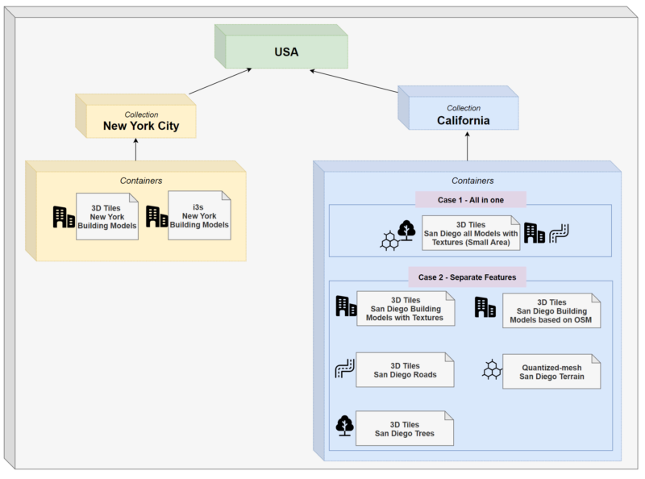
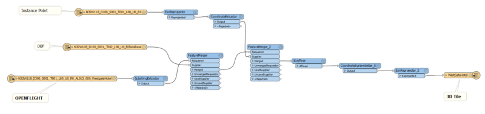
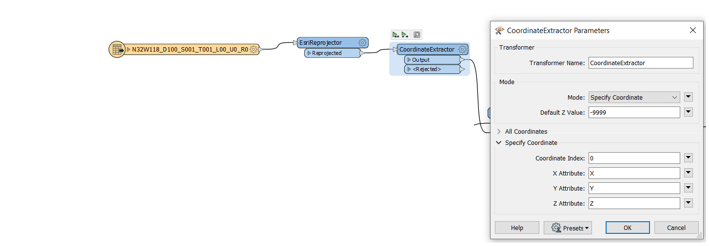
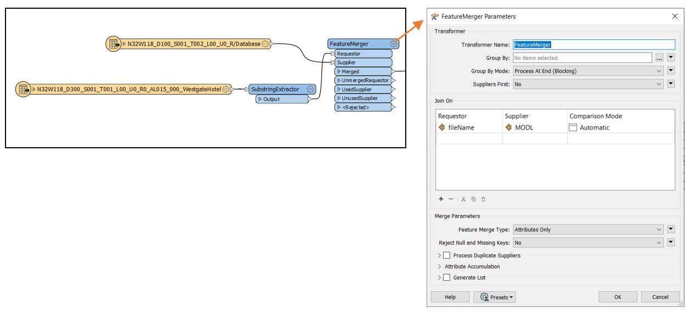
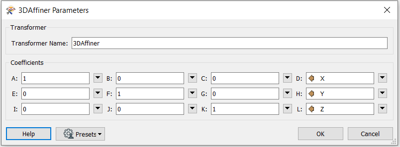
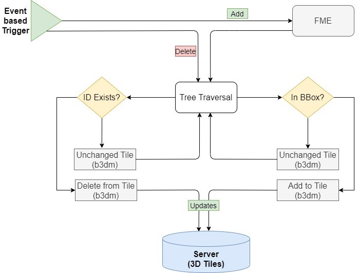
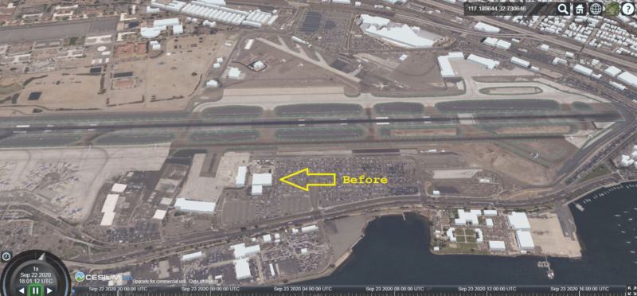
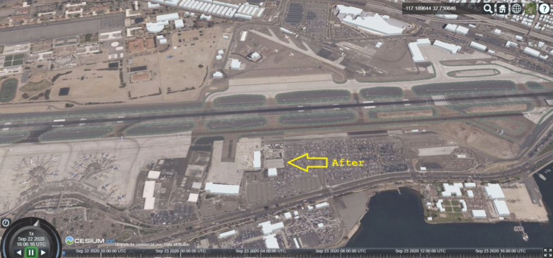
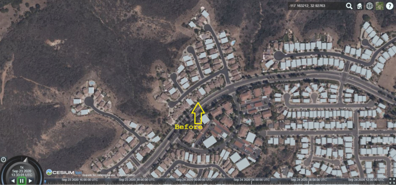
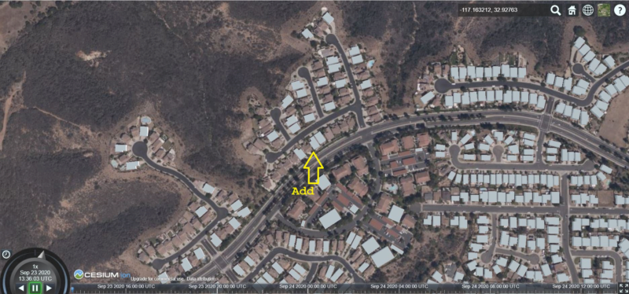

== Steinbeis Sprint Report

=== Overview

In the ISG Sprint, Steinbeis had developed a 3D web application for simulating the modern urban mobility such as air-taxi or E-bike in the 3D urban environment. In this application, our concept and implementation used the GeoVolumes API for managing the standard 2D or 3D static geospatial resources including building models, road network, tree, imagerys, and terrain. At the same time, the dynamic moving data such as taxi, air-taxi movement, e-bike movement was managed by the OGC SensorThings API standard.

=== Server Implementation

==== GeoVolumes API Server

In OGC 3D Container and Tiles API pilot, Steinbeis had successfully implemented the GeoVolumes API server to deliver geospatial resources supporting 3D Tiles, I3S, and CityGML formats in the area of New York City. This server supports the hierarchy and bounding box query through the collections and containers. This server is available at http://steinbeis-3dps.eu:8080/3DContainerTile/

In this ISG Sprint, we expanded the API mentioned above in the new server (http://steinbeis-3dps.eu/3DGeoVolumes) to serve the provided dataset from the Sprint in the San Diego area and an open-source CityGML dataset of LoD 1 buildings of California. The dataset in the API will be available in 3D Tiles format. The available geospatial datasets which are not in the visualization-ready formats such as CDB will be first converted before serving through the API. In this sprint, we were not covering the conversion part and received the ready-converted data from CAE and Ecere.

We tested and evaluated the different organization of the underlying 3D data at the server. Two approaches was compared on our client with the San Diego data set:

* Case 1: Organize the data on the server in one single bounding volume hierarchy containing all features.
** San Diego 3D models (3D Buildings, Tree, Imagery, Terrain): https://steinbeis-3dps.eu/3DGeoVolumes/collections/California/SanDiego3DModelsWithTextures/3dtiles/
*	Case 2: Organize the data on the server in multiple bounding volume hierarchies per feature types such as:
** San Diego 3D Building Models - 3D Tiles - LoD1 (from OSM) : https://steinbeis-3dps.eu/3DGeoVolumes/collections/California/SanDiego3DBuildings_LoD1/3dtiles/
** Roads : https://steinbeis-3dps.eu/3DGeoVolumes/collections/California/SanDiegoRoads/3dtiles/
** Trees : http://steinbeis-3dps.eu/3DGeoVolumes/collections/California/SanDiego3DTrees/3dtiles
** Terrain as Quantized Mesh : https://steinbeis-3dps.eu/3DGeoVolumes/collections/California/SanDiego3DTerrain/quantized-mesh/

The hierarchical collections of Steinbeis GeoVolumes API can be illustrated as shown in <<Steinbeis-GeoVolumeServers2>>.

[#Steinbeis-GeoVolumeServers2,reftext='{figure-caption} {counter:figure-num}']
.Areal Taxi on Steinbeis Client.

==== SensorThings API Server for Urban Mobility
In this Sprint, we used the OGC SensorThings standard (https://docs.opengeospatial.org/is/15-078r6/15-078r6.html) as a specification for managing the synthetic urban mobility data in San Diego city. The data modelling of the SensorThings API server for this sprint is shown in <<Steinbeis-SensorThingsDataModel>>:

[#Steinbeis-SensorThingsDataModel,reftext='{figure-caption} {counter:figure-num}']
.Steinbies SensorThings Data Modelling.
image::images/Steinbeis-SensorThingsDataModel.png[width=800,align="center"]

For the server implementation, we used the FROST-Server (https://github.com/FraunhoferIOSB/FROST-Server); an open-source implementation of SensorThings API part 1: Sensing, developed by the Fraunhofer IOSB as our SensorThings server for managing the dynamic dataset. This server is available at https://steinbeis-3dps.eu/sta-isg-sprint/ collecting the synthetic 3D routes in the area of San Diego.

=== Client Implementation
The client (https://steinbeis-3dps.eu/STT3DClient/) application was based on CesiumJS framework. It was partially based on the implementation from the Steinbeis OGC 3D Container and Tiles pilot client. The User Interface menu is shown in the image below which allows users to do following interacations:

* Load collections from the input 3D GeoVolumes API URL or select from an available list.
* Render the geospatial contents from the loaded collections/containers.
* Load and render the mobility route data as a 3D Map animation from the Steinbeis SensorThings server.
* Using the 3D Portrayal Services to request the data in the specific boudary area.

[#Steinbeis-Client-UI,reftext='{figure-caption} {counter:figure-num}']
.Steinbeis-Client-UI.
image::images/Steinbeis-Client-UI.PNG[width=400,align="center"]

==== Visualizing Contents from GeoVolumes API Servers
In this client application 3D Tiles from different sources are visualized. The 3D Tiles are requested from different servers from Steinbeis and other participants.

To request the tileset the client first acceses the 3D GeoVolumes server (https://steinbeis-3dps.eu/3DGeoVolumes) to load the collections described in the server part. The collections can be restricted with a bounding box, so only certain collections are displayed. This is done by checking the "Content.json" file on the server.

The datasets that are referenced in the content.json are shown in the dashboard on the client for a user to pick which one to visualize. By selecting a certain dataset, the user triggers another Post by the client server (Node.js) to the GeoVolumes server requesting the selected dataset. The dataset is then fetched and visualized in the client. We tested our client by loading and rendering the 3D city models of San Diego from our GeoVolumes server and other participants's GeoVolume servers. The following lists show some examples of the geospatial that rendering on the Steinbeis client:

* Visualizing San Diego Road from the Steinbeis GeoVolumes Server
+
[#Steinbeis-Client-to-Steinbeis-Server-RoadNetwork,reftext='{figure-caption} {counter:figure-num}']
.San Diego Road Model (Steinbeis server).
image::images/Steinbeis-Client-to-Steinbeis-Server-RoadNetwork.png[width=800,align="center"]

* Visualizing San Diego 3D Building models from the Steinbeis GeoVolumes Server
+
[#Steinbeis-Client-to-Steinbeis-Server-LoD2Texture,reftext='{figure-caption} {counter:figure-num}']
.San Diego 3D Building models LoD2 (Steinbeis server).
image::images/Steinbeis-Client-to-Steinbeis-Server-LoD2Texture.png[width=800,align="center"]

* Visualizing San Diego 3D Building models (LoD1 based on OSM) from the Cesium GeoVolumes Server
+
[#Steinbeis-Client-to-Cesium-server-OSM-LOD1-SanDiego,reftext='{figure-caption} {counter:figure-num}']
.San Diego 3D Building models LoD1 (Cesium server).
image::images/Steinbeis-Client-to-Cesium-server-OSM-LOD1-SanDiego.png[width=800,align="center"]

* Visualizing San Diego 3D models (only Building layer LOD2) from the Ecere GeoVolumes Server
+
[Visualization of LoD2 Models with Textures from Ecere Server]
[#Steinbeis-Client-to-Ecere-Server-LoD2Texture,reftext='{figure-caption} {counter:figure-num}']
.San Diego 3D Building models LoD2 with textures (Ecere server).
image::images/Steinbeis-Client-to-Ecere-Server-LoD2Texture.png[width=800,align="center"]

* Visualizing San Diego 3D Building models from the Helyx GeoVolumes Server
+
[#Steinbeis-Client-to-Helyx-Server-LoD2Texture,reftext='{figure-caption} {counter:figure-num}']
.San Diego 3D Building models LoD2 with textures (Helyx server).
image::images/Steinbeis-Client-to-Helyx-Server-LoD2Texture.png[width=800,align="center"]

==== Mobility Routes
To show different kinds of mobility, such as bike routes and air taxi routes, different synthetic urban routes were visualized on the client. By adjusting the height of the track to replicate a flight path with starting and landing maneuvers a air taxi route can be simulated. An Air Taxi moves presumably around 300 meters above the terrain, except for starting and landing.

To visualize these tracks in Cesium the route data is loaded from the SensorThings server followed by converting into the CZML format on the client side which allows CesiumJS to visualize the movement of an object by interpolating its position between the to given points. The locations of the objects are stored in the positon property together with the timestamps. These also include the time in seconds bases on the starting point of the epoch property.

[source,json]
----
  {
    "id": "AR-1",
    "name": "Air Route 1",
    "description": "The Steinbeis Synthetic Air Route in San Diego for OGC ISG Sprint 2020",
    "position": {
      "epoch": "2020-09-20T10:00:00Z",
      "cartographicDegrees": [
                    "<time_0>",
                    "<lon_0>",
                    "<lat_0>",
                    "<h_0>",
                    "<time_1>",
                    "<lon_1>",
                    "<lat_1>",
                    "<h_1>",
                    "...",
                    "<time_n>",
                    "<lon_n>",
                    "<lat_n>",
                    "<h_n>",
        ]
    }
}
----

The user can request the data from the Sensor things server and visualize it on the Steinbeis Client. The track of the vehicle, either bike or Air Taxi, is then visualized with a green line following the route. For example, <<Steinbeis-Client-to-Steinbeis-SensorThings-ArealTaxi3>> shows the visualization of the 3D air route of an air taxi over the San Diego City.

[#Steinbeis-Client-to-Steinbeis-SensorThings-ArealTaxi3,reftext='{figure-caption} {counter:figure-num}']
.Areal Taxi on Steinbeis Client.
image::images/Steinbeis-Client-to-Steinbeis-SensorThings-ArealTaxi3.PNG[width=800,align="center"]

=== Automatic Updates

With the update pipeline, existing 3D Tiles will be updated as the changes are made to the input 3D dataset. CDB data store has been used as the primary dataset in this sprint. The building models are stored in OpenFlight (* .flt) format within CDB store.  It was required to setup the OpenFlight to 3D Tiles conversion. FME is used for this purpose. In the following section this conversion from CDB (* .flt) to 3D tiles is discussed.

==== CDB to 3D Tiles Using FME:

FLT models are stored in the local coordinate system, which must be moved to the world coordinate system in order to project models on the actual ground locations. All the models are relative to the instance point which are stored in “GSFeature” or “GTFeature” within the CDB store. The instance point for a model can be found using FACC, FSC and MODL attributes stored in extended attributes file (* .dbf). The following <<FMEWorkbench>> shows the workbench used to convert the FLT models.

[#FMEWorkbench,reftext='{figure-caption} {counter:figure-num}']
.FME workbench for OPENFLIGHT to 3D Tile conversion.

All the inputs, transformers and the output ports of the above shown workbench are described in detail in the following section:

. *Input:* There are 3 input ports used in the workbench.
.. *FLT Reader:* It is used to read the OPENFLIGHT models. Within CDB store objects like buildings, vegetation, bridges etc. are stored in this format. One of the building models was selected to be converted in this workbench to be used as input.
.. *ESRI Shape Reader:* It is used to read the shape file format. Shape files are stored within “GSFeature” and “GTFeature”. These files contain instance point for the input object models.
.. *DBF Reader:* It is used to read the extended feature attributes that are required to join the instance point to FLT models. As mentioned above, FACC, FSC and MODL attributes are used to establish a join.

. *Transformers:* The transformers used in this workbench are discussed below:

.. *Substring Extractor:* This transformer is used to extract the part of the filename that is used to join the extended attributes.
.. *ESRI Reprojector:* with this transformer shape files are reprojected from WGS84 to WGS84/ UTM Zone 11N (EPSG:32611).
.. *Coordinate Extractor:* It will extract the X, Y, and Z coordinates from the shape file and store it as attributes of the shape file. The <<CoordinateExtractor>> shows the parameters set for this transformer.
+
[#CoordinateExtractor, reftext='{figure-caption} {counter:figure-num}']
.Coordinate Extractor Transformer in FME

.. *Feature Merger:* This transformer is fed with ‘Requestor’ and ‘Supplier’. The aim is to join the extended attributes stored in DBF file into the attributes of the FLT model. It will merge only the attributes.
There is another ‘Feature Merger’ used in this workbench that is used to merge the instance point X, Y, and Z coordinates stored as attributes in the shape file. Feature Merger used in this workbench is shown in <<FeatureMerger>>.
+
[#FeatureMerger, reftext='{figure-caption} {counter:figure-num}']
.Feature Merger Transformer in FME

.. *3D Affiner:* After merging the coordinates of instance point for the model into the model attributes, it is required to translate the model using these coordinates to place it on the actual location on the globe. 3D Affiner transformer is used for this purpose. X, Y, Z coordinates of instance point is already stored as the attributes in the model, hence it can be provided as input. The parameters set in this transformer are shown in <<3DAffiner>>:
+
[#3DAffiner, reftext='{figure-caption} {counter:figure-num}']
.3D Affiner Transformer in FME

+
This will shift the model to the world coordinate system. After this translation, model is reprojected again to WGS84 coordinates and is ready to be written as 3D Tiles.

. *Output:* The only output port for this workbench is 3D Tiles which is described below:
.. *3D Tiles:* The OPENFLIGHT model which is moved to the world coordinates system using the above-mentioned workflow is written as 3D Tiles using the 3D Tiles writer of FME.

This Workbench successfully translated the FLT models to 3D Tiles, but the issue was, it converted the models one by one. Batch deployment was tried to replicate the workflow for all the models, but it wasn’t successful during the duration of ISG sprint. This could be a future task to use FME to convert the CDB stored FLT models to 3D Tiles.

==== Automatic Update Workflow:

The <<UpdateWorkFlow>> shows the methodology used to update the existing 3D tile dataset. The starting point for this pipeline is an event-based trigger. On receiving the changes in the input datastore, this trigger will be executed which will initiate the update process. This <<UpdateWorkFlow>> shows that after receiving the changes, it traverses the existing tile tree to identify which tile(s) have been affected because of the change. The respected b3dm tile is updated for the changes and clients can view the changes.

[#UpdateWorkFlow, reftext='{figure-caption} {counter:figure-num}']
.Live Updates methodology

There are two kind of updates handled in this pipeline i.e. (i) Add, and (ii) Delete.

==== Delete:

It requires two inputs (i) the existing 3D tile dataset, and (ii) unique ID for the objects stored inside the tiles. The algorithm traverses the tree to search for object inside the tiles. After finding the tile to be updated, following algorithm is used to change the contents of a b3dm tile.

*Algorithm for Deleting a Building*

.. _Batch table contained in Binary 3D Model is searched for the ID. If the building ID to be deleted is present in the batch table, then batch table is updated, and program continues further execution, otherwise it stops._
.. _Feature Table is updated._
.. _Finally, glTF which contains geometrical information is updated by deleting chunks of binary data associated to the object deleted._
.. _Model is updated._

*Results of Live delete Objects:*

.Delete Object {Before Image}

.Delete Object {After Image}

==== Add:

It requires two inputs (i) the existing 3D tile dataset and (ii) new object(s) which are to be introduced into the existing tiles. The tree tile is searched to identify where does the new object fall inside the existing tree. This building will be added to a tile only if it is falls completely inside the bounding volume of an existing tile. After finding the node that has to be changed, following algorithm is used to update the b3dm.

*Algorithm for adding a Building*

.. _New building to be added is converted to 3D Tile using FME and stored temporarily._
.. _Since the positions stored in binary glTF are relative to the tile centre, Position vector of newly built tile is calculated again. A complete description is given in following section._
.. _Updating Feature and batch table of existing Tile._
.. _Merging of two binaries i.e. existing tile and tile for new building. For achieving this, glTF stored inside tiles is updated._
.. _Deletion of temporary tile created for new object._
.. _Existing 3D Tile is updated._

*Results of Live Add Objects:*

.Add Object {Before Image}

.Add Object {After Image}

==== Future Recommendations:

Progress has been made on the live update methodology which can make changes to the existing 3D Tile dataset with which clients will get updated 3D model data, but few questions remains which needs to be solved. There are few recommendations for the future work which are as follows:

. *OGC API - Feature Transaction:* As discussed with Ecere (another participant of ISG Sprint), OGC API - Feature transactions will be a good solution to deliver (i) models, and (ii) instance point (geographic reference for the models) to the server and on receiving these features, server can trigger the above mentioned ‘Update methodology’ to make live changes the existing 3D Tiles.

. *Batch deployment of CDB conversion using FME:* As mentioned above, FME has been successfully used to convert CDB to 3D Tiles, but due to time constraint the batch deployment wasn’t done. In future, the batch deployment of CDB to 3D Tile can be established in order to convert the whole CDB OPENFLIGHT models to 3D Tiles.

=== Discussion

==== 1. 3D GeoVolumes API Query - Polygon with a Hole.
During the sprint week, we have loaded and renders numbers of 3D contents from the GeoVolumes API servers to our client. In some cases we found that the contents are intersect to each other. For example, <<Steinbeis-Client-intersected-layers>> show the 3D Tiles texture layer (covering a smaller area) is intersect with the 3D Tiles LoD1 layer (covering a bigger area).

[#Steinbeis-Client-intersected-layers,reftext='{figure-caption} {counter:figure-num}']
.Areal Taxi on Steinbeis Client.
image::images/Steinbeis-Client-intersected-layers.png[width=800,align="center"]

In this case, we do not need the LoD1 layer to be loaded in a smaller bounding area which already render by the texture layer. The query capability for requesting the contents as a polygon with hole (or donut polygon) would help to filter the content on the server-side and save the bandwidth to client.

==== 2. 3D GeoVolumes API organization different semantic parts.
Currently, there is no concrete rule on how to name the different semantic parts. For example, the building models in the San Diego area can be hosted on

* 'https://LandingURL/collections/California/SanDiego/buildings/...

* 'https://LandingURL/collections/California/SanDiegoBuildings/...

* 'https://LandingURL/collections/California/SanDiegoCDB:Buildings/...

These gaps should be discussed and evaluated in the future development of the 3D GeoVolumes API specification.
