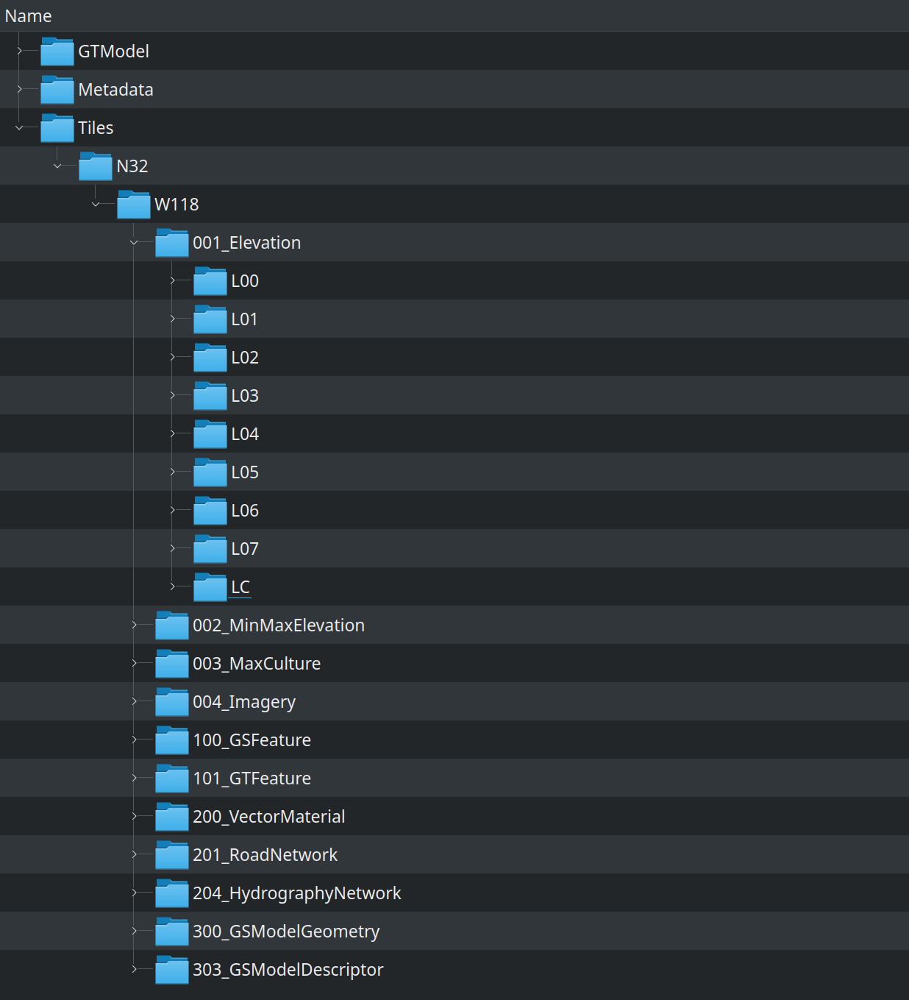
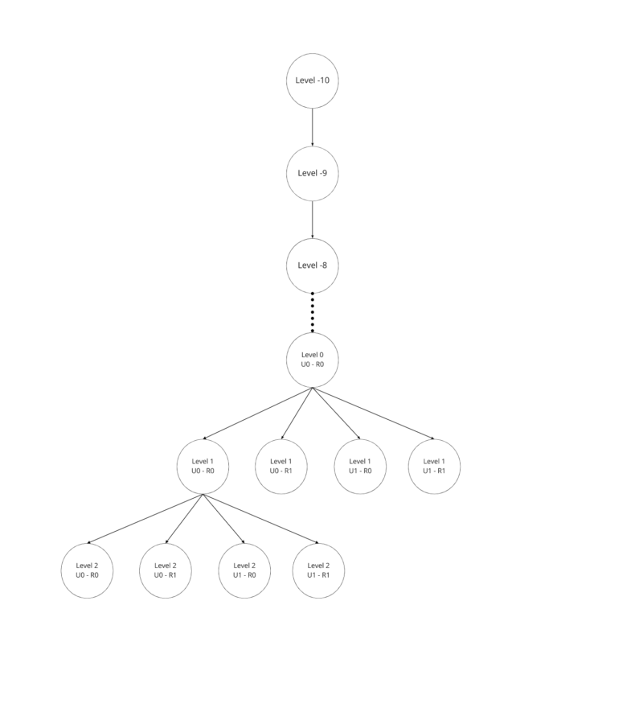
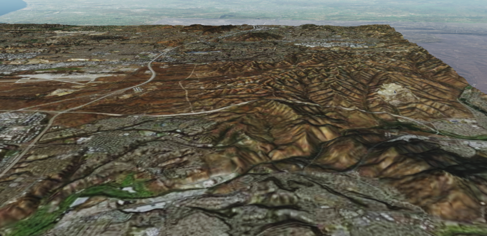
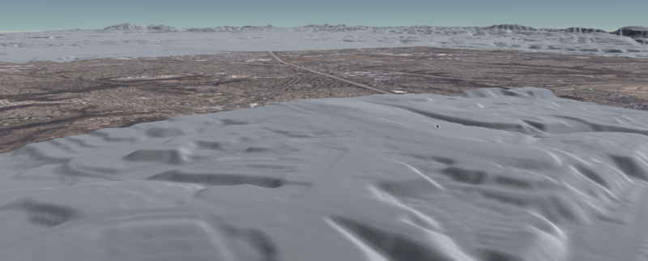
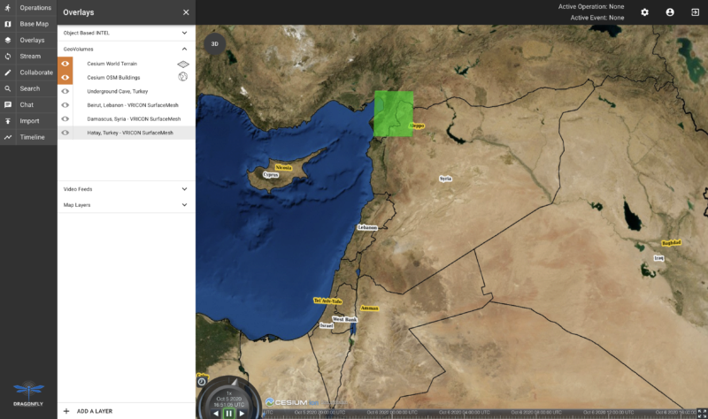

== CesiumGS

=== Introduction
In this sprint, we focused on investigating the optimal method of serving 3D content from a CDB dataset into a web viewer. We achieved this by converting the 3D data from the San Diego CDB into the OGC 3D Tiles format, and then evaluating the runtime performance of the result in the CesiumJS viewer. The idea of converting the test data to 3D Tiles on-the-fly was explored, however, there was not enough time to implement that in this sprint.

A parallel stream of effort involved building on our work in the 3D Container and Tiles API Pilot and integrating the GeoVolumes API into Dragonfly, a web based 2D/3D common operational picture (COP) platform built in support of the Global Situational Awareness (GSA) program.

=== CDB to OGC 3D Tiles

==== Organization of Test Data
.Structure of the San-Diego CDB database
[caption="Figure 1: "]

{nbsp} +
The San Diego CDB database’s size is approximately 26 GB. It contains a single GeoCell that covers the San Diego area. The GeoCell contains the following layers:

- Elevation layer, which is approximately 1.7 GB and stored in the TIF format
- Imagery layer, which is approximately 17.2 GB and stored in the jp2 format
- 3D Model layer, which is approximately 6.0 GB and stored in the OpenFlight format. Their features, orientations, and positions are stored in GSFeatures and GTFeatures directories, in the ESRI Shapefile format
- Vector layer, which is approximately 128 MB and describes road and hydrography networks. They are stored in the ESRI Shapefile format

Each layer is organized according to the same level of detail scheme. Each negative level will cover the entire GeoCell area. However, the positive levels are organized as a quadtree data structure. Each positive level subdivides the area into 4 smaller sections at the subsequent level. The amount of data stored in each level is specified differently for each layer by the CDB specification. However, generally, higher levels will contain more data to increase the detail of the layer.

==== The Converter Architecture

===== Tiling Scheme

In this Sprint, we focus only on the Elevation, Imagery, and GSModel layer. Each layer is converted into a separate tileset.

For the 3D Tiles structure, each node that represents a negative level will only have one child node with the bounding region being the region of the GeoCell. For positive levels, a node will have a maximum of 4 children representing a quadtree data structure. Each child only covers a quarter of the region of the parent node.

.Structure of the converted tileset
[caption="Figure 2: "]

===== Elevation and Imagery Conversion

The Elevation and Imagery are converted together into one tileset. The heightmap of each tile in the Elevation layer is triangulated into a mesh, and the imagery of the tile is used as the texture of the mesh. 

.San-Diego terrain and imagery
[caption="Figure 3: "]

{nbsp} +
There are 2 edge cases for the above tiling scheme. It is noticed that for the Elevation layer, the child nodes do not necessarily cover the full area occupied by the parent. As the camera zooms in close to the surface, there are holes appearing due to missing data for higher levels. The solution for this case is to sample the parent’s vertices where the child node doesn’t have data. This solution, however, is wasteful.

.Gaps between tiles appear due to missing data in the higher levels 
[caption="Figure 4: "]

{nbsp} +
Another edge case we encountered was that the Imagery layer can have more levels than the Elevation layer. The solution is to repeat the elevation mesh in the child node until there are no more levels for imagery. This is also a wasteful solution.

.This figure shows the difference in levels of detail between the elevation and imagery dataset. Notice that the elevation's maximum level is 7, whereas imagery's maximum level is 9
[caption="Figure 5: "]
image::images/Cesium-San-Diego-Terrain-Imagery-LOD-Diff.png[width=500, align="center"]

===== GSModel Conversion

For the 3D Model, we combine multiple OpenFlight files within a tile into one single batched 3D model (b3dm) file and organize the tileset similar to the tileset of terrain and imagery. We also batch models that have the same material into a single mesh to reduce the number of draw calls at runtime. As a result, we are able to obtain 40-60 frames per second, which is acceptable. However, the approach of combining multiple files into one single b3dm can yield very large file sizes for tiles at high levels of detail. For example, at level 4, there are b3dm files whose sizes are approximately 50 to 100 MB. As a result, the user has to wait 1 or 2 seconds to see the models appear. Better tiling schemes should be investigated in the future to reduce tile sizes while maintaining low impact on the rendering performance.

.San-Diego's GSModels
[caption="Figure 4: "]
image::images/Cesium-San-Diego-GSModels.png[700,700]

==== Future Improvements

To support on fly conversion, listed below are some improvements we would need to make to our conversion pipeline:

- Provide concurrency support. Currently, our converter works on a single thread. The conversion time for the San Diego CDB  is about 35 minutes. With concurrency support, we can reduce the runtime further, and fortunately, the CDB database scheme is suitable for such architecture.
- Since CDB specification defines the fixed extent a tile can cover, we can generate tileset.json quickly without reading into the data files of each layer
- We also noticed that the San Diego CDB contains a lot of OpenFlight and Imagery files, so it is essential to reduce the number of IO operations to increase performance of our converter. It also helps if the multiple 3D models can be combined into one single OpenFlight file.

=== GeoVolumes API

In collaboration with Cognitics and CAE, we aimed to build on our work done in the OGC 3D Container and Tile API Pilot. Our goal was to integrate the GeoVolumes API into Dragonfly, a common operational picture platform built to provide global situational awareness. Dragonfly uses WMS as the vehicle for organizing and serving 2D data, but there was a need for a container for all the 3D data that is available to the user. Our chosen format for 3D data was the OGC 3D Tiles format.

On the backend, we set up the GeoVolumes API to enable querying data on the client side, based on the bounding box of the current view of the map. The second part of our work involved setting up an endpoint to ingest 3D Tiles created by Rapid3D, a tool to used to generate 3D data from full motion video, and adding it to the available GeoVolumes collections. In the user interface, we added the ability for a user to "discover" the bounding box of a 3D collection by hovering over it in the GeoVolumes list, as shown below.

.GeoVolumes UI in Dragonfly
[caption="Figure 5: "]

