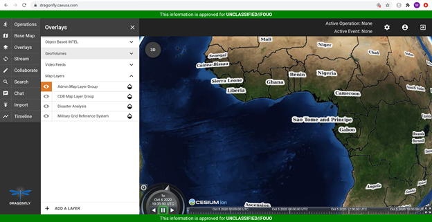
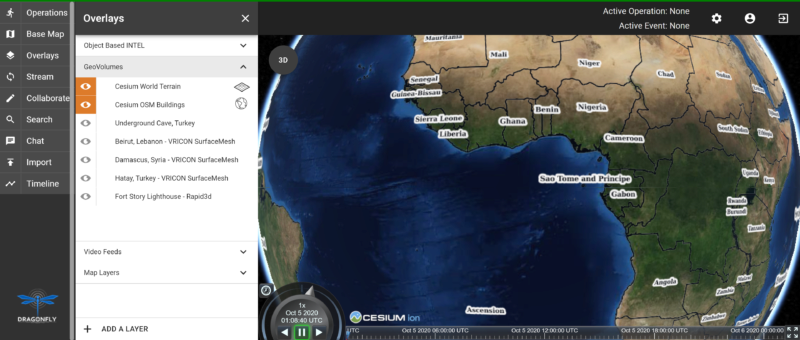
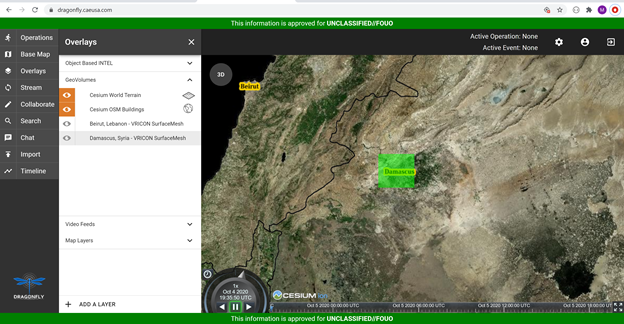
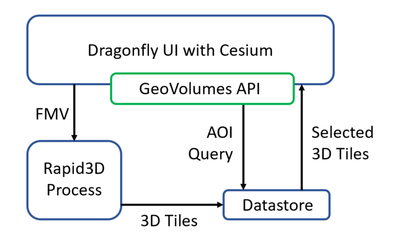

=== Cognitics Sprint Report

== Abstract
In cooperation with CAE and Cesium, we used GeoVolumes to enhance integration between our Global Situational Awareness (GSA) and Rapid3D (R3D) efforts. The current phase of the GSA effort has produced a prototype infrastructure/service called Dragonfly.

Within Dragonfly, a user has the ability to send full motion video (FMV) into Rapid3D for the generation of 3D content. When a production task has completed, Rapid3D provides the content back into Dragonfly for visualization in 2D and 3D (Cesium).

Currently, all content produced in this manner is incorporated into the visualization. It lacks any method for organizing the content for user filtering.

In this sprint, we:

*Implemented a GeoVolumes service providing Rapid3D result content.

*Implemented a GeoVolumes client in the Dragonfly web interface, allowing a user to select content based on source or geographic area.

This provides a realistic scenario for the sprint while also solving a real SOCOM need.

== Dragonfly

Dragonfly is a web based user interface currently hosted at https://dragonfly.caeusa.com/.  It contains a client that utilizes the GeoVolumes API for selection of 3D content. This client is found in the main menu under Overlays, GeoVolumes while in the 3D view.

When the user is zoomed out to the globe level, the effective bounding box is the entire globe, and all available GeoVolumes overlays are displayed in the table of contents.

As the user zooms in, the bounding box encompasses only the area shown in the user interface and only the corresponding GeoVolumes overlays are shown.  In the figure below, the bounding box includes Beirut and Damascus.  When the user hovers over a GeoVolumes overlay, the extent of that overlay is highlighted, as seen in the figure below of the Damasuc overlay.

== Architecture

Dragonfly is a web based user interface that supports both 2D and 3D content.

, align="center"]

== Damascus, Syria Vricon SurfaceMesh

The 3D content of Damascus, Syria is a SurfaceMesh provided by Vricon.

== Fort Story Rapid 3D Data

The Fort Story dataset is constructed from full motion video (FMV) that has been sent through the Rapid3D process to generate the 3D content.

1.	Did you retest anything that was tested in the Pilot, but with a slight variation (and what was the outcome)?
2.	Did you test any gaps in what was tested in the Pilot (and what was the outcome)?

5.	In cases where the Pilot Spec was defective or confusing, contained a gap, or needs to be extended, did you document your findings so that a Change Request can be written against the Pilot Spec?
6.	Did you conduct any performance testing to gain insight into what bottlenecks might hinder scalability?
7.	Other testing that doesn’t fall into any of these categories?
