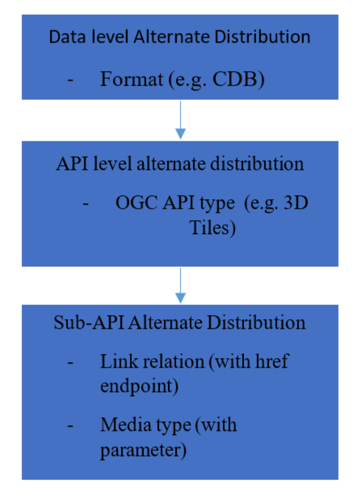

== Helyx Sprint Report

=== Types of alternate distribution in scope of GeoVolumes API
The formats that were handled by the draft GeoVolumes API in the pilot were i3s and 3D Tiles. These are community standards that serve out 3d data through a particular bounding volume hierarchy.
But there are a wider range of formats that can be served directly (such as CDB or CityGML), or can be transformed to an intermediate state for easier transmission over the web - for instance a 2D tile matrix set or implicit tiling tileset. The structure of these datasets should lend itself to the OGC Tiles API.
So an important question is where is the boundary between APIs in the OGC ecosystem – is it a fuzzy boundary? Can you have both types of API under one collection?
So far the structure of the API follows OpenAPI Common Part 2: Geospatial data, which includes a landing page, a list of collections (including filtering by bbox), a collection description (including a link to the data) and filtering on the data itself (e.g. through a bounding box)

=== What is an alternate distribution?
At the OpenAPI Common level, alternate distributions are only really discussed in terms of JSON or Html representations of server responses.
However, it can be posited that the different OGC API standards are all alternate distributions of a collection of geospatial data. So the same source data could be converted and served in different ways – either with a manual conversion or on the fly (e.g. to 3D tiles, i3s, a 2D representation of the data, or as features).
How do we represent alternate distributions?
Can happen at the API level (collection level - 3d tiles), can you have alternate distributions at the sub-resource level (e.g. buildings) underneath a common collection

=== Representing alternate distributions at the API level
This considers the mechanism by which clients request and get responses from a server as a particular type of distribution. The goal is to have a common starting point and landing page, and to display the collections within, but then to differentiate based on the particular structure of the distribution format.

image::images/3D_data.PNG[]

So the 3d data has the potential to be in scope of the GeoVolumes API, but it also has the potential to be in scope of other OGC APIs such as the Tiles API or Features API.
The GeoVolumes API has so far covered 3d Tiles and i3S community specifications. But this could be extended with for instance the draft 3d Tiles implicit tiling schemefootnote:[ https://github.com/CesiumGS/3d-tiles/issues/92] discussed by Cesium. This would be the equivalent of the tiling schemes that fall under the Tiles API, but tailored for working with 3D data.
A further discussion should be had to decide whether a 2d Tile map scheme served through the 3D Tiles implicit tiling scheme falls under the GeoVolumes API or not. Key questions are:

    * Whether only the source data needs to be 3d (this doesn’t preclude 2d tiling scheme made from 3d data being in scope)
    * Whether what is being served has to have a bounding volume hierarchy (which exludes the 2d tiling schemes and also the implicit tiling scheme)
    * Or whether the end client simply needs to be able to extract 3d data from the API call

=== Representing Alternate Distributions within one API – endpoints
In the pilot, each sub-resource on the server had its own endpoint such as the below:

http://server.com/collections/SanDiego/SanDiego-buildings/3dTiles

http://server.com/collections/SanDiego/SanDiego-buildings/i3s

http://server.com/collections/SanDiego/SanDiego-buildings/iTiles (or whatever the Implicit tiling scheme is named)

=== Representing Alternate Distributions within one API – parameters
However there is a separate school of thought that there could also be a common endpoint with a parameter instead deciding which representation of the resource to return, so that the client can use content-negotiation (Accept: header) to select the desired representation. For instance:

http://server.com/collections/SanDiego/SanDiego-buildings/bvh?f=3dTiles

http://server.com/collections/SanDiego/SanDiego-buildings/bvh?f=i3s

http://server.com/collections/SanDiego/SanDiego-buildings/bvh?f=iTiles   (or whatever name the implicit tiling scheme is named)

The use of parameters for content negotiation of the resource is currently not discussed in the draft GeoVolumes API but could be elaborated upon. Whether this is used in addition to the current API structure, or is even taken back a level so that:

http://server.com/collections/SanDiego/SanDiego-buildings?f=3dTiles

referenced the 3d Tiles endpoint is not agreed upon.
Also please note that this does not preclude changing the parameter value further down the path (for instance f=b3dm to bring back the final bounding volume)

=== A note on path format
It has also been discussed that the collectionId cannot contain slashes and the GeoVolumes API is currently not compatible with the OGC API family of standards if they currently allow slashes.
 A ‘:’ structure has been proposed for hierarchy structuresfootnote:[https://github.com/opengeospatial/oapi_common/issues/11#issuecomment-677947387], however for the most simple web servers hosted on Windows, folder names that will be served cannot contain ‘:’ in their name and therefore may cause issues with interoperability. It is suggested this is discussed further in the Domain Working Group as servers become more complicated with different data levels, this will need to be standardised.

=== Representing Alternate Distributions within one API - Link Relations
As discussed, from within a single API, defining a resource or sub-resource as an alternate distribution can typically be done using a link relation. OGC API Common refers to IANA’s definition that an ‘alternate’ link relation is ‘a substitute for this context’. Link relations are also discussed within the 3D Container ER, with a slight extension to include parent and root link relation typesfootnote:[http://docs.opengeospatial.org/is/17-069r3/17-069r3.html#_link_relations].
If we consider the IANA guidance around link relations, a couple of points are made:

_‘The *alternate* keyword creates a hyperlink referencing an alternate representation of the current document. The nature of the referenced document is given by the *href*, and type attributes. If the *alternate* keyword is used with the type attribute, it indicates that the referenced document is a reformulation of the current document in the specified format.
The *href* and *type* attributes can be combined when specified with the alternate keyword.
This relationship is transitive — that is, if a document links to two other documents with the link type "alternate", then, in addition to implying that those documents are alternative representations of the first document, it is also implying that those two documents are alternative representations of each other.footnote:[https://html.spec.whatwg.org/multipage/links.html#link-type-alternate]_

The last paragraph is interesting, as it suggests that more than one alternate distribution can be present for a particular resource, but that they are all alternative representations of the original. So the original could be served as 3D Tiles, but a second alternative distribution can be served as i3s, and a 3rd as an implicit tiling scheme, for instance.
So putting endpoints, parameters and link relations together the endpoint of each alternate distribution should also reference the endpoint of other representations of the same data using link relations. These can be chosen using the href of the link or by a url parameter.

=== Representing Alternate Distributions as Media Types
As discussed above, alongside the ref: alternate link relation, should be a related type attribute, which relates to the media type (previously MIME type). The media types explored in the pilot were predominantly application/json+i3s and application/json+3dTiles. These are not currently registered with IANA, and as such need to be officially / successfully registered to be official.
Note that this doesn’t preclude other media types being used further down the path (e.g. application/json)
Ecere suggest that if this were not possible, an alternative would be to use the application/JSON type, with a particular approach agreed upon in OGC API – Common that is common to all, to lay out the schemas in a standardised way.
What is suggested based on this understanding is that there is a hierarchy of alternate distributions for 3d content:

=== What is the difference between an alternate distribution and an alternate resource?
There are some cases which could be construed as an alternate distribution such as:

    * A resource that is the same as another resource on the server, but is in a different co-ordinate system
    * A resource that is the same as another resource on the server, but is served through from another location
    * A resource that is a different version of an original resource on the server
    * A resource which is a link to translate an original resource on the server to another format

Benefits
Having a clear understanding of the alternate distribution options available at each stage of the standardisation process, knowing where to standardise, and where to provide tailored structure for particular distribution types helps to demonstrate how flexible and adaptable the OGC OpenAPI model is.
