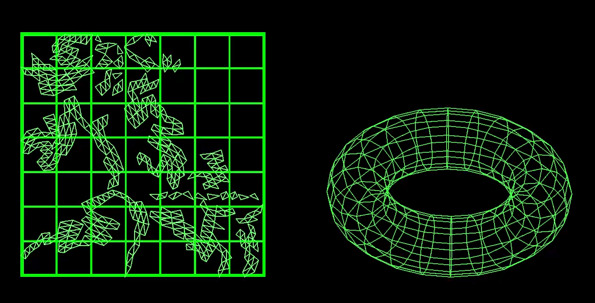
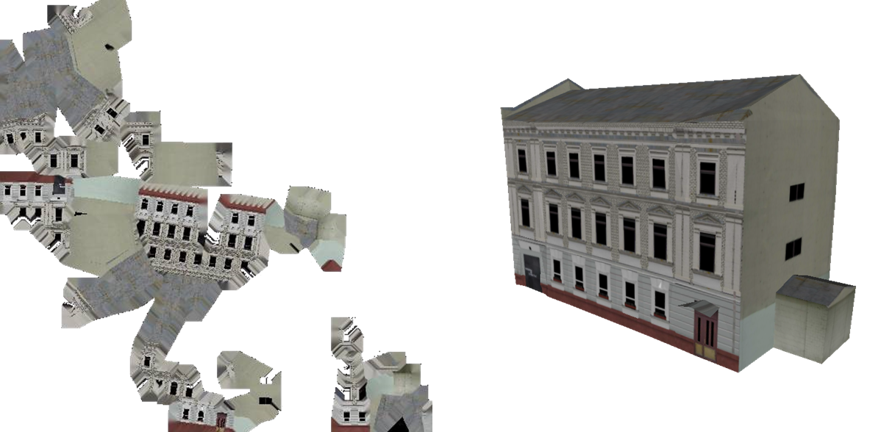
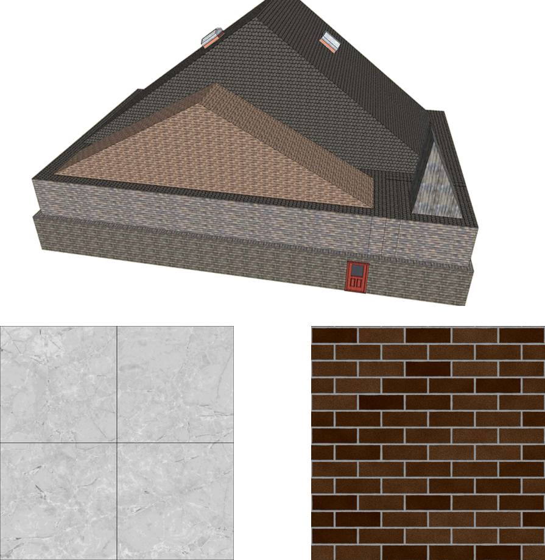
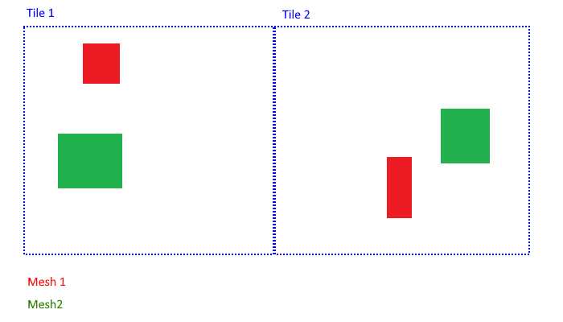

== Hexagon GSP

=== Abstract
This chapter investigates how model and terrain updates, originating from a CDB data
store and delivered as glTF or elevation, are integrated with background elevation and OGC 3D Tiles
into the client environment.

For a large data set, all the meshes from the CDB data store are converted to an OGC 3DTiles tileset.
Displaying the resulting pre-processed OGC 3DTiles offers performance and visual quality advantages over reading the
CDB data store directly. The increased efficiency is due to a better tiling scheme and mesh simplification.

The question of generating tiles on the fly from the CDB data store is explored but the implementation could not
be finished in time for the sprint.

OGC 3DTiles can be automatically adapted to elevation updates, whether they come from a CDB data store or another source.
This is achieved by adjusting the height of the mesh vertices at render time using expressions that are evaluated on the GPU.
The result is that meshes will always match to any elevation model loaded in the client.

Using the same technique, mesh updates coming form a CDB data store or any other source can automatically push down
background OGC 3DTiles. The old and new models integrate seamlessly and there is no need to reprocess the entire
dataset to create a single coherent OGC 3DTiles tileset.

=== Test Data
The research is based on the San Diego CDB sample dataset provided for this sprint. It provides imagery, elevation, 3D
models and a variety of vector data.

image::images/SanDiegoCDBFileSystem.png[]

=== Organization of CDB for 3D Models
This section recaps the organization of CDB data for 3D models.

==== GSFeatures and GSModelGeometry
GSFeatures and GSModelGeometry are two folders containing matching Level Of Detail (LOD) folders.
In the GSModelGeometry folder, OpenFlight files are zipped in groups corresponding to a tiling schema.

GSModelGeometry items are unique in the sense that OpenFlight files are used only once (one file per building) while
textures can be reused many times.

LOD folders are additive meaning that each LOD adds more data relative to it's parent rather than replacing it.

The GSFeature contains point features that have a parameter "MODL" giving the name of a model geometry in the
OpenFlight format. This is not the full path or even relative path to the geometry but rather a name that must be
matched with one of the files (zipped) at the corresponding LOD level if present at all.

===== SHP and DBF files
GSFeature folder is made up of esri SHP files linking to DBF files where the DBF files have many-to-one relationships
amongst themselves.

==== GTFeature and GTModelGeometry
GTFeatures are similar to GSFeatures except that the GTmodels are instanced and a single GTModel can be referenced by
many GTFeatures.

==== CDB technical specification recommendations
Based on the San Diego CDB data set, the compression of
OpenFlight data through zip leads to a minimal gain in hard-drive memory usage (on the order of 5%).

A much greater compression can be achieved on textures that in this case were mostly encoded in SGI .rgb format.
The SGI .rgb format isn't a default format like JPEG or PNG which means developers will usually need to
include 3rd party libraries or write extra code.

The relative path to the 3D model can be inserted in the parameters of the GSFeatures rather than
a short name. This would waste a few bytes of memory but would reduce the complexity of the decoder code.

A flat single DBF file accompanying every feature SHP file could be envisaged rather than multiple ones with
many-to-one relations. This would help with the limited capabilities offered by some APIs relative to this format and
this might be a case where it is better to waste a few bytes of data for the sake of simplifying decoder code.

=== Pre-processing CDB 3D models to OGC 3DTiles
image::images/3DTilesWithMap.png[align="center"]

CDB uses a tiling system where higher Levels Of Detail (LOD) add mesh models. Single buildings may also have
several LODs embedded in a single file. While this gives the flexibility to achieve anything visually, it is complex to
decode on the client or to process on the fly. This section describes an approach to convert the entire CDB 3D
models to a more efficient OGC 3DTiles tileset through a pre-processing stage.

When converting to 3DTiles, only the highest LOD for every 3D model is taken into account to re-generate a complete
tileset.

image::images/octree.png[width=800,align="center"]
The new LOD structure is an octree where child nodes entirely replace parent nodes.

Creating this structure is recursive process that repeats the following steps:
tiling -> grouping tiles -> simplifying -> re-texture

image::images/3DTilesWithoutMap.png[align="center"]
The pre-processed tileset can display more buildings at low LODs than would be possible by loading the raw files from
the CDB data store even if the distant buildings are simplified meshes with just a basic texture.

==== Mesh simplification
image::images/simplification.png[width=800,align="center"]
In lower LODs, the models are simplified using quadric edge collapse decimation.

Cluster simplification or dropping out smaller independent groups of faces are faster alternatives.

==== Parameterization and texture baking

Meshes are re-parametrized (compute new texture coordinates). This is a
process of unfolding 3D meshes to 2D space while splitting it in the least amount of pieces and wasting the least
amount of space.

texture baking is the process of using bits and pieces from the original textures to create a texture atlas. Having a
single texture per tile rather than one or more texture for every building decreases the overhead of having to pass
several textures to the GPU.

This task is made more complex by the use of repeating textures where UV texture coordinates go beyond the normal
0 to 1 range as in the example above. Repeating textures are common and seem appealing because they can cover a large
area with apparent detail. However, they cannot be used to create texture atlasses and look unrealistic if overused.

Another drastic approach to solving repeated textures is to convert textures to color by taking the average pixel
color of a texture and using it instead. This gives the tileset a rather cartoony feel which can be amplified with
certain postFX.

==== Tile size
Every tile at every LOD uses approximately the same size in memory.
At any given point of view, the client application will load roughly the same amount of data.

==== Metadata and selection
The tiling may cut buildings in pieces but this does not impact selection or access to metadata because an index is
encoded inside the mesh faces linking them to the original model they belong to.

==== Conversion speed
The drawback of this approach is the time it takes. It's currently impossible to achieve this conversion on the fly and
converting the entire San Diego dataset took several hours.

==== Referencing
CDB provides referencing and orientation of 3D models through point features. The height of the 3D models is either
given as a parameter of the point-features or can be inferred from elevation data provided in the CDB data store.

The referencing information is used but the heights is dismissed during creation of OGC 3DTiles. The height is
inferred at render time through GPU evaluated expressions on any loaded elevation data.

==== 3D data organization recommendations
The ideal pre-processed dataset doesn't use the raw files but rather simplifies, splits
and merges them into tiles of varying levels of detail. The LODs embedded inside OpenFlight files cannot be used
because the ideal level of simplification for a given tile depends on the entire dataset. This removes the need for a
complex structure within the CDB data store. There are still certain recommendations that can help improve the
pre-processing speed.

As a general recommendation, it does help to deal with files that have a moderate size. When dealing with millions of files
that are just a few kilobytes, the overhead of reading from the hard drive can become a bottleneck. At the same time,
dealing with very large files can use too much memory and they need to be split in advance.

It is also helpful if meshes cover a limited area. Consider the following scenario:

The 2 meshes are made up of several parts that span a large area and as a result, when Tile 1 or Tile 2 is generated,
both mesh files need to be loaded, split and merged.

image::images/meshTopologyB.png[align="center"]
In this scenario, the mesh files are also made up of several parts but because they are close to each other
generating a tile only requires loading one file at a time.

=== Serving OGC 3DTiles from CDB with on the fly tiling
Serving 3D Models on the fly means that whenever a client application looks at the data from a certain angle, it will
send a request to the server that must gather the data to be visualized and convert it to gltf on the fly. This task
has not been completed within the sprint but will help handle updates more easily than using the previously
described pre-processing approach.

At startup, the server creates a tileset.json file by decoding and indexing the bounds of all the 3D models into an
octree structure. This process takes around 5 minutes on the San Diego Dataset which contains about 6Gb of mesh data.
Each node is given a name and a tileset.json file is generated. The client therefore requests tiles that don't
exist yet because the server generates them on the fly.
The LOD structure of the CDB data store isn't used because in this particular case, it is inadequate. If the CDB
data store LOD structure could be used, the process would become almost instantaneous. A good LOD structure is one
that is deep and has small tiles of approximately the same size.

When a tile is requested, the relevant meshes are loaded, converted to gltf, wrapped in a B3DM file and sent back to
the client. This last part could not be integrated in an OGC 3DTiles service in time for the sprint.

The approach of simplifying meshes for lower LODs cannot be done in real-time because it is too slow. simply dropping
out smaller buildings for lower LODs will have to be used.

==== Speed
The speed of the server is expected to be good enough to call real-time.

==== quality
Mesh simplification will be too slow to generate tiles on the fly. Instead, dropping out smaller models at low LODs
must be used.
If the tiles are additive, it is impossible to use different levels of detail for
textures. It's expected that a compromise would have to be done in respect to texture quality. A replacement tactic
will be better suited but requires more computation on the server.

==== updates
Updates may be implemented by having a file watcher on the CDB GSFeature and GTFeature folders.
An update would trigger rebuilding the tileset.json and a notification to the client application.

This process can be almost instantaneous if an efficient tiling is implemented within the CDB data store. If the
tiling structure has to be re-build entirely, the time for an update to be taken into account rises but isn't
prohibitive.

It's also possible to rebuild only certain branches of the LOD tree in case of an update but this is not usually done
for deep trees because the gain is minimal in comparison to the complexity of the implementation.

==== server caching
Tiles are automatically cached on the client using the browser's cache. Tiles may also be cached on the server.

==== data structure
Depending on the dataset, an octree, quadTree or even an R-tree can be used for the LOD structure. Another data
structure that is ideal for frequent updates is a regular grid of cells. The grid of cells doesn't need to be rebuilt
for every update but it is uncertain if such a structure can be leveraged to serve 3D-tiles efficiently.

==== 3D data organization recommendations
In this approach, a tileset.json is generated on the fly at startup of the server or when an update happens.
The tiles themselves are generated upon request.
Having OpenFlight meshes that are already organized in coherent LODs can improve the time it takes to build a
tileset.json.

A general recommendation is to split LODs into a regular grid of cells and to make sure that cells are small. A general
guideline would be about 500Kb per tile (mesh and texture included).

It's important to take into account that in the case of an additive approach, higher LODs are added to lower LODs
meaning that when the client loads a high LOD tile, it must also load all of its parents even if, for the largest part,
they are out of view. This also means that using different levels of detail for textures is impossible.

A Replacement approach is better in that respect. It implies that some features are repeated at several levels of
detail (only the point features are repeated, not the 3D models inside the CDB data store). A drawback is that updating
the CDB data store becomes more complex.

=== On the fly vertex displacement: a solution to handle CDM model and elevation updates
3D Meshes can be displaced at render time using GPU evaluated expressions. This technique allows handling
updates of terrain and 3D models and ensuring that there is no overlap or mismatch between data sets.

==== Integrating terrain updates with OGC 3DTiles tileset
Whether CDB 3D Models are pre-processed into an OGC 3DTiles tileset or served on the fly directly from the data store,
the height of the verices is calculated based on a pre-defined elevation model. It is also possible to serve tiles
without any elevation and to adjust the height of the 3D meshes when they are rendered based on GPU evaluated
expressions. As a result, the pre-processed OGC 3DTiles tileset can adapt to any elevation model loaded in the client
whether it originates from a CDB data store or otherwise.

===== Evaluating the height of a vertex based on an elevation model
Because the height of the vertices is calculated based on a specific elevation model, both the meshes and a
representation of the elevation need to be provided to the GPU. The difference in height between the elevation
model and the ellipsoid is calculated at the location of the vertex and the vertex is displaced by that amount.

===== Evaluating the height of the terrain
Rather than displacing the mesh, it's also possible to displace the terrain itself.

==== Handling 3D model updates with elevation and background OGC 3DTiles
When 3D data is served on the fly from a CDB data store, updates should be taken into account automatically.
However, pre-processing a large data set has several advantages in terms of visual appearance and performance. In
addition, model updates may originate from other sources than the CDB store itself.

On the fly vertex displacement offers a solution to small model updates.

===== Added model
In the case that a completely new model is added, it is converted into a separate OGC 3DTiles tileset and loaded
alongside the background data. this conversion to 3D Tiles can be very fast for small models.

===== Updated model
In the case where a model is updated with a newer version, it cannot simply be loaded alongside the background
3DTiles because it would overlap with the previous version of itself. To resolve this, the vertices of the background
data set that are inside the bounding box of the new model are pushed down below the new one.

===== Deleted model
When a model is deleted, it should be removed from the pre-processed background dataset. This can be achieved by pushing
the vertices that correspond to the deleted model down.
