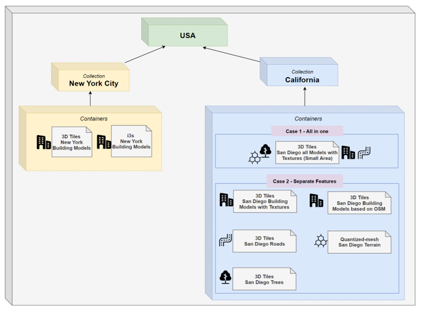
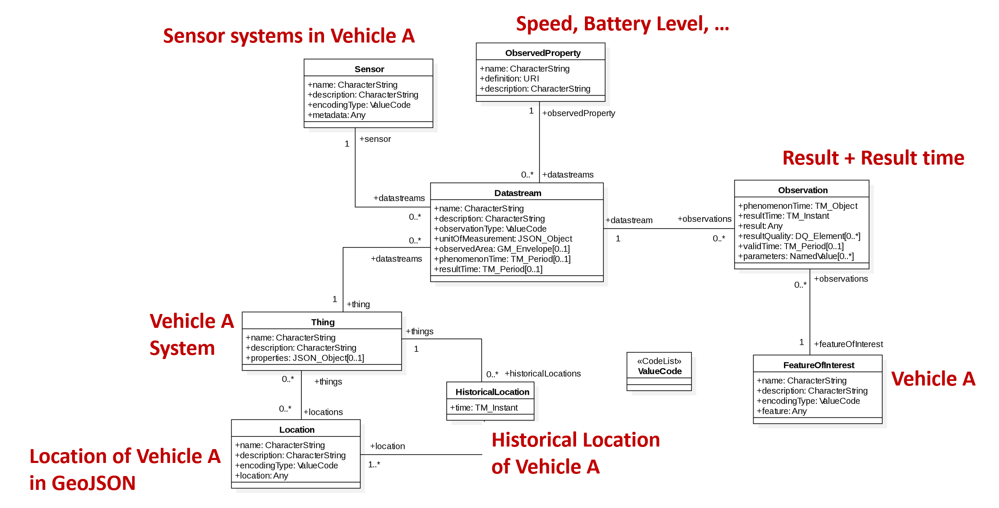
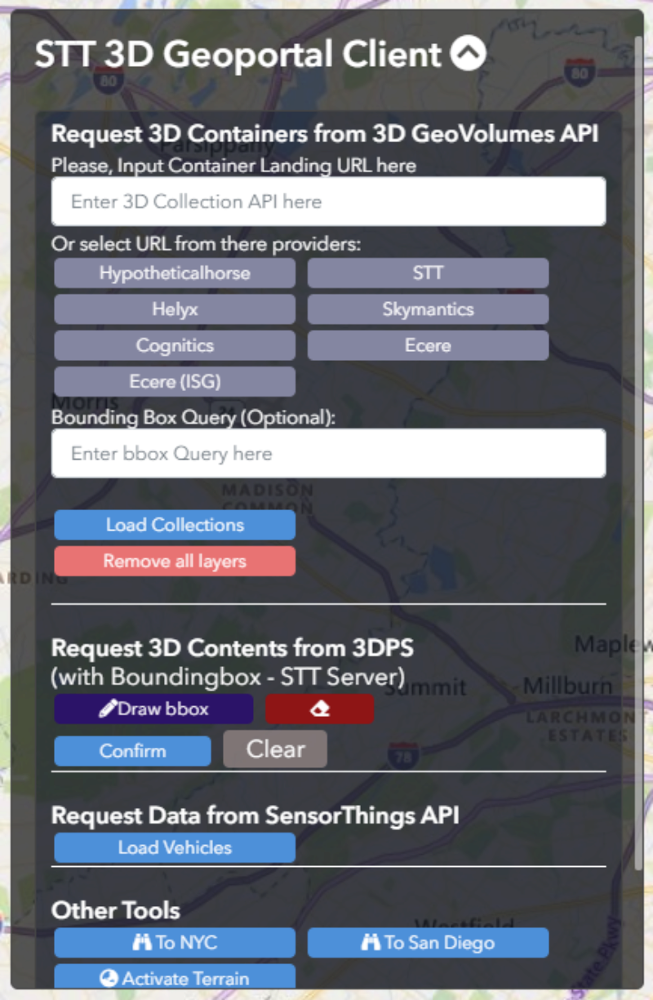
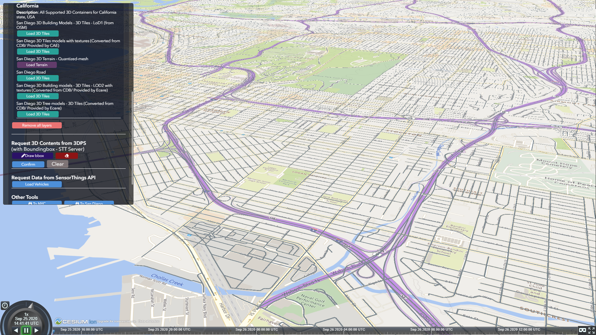
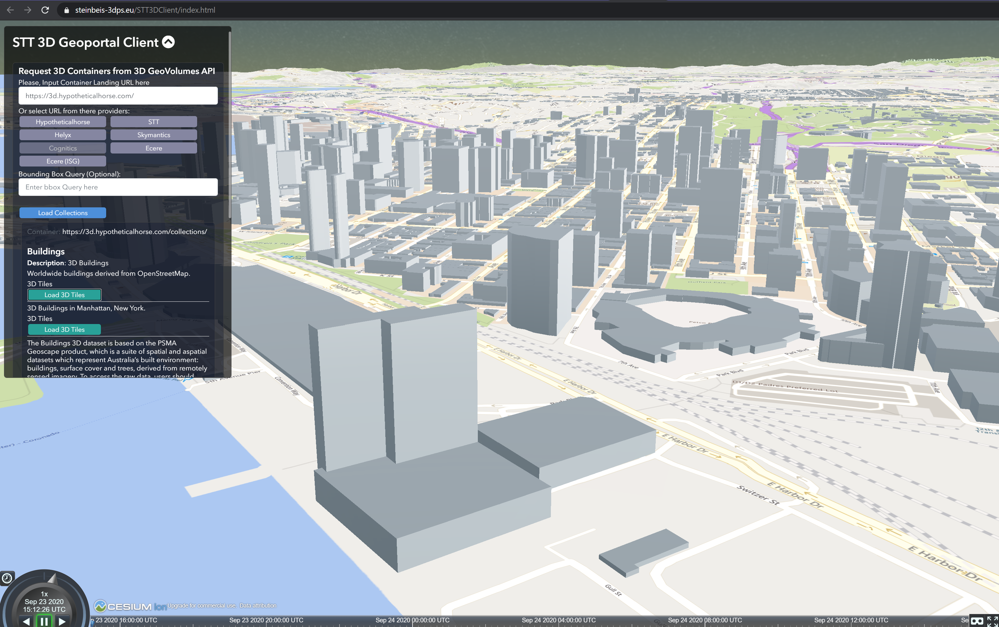
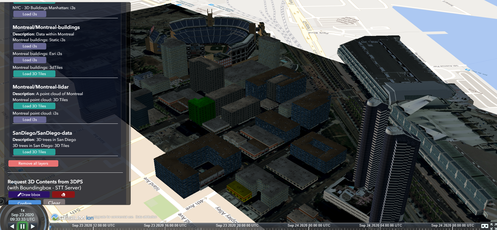
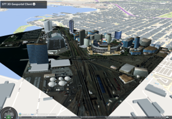

== Steinbeis Sprint Report

=== Overview

In the ISG sprint, Steinbeis had developed a 3D web application for simulating the modern urban mobility such as air-taxi or E-bike in the 3D urban environment. In this application, our concept and implementation used the GeoVolumes API for managing the standard 2D or 3D static geospatial resources including building models, road network, tree, imagerys, and terrain. At the same time, the dynamic moving data such as taxi, air-taxi movement, e-bike movement was managed by the OGC SensorThings API standard.

=== Server Implementation
==== GeoVolumes API Server

In OGC 3D Container and Tiles API pilot, Steinbeis had successfully implemented the GeoVolumes API server to deliver geospatial resources supporting 3D Tiles, I3S, and CityGML formats in the area of New York City. This server supports the hierarchy and bounding box query through the collections and containers. This server is available at http://steinbeis-3dps.eu:8080/3DContainerTile/

In this ISG sprint, we expanded the API mentioned above in the new server (http://steinbeis-3dps.eu/3DGeoVolumes) to serve the provided dataset from the sprint in the San Diego area and an open-source CityGML dataset of LoD 1 buildings of California. The dataset in the API will be available in 3D Tiles format. The available geospatial datasets which are not in the visualization-ready formats such as CDB will be first converted before serving through the API. In this sprint, we were not covering the conversion part and received the ready-converted data from CAE and Ecere. 

We tested and evaluated the different organization of the underlying 3D data at the server. Two approaches was compared on our client with the San Diego data set: 

* Case 1: Organize the data on the server in one single bounding volume hierarchy containing all features.
** San Diego 3D models (3D Buildings, Tree, Imagery, Terrain): https://steinbeis-3dps.eu/3DGeoVolumes/collections/California/SanDiego3DModelsWithTextures/3dtiles/
*	Case 2: Organize the data on the server in multiple bounding volume hierarchies per feature types such as:
** San Diego 3D Building Models - 3D Tiles - LoD1 (from OSM) : https://steinbeis-3dps.eu/3DGeoVolumes/collections/California/SanDiego3DBuildings_LoD1/3dtiles/
** Roads : https://steinbeis-3dps.eu/3DGeoVolumes/collections/California/SanDiegoRoads/3dtiles/
** Trees : http://steinbeis-3dps.eu/3DGeoVolumes/collections/California/SanDiego3DTrees/3dtiles
** Terrain as Quantized Mesh : https://steinbeis-3dps.eu/3DGeoVolumes/collections/California/SanDiego3DTerrain/quantized-mesh/

The hierarchical collections of Steinbeis GeoVolumes API can be illustrated as shown in <<Steinbeis-ClientUI>>.

[#Steinbeis-ClientUI,reftext='{figure-caption} {counter:figure-num}']
.Areal Taxi on Steinbeis Client.

==== SensorThings API Server for Urban Mobility
In this sprint, we used the OGC SensorThings standard (https://docs.opengeospatial.org/is/15-078r6/15-078r6.html) as a specification for managing the synthetic urban mobility data in San Diego city. The data modelling of the SensorThings API server for this sprint is shown in <<Steinbeis-SensorThingsDataModel>>:

[#Steinbeis-SensorThingsDataModel,reftext='{figure-caption} {counter:figure-num}']
.Steinbies SensorThings Data Modelling.

For the server implementation, we used the FROST-Server (https://github.com/FraunhoferIOSB/FROST-Server); an open-source implementation of SensorThings API part 1: Sensing, developed by the Fraunh-ofer IOSB as our SensorThings server for managing the dynamic dataset. This server is available at https://steinbeis-3dps.eu/sta-isg-sprint/ collecting the synthetic 3D routes in the area of San Diego. 

=== Client Implementation
The client (https://steinbeis-3dps.eu/STT3DClient/) application was based on CesiumJS framework. It was partially based on the implementation from the Steinbeis OGC 3D Container and Tiles pilot client. The User Interface menu is shown in the image below which allows users to do following interacations:

* Load collections from the input 3D GeoVolumes API URL or select from an available list.
* Render the geospatial contents from the loaded collections/containers.
* Load and render the mobility route data as a 3D Map animation from the Steinbeis SensorThings server.
* Using the 3D Portrayal Services to request the data in the specific boudary area.

[#Steinbeis-Client-UI,reftext='{figure-caption} {counter:figure-num}']
.Steinbeis-Client-UI.

==== Visualizing contents from GeoVolumes API Servers
In this client application 3D Tiles from different sources are visualized. The 3D Tiles are requested from different servers from Steinbeis and other participants.

To request the tileset the client first acceses the 3D GeoVolumes server (https://steinbeis-3dps.eu/3DGeoVolumes) to load the collections described in the server part. The collections can be restricted with a bounding box, so only certain collections are displayed. This is done by checking the "Content.json" file on the server.

The datasets that are referenced in the content.json are shown in the dashboard on the client for a user to pick which one to visualize. By selecting a certain dataset, the user triggers another Post by the client server (Node.js) to the GeoVolumes server requesting the selected dataset. The dataset is then fetched and visualized in the client. We tested our client by load and render the 3D city models of San Diego from our GeoVolumes server and other participants's GeoVolume servers. The following lists show some examples of the geospatial that rendering on the Steinbeis client: 

* Visualizing San Diego Road from the Steinbeis GeoVolumes Server 
+
[#Steinbeis-Client-to-Steinbeis-Server-RoadNetwork,reftext='{figure-caption} {counter:figure-num}']
.San Diego Road Model (Steinbeis server).

* Visualizing San Diego 3D Building models from the Steinbeis GeoVolumes Server 
+
[#Steinbeis-Client-to-Steinbeis-Server-LoD2Texture,reftext='{figure-caption} {counter:figure-num}']
.San Diego 3D Building models LoD2 (Steinbeis server).
image::images/Steinbeis-Client-to-Steinbeis-Server-LoD2Texture.png[width=800,align="center"]

* Visualizing San Diego 3D Building models (LoD1 based on OSM) from the Cesium GeoVolumes Server 
+
[#Steinbeis-Client-to-Cesium-server-OSM-LOD1-SanDiego,reftext='{figure-caption} {counter:figure-num}']
.San Diego 3D Building models LoD1 (Cesium server).

* Visualizing San Diego 3D models (only Building layer LOD2) from the Ecere GeoVolumes Server 
+
[Visualization of LoD2 Models with Textures from Ecere Server]
[#Steinbeis-Client-to-Ecere-Server-LoD2Texture,reftext='{figure-caption} {counter:figure-num}']
.San Diego 3D Building models LoD2 with textures (Ecere server).
image::images/Steinbeis-Client-to-Ecere-Server-LoD2Texture.png[width=800,align="center"]

* Visualizing San Diego 3D Building models from the Helyx GeoVolumes Server 
+
[#Steinbeis-Client-to-Helyx-Server-LoD2Texture,reftext='{figure-caption} {counter:figure-num}']
.San Diego 3D Building models LoD2 with textures (Helyx server).

==== Mobility Routes
To show different kinds of mobility, such as bike routes and air taxi routes, different synthetic urban routes were visualized on the client. By adjusting the height of the track to replicate a flight path with starting and landing maneuvers a air taxi route can be simulated. An Air Taxi moves presumably around 300 meters above the terrain, except for starting and landing.

To visualize these tracks in Cesium the route data is loaded from the SensorThings server followed by converting into the CZML format on the client side which allows CesiumJS to visualize the movement of an object by interpolating its position between the to given points. The locations of the objects are stored in the positon property together with the timestamps. These also include the time in seconds bases on the starting point of the epoch property.

[source,json]
----
  {
    "id": "AR-1",
    "name": "Air Route 1",
    "description": "The Steinbeis Synthetic Air Route in San Diego for OGC ISG Sprint 2020",
    "position": {
      "epoch": "2020-09-20T10:00:00Z",
      "cartographicDegrees": [
                    "<time_0>",
                    "<lon_0>",
                    "<lat_0>",
                    "<h_0>",
                    "<time_1>",
                    "<lon_1>",
                    "<lat_1>",
                    "<h_1>",
                    "...",
                    "<time_n>",
                    "<lon_n>",
                    "<lat_n>",
                    "<h_n>",
        ]
    }
}
----

The user can request the data from the Sensor things server and visualize it on the Steinbeis Client. The track of the vehicle, either bike or Air Taxi, is then visualized with a green line following the route. For example, <<Steinbeis-Client-to-Steinbeis-SensorThings-ArealTaxi3>> shows the visualization of the 3D air route of an air taxi over the San Diego City.

[#Steinbeis-Client-to-Steinbeis-SensorThings-ArealTaxi3,reftext='{figure-caption} {counter:figure-num}']
.Areal Taxi on Steinbeis Client.
image::images/Steinbeis-Client-to-Steinbeis-SensorThings-ArealTaxi3.PNG[width=800,align="center"]

=== Updating 3D Models

to be updated...

=== Discussion

==== 1. 3D GeoVolumes API query - Polygon with a Hole.
During the sprint week, we have loaded and renders numbers of 3D contents from the GeoVolumes API servers to our client. In some cases we found that the contents are intersect to each other. For example, <<Steinbeis-Client-intersected-layers>> show the 3D Tiles texture layer (covering a smaller area) is intersect with the 3D Tiles LoD1 layer (covering a bigger area). 

[#Steinbeis-Client-intersected-layers,reftext='{figure-caption} {counter:figure-num}']
.Areal Taxi on Steinbeis Client.

In this case, we do not need the LoD1 layer to be loaded in a smaller bounding area which already render by the texture layer. The query capability for requesting the contents as a polygon with hole (or donut polygon) would help to filter the content on the server-side and save the bandwidth to client.

==== 2. 3D GeoVolumes API organization different semantic parts.
Currently, there is no concrete rule on how to name the different semantic parts. For example, the building models in the San Diego area can be hosted on

* https://LandingURL/collections/California/SanDiego/buildings/...

* https://LandingURL/collections/California/SanDiegoBuildings/...

* https://LandingURL/collections/California/SanDiegoCDB:Buildings/...

These gaps should be discussed and evaluated in the future developement of the 3D GeoVolumes API specification.

